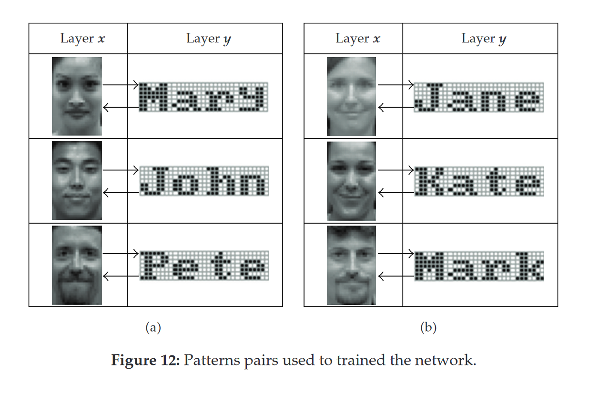
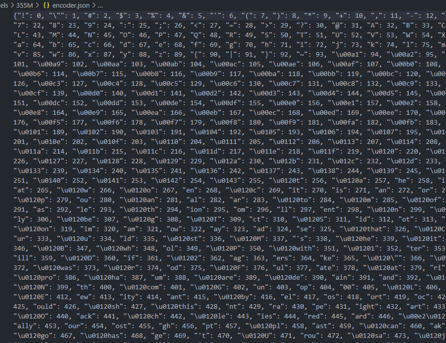

BAM can link together data of different types. Associations...

From one side the model requires to use bipolar patterns - arrays of -1 and 1. But I need to store words and sentences. How do I decode them into that format? I looked into byte pair encoding (BPE) used in GPT-2. It basically tokenized by subwords.

How letters and words stored in neurons? Should I look into psychological research or just made up some decoder?

- Cannot achieve clusters and hierarchy with just one layer in BAM. 
- Sadly words are triggered together with other neuron activity (even with electrodes placed in the brain, 'electrocorticography' - official name of the technique, we can't get much understanding)
- Every letter and every word stored in separate neurons.

> GPT has a vocabulary size of 40,478 since they have 478 base characters and chose to stop training after 40,000 merges.
>
> GPT-2 uses bytes as the base vocabulary, which is a clever trick to force the base vocabulary to be of size 256 while ensuring that every base character is included in the vocabulary. GPT-2 has a vocabulary size of 50,257, which corresponds to the 256 bytes base tokens, a special end-of-text token and the symbols learned with 50,000 merges.
>
> From https://huggingface.co/docs/transformers/tokenizer_summary

Here is how BPE encoding looks like. You can see it as a dictionary used by GPT. It has subwords and single letters. But the amount of subwords is limited by researchers.

As a result they have flat vocabulary. By "flat" I mean all symbols are independent. Strange prefix \u0120 (sometimes printed as Ġ, \[[1](https://github.com/huggingface/transformers/issues/3867)], \[[2](https://github.com/pytorch/fairseq/issues/1716)], \[[3](https://github.com/openai/gpt-2/issues/80)]) denotes a space, which means that nothing can be prepended to symbols containing it.

But instead of being flat we need a hierarchical network that starts with single letters and combines them into subwords and words.

Next, firing of inputs is not "flat" as well. We will not present a word "hello" as a simultaneous input to first layer neurons

## Papers

- Original - [Kosko (1988)](https://sipi.usc.edu/~kosko/BAM.pdf) and a [follow up with more examples](https://sipi.usc.edu/~kosko/ABAM.pdf)
- [Chartier](http://jpbachy.free.fr/chartier-TNNc.pdf) uses two matrices instead of transposition of one matrix ([another short paper](https://www.sciencedirect.com/science/article/pii/S1877050918323901?ref=pdf_download&fr=RR-2&rr=7a894a268de97c7d))
- some explanation with code and pictures (but wrong tests, meaningless random data) [post](https://towardsdatascience.com/a-succinct-guide-to-bidirectional-associative-memory-bam-d2f1ac9b868)
- Tae-Dok Eom, Changkyu Choi, Ju-Jang Lee [Generalized asymmetrical bidirectional associative memory for multiple association](https://citeseerx.ist.psu.edu/document?repid=rep1&type=pdf&doi=7eb4f5ed9fb4cf20d63dff3e6c24f8f2aac35670)
- [short version](http://www.cyber-s.ne.jp/Top/Volume/1-1/0001tf.pdf) (still don’t understand what their notation means) 
- [more examples and explanation](https://www.hindawi.com/journals/jam/2011/301204/) of chartier approach, good examples with text and picture associations. and more: temporal pattern sequences with the help of autoassociative layer ([pdf](https://downloads.hindawi.com/journals/jam/2011/301204.pdf))
- [very formal and formula rich](https://www.mdpi.com/2073-8994/14/2/216), mostly about stability 
- [another paper](https://arxiv.org/abs/2211.09694) with many formulas, this time focused on memory capacity 
