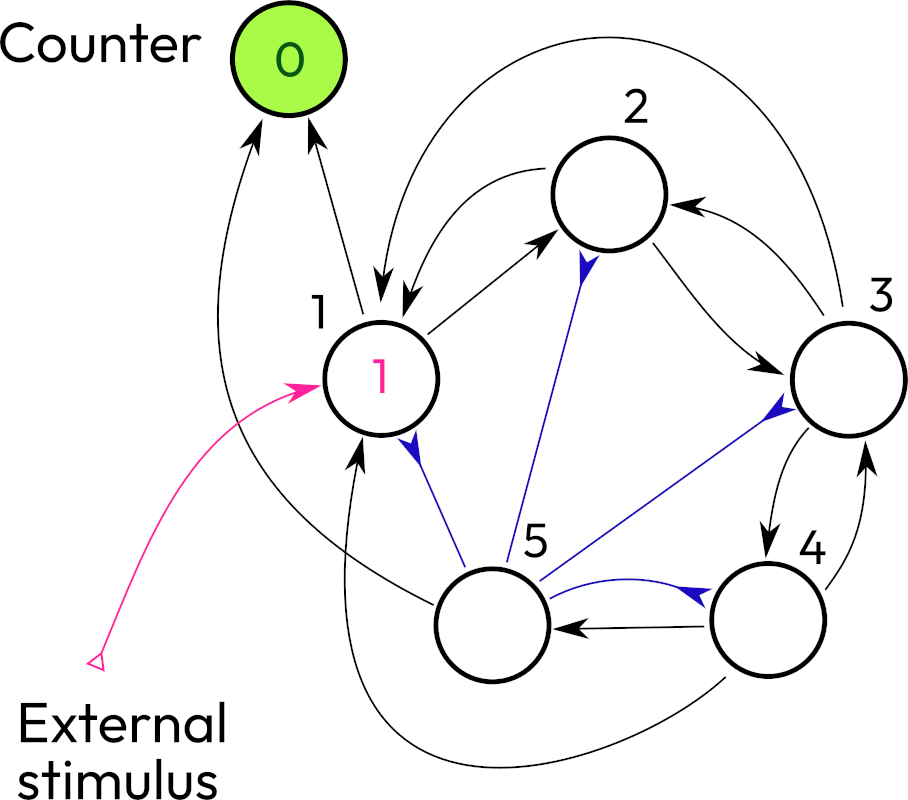
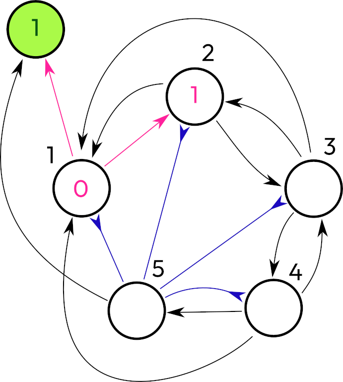
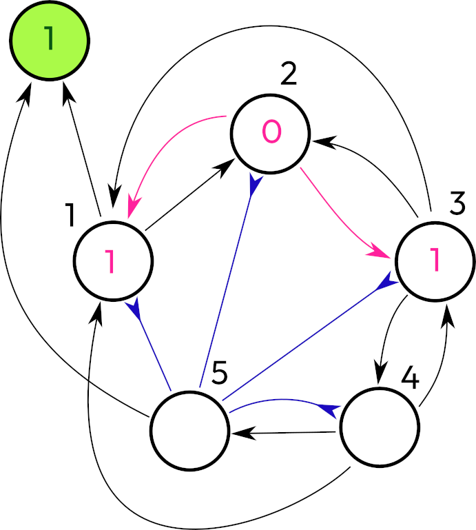
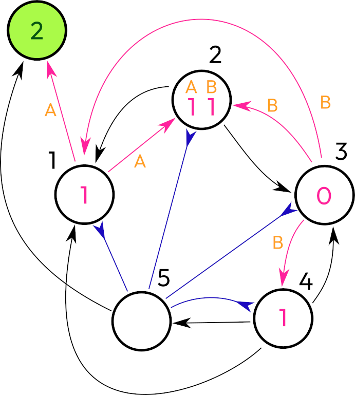
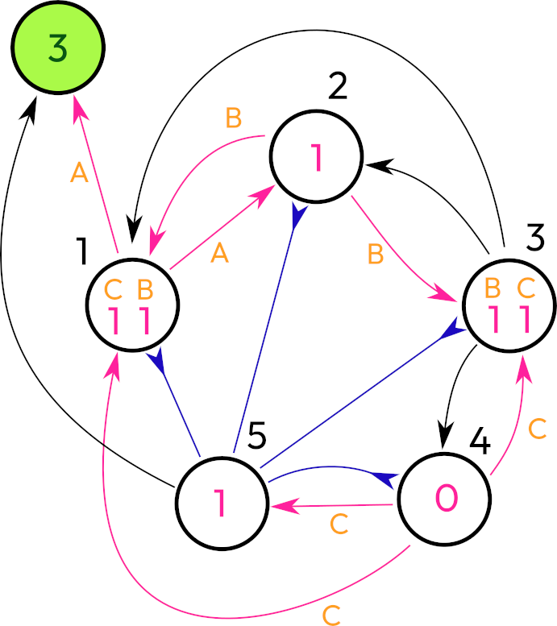
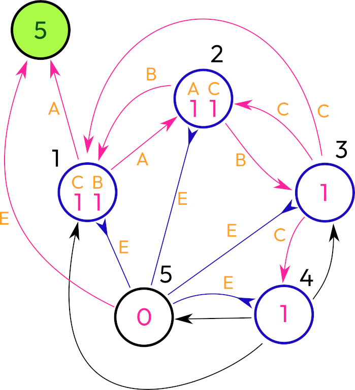
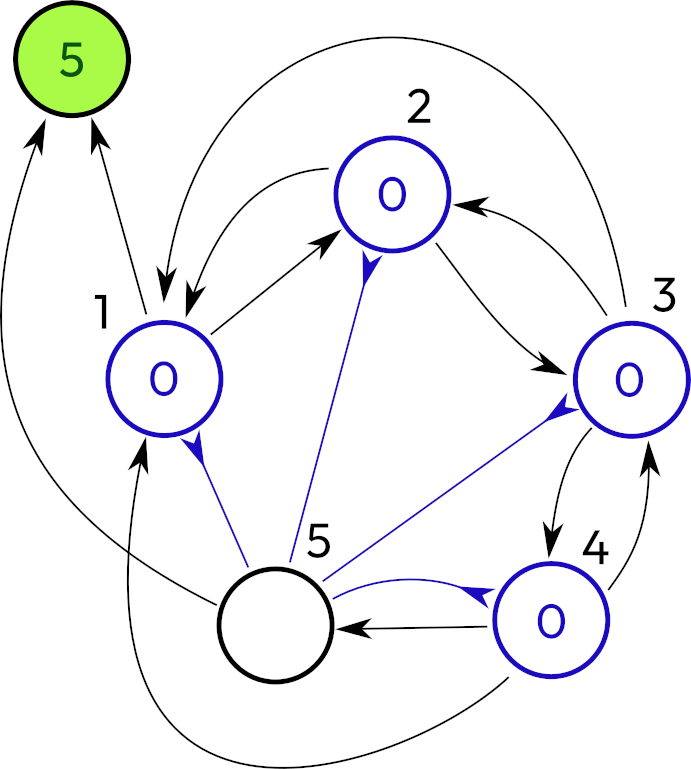

## Dynamics

Overall dynamics is very flexible, but we choose the smallest steps where the transition between two points is very deterministic.

$x_1$ is a tuple defining inputs to a neuron at a time point 1. $g(x_1)$ will give a resulting value $s_1$ stored in the neuron. It’s a summation. Yes, on this level and at this moment it’s just the summation. My remark that neurons can do better was not about this part.

$t$ is an activation threshold. if $g(x_1) \gt t$ then $s_1 = g(x_1) - t$ and we send activation potential to all connected neurons on the time 2.

$x_2$ is another tuple for the input coming in the following time point 2. 

Function $f(x_1, x_2)$ can calculate the resulting state of the neuron based on previous input and a new one. For example if we get repeating inputs in appropriate intervals then potential rises and leads to activation. 

All neurons form a graph $G$ of connections between each other. At some point we know what signal what neurons receive $G_1$, calculate f and that’s how we have the next state of the network $G_2$.

I think it’s interesting to review the change $d(G_2, G_1)$. If $G_1$ equals $G_2$ then $d = 0$. It’s an equilibrium.

## Count to 5 example

Can we take some network of spiking neurons and teach them to count to five? By count I mean that they must respond to incoming impulse as switching to the state that will continuously activate five times and then switch off. 

Here I present a network with 5 nodes, one external "counter" (it doesn't work as a neuron, at least it doesn't play any role in stimulating the network or changing the dynamics in any other way)

So I made the neuron 1 to be the one who increments the counter (except the last step). Another design was a recurrent connection to the neuron 1 itself. But then, how will it execute the counting task by itself? Surely this network is an example where all neurons have a threshold of 1. We could play with the threshold values and come up with another structure. However, this design focuses on similar neurons.

So there is a chain of 5 neurons. The first one after its activation slowly sends the signal along the chain. Every neuron in the chain will activate the preceding neuron and also the first one. 

(I will need to check that backlinks 3-2 and 4-3 are required. It's possible that they are extra.)

Then when we reach the neuron 5, it inhibits all other neurons and increments a counter bypassing the neuron 1, because the neuron 1 is inhibited on this step. There are possible variations. 

If we would want to send signals to the counter solely through the neuron 1, then we could add a sixth neuron and remove the bypass.

Also we could inhibit the network excluding neuron 1 from the neuron 5, but inhibit it for two steps in order to prevent self-excitation of the network.

The neuron 5 sent a cooldown to neurons 1, 2, 3, and 4, resetting their values to zero. No more activations.

So we designed a network that works without any training process as we expected. We achieved that by carefully putting connections between neurons what made it function in a stable manner and led to a halt.

Now let's consider creating a network using training. How do we create connections or change thresholds or add more neurons by reacting to a feedback? In this example, when the output sequence is not equal to five impulses, the negative feedback will be issued.

I assume that training data should be artificially designed for this type of behavior. It will induce negative feedback if amount of impulses is less or more than five.

For example, receive one input

- no activation, five negative responses
- one activation, four negative responses
- 2 activations, 3 negative responses
- 3 activations, 2 negative responses
- 4 activations, 1 negative response
- 5 activations, no negative response
- 6 activations, 1 negative response

For a function of negative response minimization, we see one minimum for 5 activations.

Maybe the network could have more than 5 neurons and they create connections between input and output and other 4 neurons that work as a counter and self stimulation.

## Graph design

And there are more questions about graphs:
- Is it the only configuration that produces this result? I'm mostly certain that it's one of many possible configurations.
- But is it the minimal graph for this task? Which should imply that **anything smaller will be insufficient** for the task.
- What is the **procedure to minimize** a given graph?
- Is there an isomorphism between two graphs that can prove that they are doing the same task?
- 

