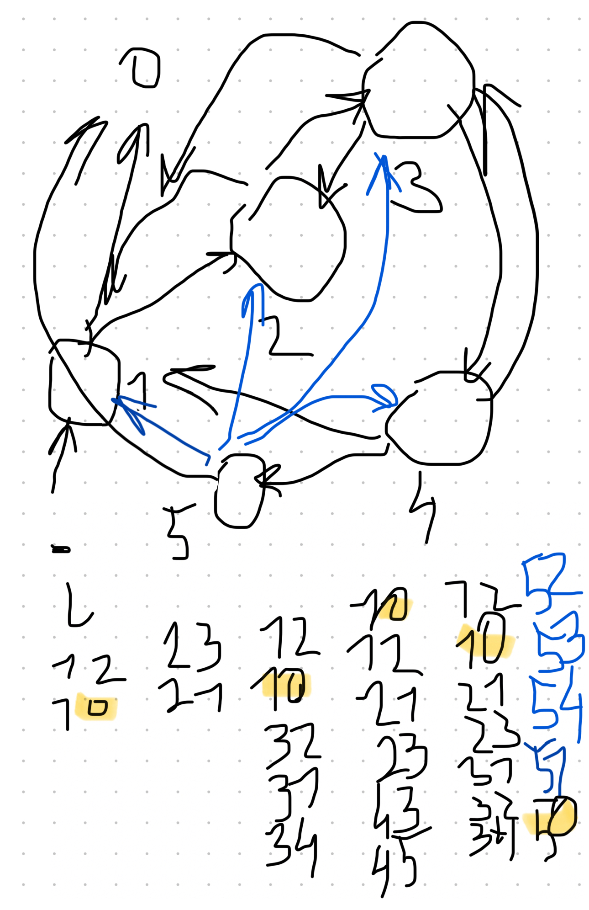

## Dynamics

Overall dynamics is very flexible, but we choose the smallest steps where the transition between two points is very deterministic.

$x_1$ is a tuple defining inputs to a neuron at a time point 1. $g(x_1)$ will give a resulting value $s_1$ stored in the neuron. It’s a summation. Yes, on this level and at this moment it’s just the summation. My remark that neurons can do better was not about this part.

$t$ is an activation threshold. if $g(x_1) \gt t$ then $s_1 = g(x_1) - t$ and we send activation potential to all connected neurons on the time 2.

$x_2$ is another tuple for the input coming in the following time point 2. 

Function $f(x_1, x_2)$ can calculate the resulting state of the neuron based on previous input and a new one. For example if we get repeating inputs in appropriate intervals then potential rises and leads to activation. 

All neurons form a graph $G$ of connections between each other. At some point we know what signal what neurons receive $G_1$, calculate f and that’s how we have the next state of the network $G_2$.

I think it’s interesting to review the change $d(G_2, G_1)$. If $G_1$ equals $G_2$ then $d = 0$. It’s an equilibrium.

## Counting example

Can we take some network of spiking neurons and teach them to count to five? By count I mean that they must respond to incoming impulse as switching to the state that will continuously activate five times and then switch off. I assume that training data should be artificially designed for this type of behavior. It will induce negative feedback if amount of impulses is less or more than five.

For example, receive one input

- no activation, five negative responses
- one activation, four negative responses
- 2 activations, 3 negative responses
- 3 activations, 2 negative responses
- 4 activations, 1 negative response
- 5 activations, no negative response
- 6 activations, 1 negative response

For a function of negative response minimization, we see one minimum for 5 activations.

Maybe the network has more than 5 neurons and they create connections between input and output and other 4 neurons that work as a counter and self stimulation.

So now, this seems possible but how do we create such a network just by reacting to the same feedback that directs by negative response when output sequence is not equal to five impulses.

