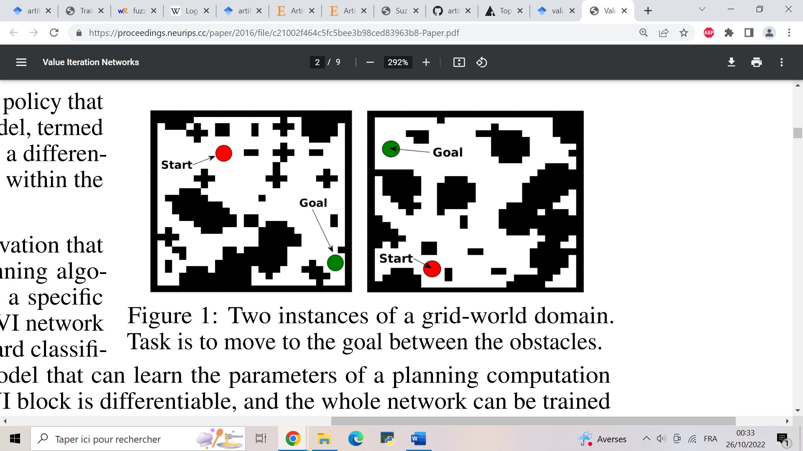
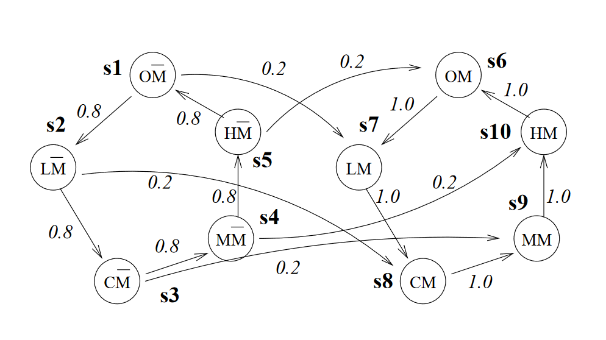

Neural networks, classification and clusterization algorithms are considered to be intelligent as far as they are part of Artificial Intelligence. But can they create novel independent decisions? Plan their execution algorithm and improve it over time?

And when I ask these questions I don't want to focus on specific aspects like "improving the algorithm". Because I can manually add some genetic algorithm to the system, and voila, it improves some characteristic over time. Instead I want the system to decide itself if it needs improvement, or a change - all of it depending on its goals.

In another words, if the environment changes, the system can use its prior knowledge to learn and adapt to new conditions. In terms of current AI paradigm: it doesn't need new training and testing set and training process for many hours and days on many GPUs. Is it possible?

Appropriate keywords:

- incremental learning
- generative neural networks

## Papers

- [Reinforcement Learning](http://incompleteideas.net/book/the-book.html): An Introduction by Richard S. Sutton and Andrew G. Barto  [Another link to PDF](https://web.stanford.edu/class/psych209/Readings/SuttonBartoIPRLBook2ndEd.pdf)
- MDP formal description https://arxiv.org/pdf/2006.05879.pdf (wikipedia as always sucks)
- More math https://games-automata-play.github.io/blog/dynamic_algorithms_MDP/
- [Big review of many other planning techniques](https://arxiv.org/pdf/1105.5460.pdf) in **Decision-Theoretic Planning: Structural assumptions and Computational Leverage**. Task of making coffee, checking mail and cleaning the room. MDP to bayesian network. Task decomposition - partitioning of the state space into blocks - exactly my thought that infinite grid world doesn't exist, it's only possible to process small rooms and then combine them. But how such rooms are created? 
- [Reward is not Necessary](/ai/reward-is-not-necessary.md). Temporal goals https://arxiv.org/pdf/2211.10851.pdf
- Unpredictable transitions https://gaips.inesc-id.pt/~fmelo/publications/witwicki13icaps.pdf
- Dynamic states with fixed initial one https://finale.seas.harvard.edu/files/finale/files/doshi-velez-tpami-2015.pdf
- Dynamic state space https://www.frontiersin.org/articles/10.3389/fncom.2021.784592/full <<<=== this is something very related to what I was - hoping to find. It's 2022, imagine how fresh it is!
- When there is a reward function and values assigned to the states, some of them receive significant values which makes them standout across the others. Such special states we call goals - because they apparently very important for the agent. With some logic added to this we can decompose goals and have more meaningfull model. **Prioritized Goal Decomposition of Markov Decision Processes: Toward a Synthesis of Classical and Decision Theoretic Planning** [PDF](https://www.cs.toronto.edu/~cebly/Papers/decomposition.pdf)
- [GLAMOR](https://openreview.net/pdf?id=V6BjBgku7Ro) - learn the world models by modeling inverse dynamics. [Code](https://github.com/keirp/glamor). Use conditional probabilities and Bayes' rule to find the best sequence of actions (like language sequences of tokens)

## Code 

May be good for the implementation

- Straight-forward implementation, but code can be useful https://github.com/sawcordwell/pymdptoolbox/blob/master/src/mdptoolbox/mdp.py
- Not bad Python code https://github.com/coverdrive/MDP-DP-RL/blob/master/src/processes/mdp.py
- https://github.com/infer-actively/pymdp

My implementation of MDP didn't converge. In reinforcement learning the reward function must be designed for the task, and I put there wrong values. I put 10 points for reaching the goal, -20 as penalty for other states. Changing to 0 and -1 respectively gives 100% convergence. Here's the [source of enlightenment](https://link.springer.com/article/10.1023/A:1007355226281)

> When the problem solver reaches a goal state, we can provide a fixed reward (e.g., zero) and terminate the search (i.e., the goal states are absorbing states). With this reward function, the cumulative reward of a policy is equal to the negative of the cost of solving the problem using that policy. Hence, the optimal policy will be the policy that solves the problem most efficiently.

### Examples

- [Social media bot](/ai/mdp-example-social-media-bot)

## Value Iteration Networks

There is this repo [here](https://github.com/itdxer/neupy)

> Exploring world with Value Iteration Network (VIN) One of the basic applications of the Value Iteration Network that learns how to find an optimal path between two points in the environment with obstacles.

from an article (2017 Aviv Tamar, Yi Wu, Garrett Thomas, Sergey Levine, and Pieter Abbeel - [Value Iteration Networks](https://arxiv.org/pdf/1602.02867.pdf))

> We introduce the value iteration network (VIN): a fully differentiable neural network with a ‘planning module’ embedded within. VINs can learn to plan, and are suitable for predicting outcomes that involve planning-based reasoning, such as policies for reinforcement learning.

Here's a bold claim accusing RL in only maximizing one action over a smart strategy

> [Typical NNs] are inherently reactive, and in particular, lack explicit planning computation. The success of reactive policies in sequential problems is due to the learning algorithm, which essentially trains a reactive policy to select actions that have good long-term consequences in its training domain.

So I skipped simple ANN implementations and [tried VIN](https://github.com/avivt/VIN). I had git problems here. I found a fork with a fix. I also found that VIN is implemented in [PyTorch](https://github.com/kentsommer/pytorch-value-iteration-networks) and [TensorFlow](https://github.com/TheAbhiKumar/tensorflow-value-iteration-networks) which means I don't need to use neupy library. 

## Questions

From the MDP definition I do not see if an agent can carry information obtained in one of the states, in case if we view a state as a position in the two-dimensional grid.

Because if we add that information to the state, then all states must include this extra level, so in another terms, the agent travels into another world, where the grid is the same, but it must learn transitions between them from scratch.

Here's an illustration of two connected worlds I found in the article: one without mail in the mailbox (M = false) and another when a postman delivered mail (M = true). Otherwise the loop is the same.

