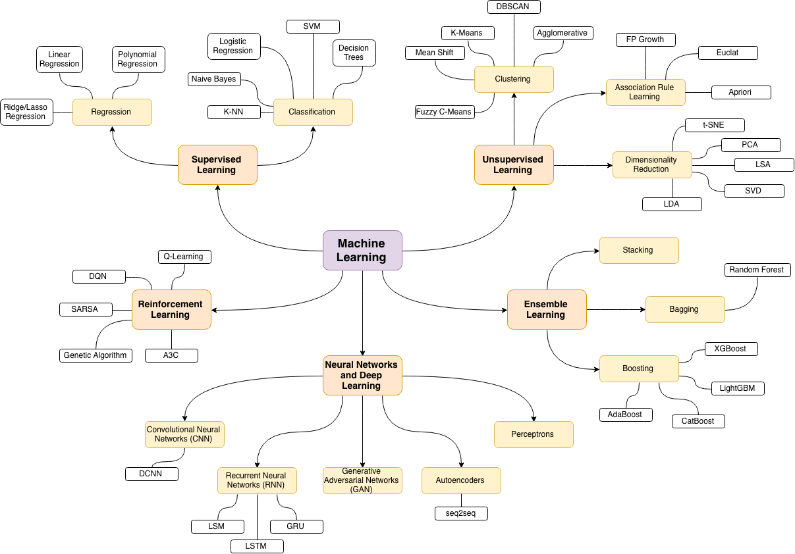

First a quick overview of current branches in machine learning (by [Oleksii Trekhleb](https://github.com/trekhleb/homemade-machine-learning))

# My roadmap

## Biological neuron and mathematical models

I started with an [article on Wikipedia about neuron](https://en.m.wikipedia.org/wiki/Neuron). I needed to clear all biological moments, understand new terminology, start with early research on the topic and catch up with the latest results.

Phrase "the most negative threshold potential" led me to a specific article about [threshold potential](https://en.m.wikipedia.org/wiki/Threshold_potential). It reviews the neuron from electrical side.

I should read more about [**Neural coding**](/ai/neural-coding) in the future, but I couldn't resist to visit a citation that must explain how neuron can code digital and analog data: Thorpe SJ (1990). ["Spike arrival times: A highly efficient coding scheme for neural networks"](/ai/reviews/spike-arrival-times-a-highly-efficient-coding-scheme-for-neural-networks). Funny, it's a small note that proposes use of time (relative time between spikes) for encoding. It looks as a simple change, but for ANN models it's something radically new. In respect of that I should read about [Spiking Neural Networks](/ai/spiking-neural-networks). **->**

After pure biological overview it's time to glance at current models. [Biological neuron model](https://en.wikipedia.org/wiki/Biological_neuron_model)

The best model from 1952 is [Hodgkin–Huxley model](https://en.wikipedia.org/wiki/Hodgkin%E2%80%93Huxley_model). It received the Nobel prize in 1963. Based on squid neurons. Think about it ordering fried calamari next time.

There are simplified models, but the main question is how to train them. For example _adaptive exponential integrate-and-fire model_ (AdEx) and its implications described by Naud R, Marcille N, Clopath C, Gerstner W. (2008) [Firing patterns in the adaptive exponential integrate-and-fire model](https://www.ncbi.nlm.nih.gov/pmc/articles/PMC2798047/#!po=48.6842). Despite it's a [simple one-dimensional model](https://en.wikipedia.org/wiki/Exponential_integrate-and-fire), it can simulate precisely many potential measurements graphs. And I find a [Python library](https://neuronaldynamics-exercises.readthedocs.io/en/latest/exercises/adex-model.html) for this model. I don't understand how they produce all different firing patterns. Is it just a play with model parameters or I missed a paragraph about training?

I read [Chapter 17](https://link.springer.com/referenceworkentry/10.1007/978-3-540-92910-9_17) from **Handbook of Natural Computing** (2012), where I notice one big omission after reading Wikipedia. The synapse can be either electrical or chemical. This must be included into next improved roadmap version as the second step.

What are the key examples of the use of computational methods in the study of biological neural networks? [Q](https://psychology.stackexchange.com/questions/1391/what-are-the-key-examples-of-the-use-of-computational-methods-in-the-study-of-bi?rq=1)

## Network organization

Let's say we figured out neuron and synapse level, but how do we organize our network? Connections are not following the same pattern, exceptions are everywhere. (Read about [**Local connectivity and synaptic dynamics in mouse and human neocortex**](https://www.science.org/stoken/author-tokens/ST-374/full)) Should we copy connections [from a real brain](/ai/brain-map)? Should we stick to one pattern? How many neurons to consider? I think here should be study about different neuron connections and their properties. Thus based on the qualities we need, we can construct a network satisfying our requirements.

Authors of the book [Handbook of Natural Computing] see the answer to _how the network structure can influence the functionality of the system_ in the work of Johnson S, Marro J, Torres JJ (2008) [Functional optimization in complex excitable networks](https://arxiv.org/abs/0805.1309). Connections don't change, but neurons still can alter them by chemical control. This alteration happens constantly, but how do we preserve memories, our personality? Perhaps there are another levels that don't change. Is there a study that classifies NNs into such memory writers?

To answer that there are metastable states in the work of Rabinovich MI, Huerta R, Varona P, Afraimovich VS (2008) [Transient cognitive dynamics, metastability, and decision making](https://journals.plos.org/ploscompbiol/article?id=10.1371/journal.pcbi.1000072). Which I find rich for mathematical background and interesting for exercises, but not answering the question in terms of NNs, though interesting research to revisit later.

Then I switch to a huge topic called [Synaptic plasticity](https://www.nature.com/articles/1301559). Which actually brought me to a dead end. Not because the idea is dead, but because it introduces so many biological terms about chemical processes in neurons that I stop understanding this and other articles on the second sentence. I'll need to return to this topic when I will have interactive model ready. **->**

> Neural plasticity, the alteration of function in response to experience, is a basic property of the nervous system that can be observed at the level of neural networks. Long-Term Potentiation (LTP) refers to a persistent enhancement of synaptic transmission following high frequency stimulation and is thought to reflect the cellular processes underlying learning and memory. The induction of LTP is dependent on activation of NMDA receptors, which are inhibited by organic solvents. 
>
> _Christoph van Thriel, William K. Boyes, in Advances in Neurotoxicology, 2022_

> Plastic changes can also include the ability of the neurons to change their function and the amount and type of neurotransmitter they produce. [...] Although most of the 100 billion neurons are already formed at birth, neurons continue to make connections with other structures through dendritic branching and by remodeling other connections.
>
> _Donna J. Cech DHS, PT, PCS, Suzanne “Tink” Martin MACT, PT, in Functional Movement Development Across the Life Span (Third Edition), 2012_

## Feedback loops

Trying to digest information from the list above, I started thinking about possible neural connections between sensors and motors, I put one neuron in between and it already reminded me very simple perceptron. So instead of going the same route as Rosenblat and Minsky in 60s-80s, I raised my first question: How to connect the second neuron? Can it be connected in reverse that will make a loop? So I started looking for _neuron feedback loop_. 

Here is is my question [asked by someon else](https://psychology.stackexchange.com/questions/15932/are-there-neural-loops-within-a-column-or-an-area-of-the-cortex) on StackExchange network. The short answer is yes, there are loops. And list of literature is provided.

**The Mechanisms and Roles of Neural Feedback Loops for Visual Processing** (2010) by Debajit Saha - a dissertation about [eyes of the turtle](https://openscholarship.wustl.edu/cgi/viewcontent.cgi?article=1306&context=etd), but mainly it leads me to a [scheme showing connections between neurons](https://www.pnas.org/doi/10.1073/pnas.0712231105) and more details in the [appendix](https://www.pnas.org/action/downloadSupplement?doi=10.1073%2Fpnas.0712231105&file=12231Appendix.pdf).

But again, I don't want to mimic connections from a real brain. Thus next I find a website that probably reviews everything that I found before so far and [it gives classification to neuron connections](https://nba.uth.tmc.edu/neuroscience/m/s1/introduction.html)

**Evoked brain responses are generated by feedback loops** - [feedback loop explained by bayesian model](https://www.pnas.org/doi/10.1073/pnas.0706274105). Not easy to understand, but it's a good reference to bayesian (probabilistic) models I think.

[There are experiments](https://www.frontiersin.org/articles/10.3389/fncir.2012.00121/full) where to a culture of cortical neurons connect integrated circuit, read its signal and respond back. This way researchers can verify theories about plasticity, memory and training. This particular article doesn't get anything meaningful from neurons.

[Training algorithm](https://www.ncbi.nlm.nih.gov/pmc/articles/PMC2559979/) to teach real neurons. Wild. Maybe I'll return back to this article, but as they write: "Even though many details of cellular biology and electrode physics were absent from the model network...".

**DNN cyclic inter layer connections**. _Deep neural networks using a single neuron: folded-in-time architecture using feedback-modulated delay loops_ (https://www.nature.com/articles/s41467-021-25427-4)

## Piaget's theory of cognitive development

- https://en.m.wikipedia.org/wiki/Piaget%27s_theory_of_cognitive_development
- behavior. An artificial visual cortex drives behavioral evolution in co-evolved predator and prey robots https://dl.acm.org/doi/10.1145/2330784.2330838

## Multi network system

Somewhere here I was interjected with a random recommendation. A speach from one conference in 2011 about [shifting the paradigm in robotics](http://www.robotics.tu-berlin.de/fileadmin/fg170/Publikationen_pdf/berlin_summit_2011.pdf). I found new interesting terms like _developmental psychology_, _morphological computation_, but they compare brain capabilities with current robot developments. I don't like such dull comparison when they highlight challenges in robotics and then say that the brain has more neurons but much slower and yet can solve all problems. Maybe because they formulate AI goal in a way that I think is absurd: here's input from camera - your eyes, here's other sensor metrics, now you need to be smart as human, so move to point B and avoid all obstacles. Why are you still standing?

How to understand the goal? Even more, how to understand movements and think about solutions in unknown environment?

Then I'm going back to two neurons that I drew in my notebook, I know that they can make a loop, and also I think that one neural network is not enough. I've read about ganglions - cluster of neurons that do preprocessing.

 [accessed 14 Sep, 2022]")

_Multiple neural network systems_, but not when they are trained on different parameters and replace each other, but when they [must work in conjunction](https://citeseerx.ist.psu.edu/viewdoc/download?doi=10.1.1.497.5717&rep=rep1&type=pdf). **A theoretical framework for multiple neural network systems** by Mike Shields and Matthew Casey. Graph theory and some algebra - very nerdy and heavy.

For example Recurrent Neural Networks (RNN) have connection loops and specific memory nodes that together allows it to be Turing complete

Also [Model-Agnostic Meta-Learning](https://arxiv.org/pdf/1703.03400.pdf) (MAML) look like a multi network system

## Temporal encoding

22. Also temporal encoding of analog data is really intriguing topic that I want to figure out. Can be found in [this online book](https://neuronaldynamics.epfl.ch/online/index.html) that I immediately added to [my reading list](/science/reading-list).
23.
24. But then [research from Google team](https://arxiv.org/pdf/1907.13223.pdf) very disappointed me. It must be a method of how to encode temporal data, that everyone citing to. And indeed, they encoded data, but just like programmers would do just to replace time with data that has weights that can be trained with very familiar practive of backpropagation.

## Sensorimotor

[Sensory-motor coupling](https://en.m.wikipedia.org/wiki/Sensory-motor_coupling)

23. I'll try to focus only on [motor information](https://www.jneurosci.org/content/35/30/10888). When I started reading this paper, I thought: Every robotics engineer must read this and think in such terms.
24. There are already many attempts to create a neuron out of silicone (meaning by designing an integrated circuit) [Nullcline-Based Design of a Silicon Neuron](https://0795f079-a-62cb3a1a-s-sites.googlegroups.com/site/arindambasu/writings/2010_J2.pdf) that I found from in [a big report](https://apps.dtic.mil/sti/pdfs/AD1101848.pdf) by Yang Yi: Enabling Brain-Inspired Processors Through Energy-Efficient Delayed Feedback Reservoir Computing Integrated Circuits.

- Coordination Dynamics in Cognitive Neuroscience - https://www.frontiersin.org/articles/10.3389/fnins.2016.00397/full
- Cortical coordination dynamics and cognition by Steven L. Bressler and J.A. Scott Kelso http://www.ccs.fau.edu/~bressler/pdf/TICS01.pdf (found at https://www.semanticscholar.org/paper/Cortical-coordination-dynamics-and-cognition-Bressler-Kelso/1a10508b6fdc44a2f1cc0a62659b0c87e46f8642)
- Toward a self-organizing pre-symbolic neural model representing sensorimotor primitives https://www.frontiersin.org/articles/10.3389/fnbeh.2014.00022/full

[Reservoir Computing](/ai/reservoir-computing) sounds very interesting. I've heard about it and abiout _Liquid State Machines_ when I was doing a search about Finite State Machines, and someone probably by mistake attached it into related articles.

The paper says that reservoir computing is good, essentially it just converts the problem to a higher dimension (why? when everyone tries to simplify the problem instead), implementation in software is slow, digital circuits are slow too, so let's do analog systems. And they provide circuits and explanation. Good, but no extensive comparison and explanation of reservoir benefits in the beginning. Only some simple tests in the end.
24. [Neural networks and manifolds](http://colah.github.io/posts/2014-03-NN-Manifolds-Topology/), [visualization of the learning process](https://cs.stanford.edu/people/karpathy/convnetjs//demo/classify2d.html)
25. 2001 S. Bressler, J. Kelso - Cortical coordination dynamics and cognition [PDF](http://www.ccs.fau.edu/~bressler/pdf/TICS01.pdf)

- [ANN 101](https://quantdare.com/understanding-neural-networks-with-graphs/)
- [Amazing NN catalogue](https://web.archive.org/web/20160221220505/http://tocs.ulb.tu-darmstadt.de/110876539.pdf) but in German only
- [DNN with cyclic connections](https://www.researchgate.net/publication/352493209_User_Driven_FPGA-Based_Design_Automated_Framework_of_Deep_Neural_Networks_for_Low-Power_Low-Cost_Edge_Computing)
- [2020 Cyclic graph multilayer perceptron](https://openreview.net/pdf?id=S1xSzyrYDB) - bleeding edge
- [Graph Neural Networks](https://distill.pub/2021/gnn-intro/)
- 2021 [DIRECTED ACYCLIC GRAPH NEURAL NETWORKS](https://jiechenjiechen.github.io/pub/dagnn.pdf)
- I believe that there is a homomorphism between ANN and SNN. Wait, but can xNN be defined as an algebraic structure? Of course: [Modelling a neural network using an algebraic method](https://www.semanticscholar.org/paper/Modelling-a-neural-network-using-an-algebraic-Sugunnasil-Somhom/3de6d2dd204958731f0d3eeccdc317547b5a9413)
- [Algebraic Neural Networks](https://arxiv.org/pdf/2009.01433.pdf)
- Very optimistic article about [Reinforcment learning](https://www.semanticscholar.org/paper/Reinforcement-learning-in-artificial-and-biological-Neftci-Averbeck/951af7222535d934ca2b401ca0cd2181b28284f9). At the end it says that SNN will change the world and overthrow Moore's law. But it answers many questions about neverending learning and about using the same neurons on different timescales - by different systems (learning vs predicting)

## Embodied Cognition

- https://plato.stanford.edu/entries/embodied-cognition/#FoilInspForEmboCogn

## LSTM

- https://machinelearningmastery.com/time-series-prediction-lstm-recurrent-neural-networks-python-keras/
- https://machinelearningmastery.com/multi-step-time-series-forecasting-long-short-term-memory-networks-python/
- keras implementation https://keras.io/guides/working_with_rnns/
- original paper (1997 Hochreiter Schmidhuber)  https://www.bioinf.jku.at/publications/older/2604.pdf
- panda timeseries https://pandas.pydata.org/docs/dev/getting_started/intro_tutorials/09_timeseries.html

## Terminology

- metastable cognitive states/modes [article](https://www.fil.ion.ucl.ac.uk/~karl/Transients,%20Metastability,%20and%20Neuronal%20Dynamics.pdf)
- transient cognitive (brain) dynamics
- read about layers in [Cerebral cortex](https://en.wikipedia.org/wiki/Cerebral_cortex) article
- in case you are bored looking at neurons, then extend your view by reviewing _extended mind thesis_
- temporal neural encoder
- neuromorphic computing systems
- [spike coded trains](https://www.frontiersin.org/articles/10.3389/fncom.2019.00082/full) - the sequence of neuronal firing timings
- [autoencoders](https://www.jeremyjordan.me/autoencoders/) - hidden layers in ANN, output is equal to input and learning formula L is special. Boring.
- Developmental psychology
- developmental learning
- Morphological computation
- Moravec's paradox
- symbolic AI
- Temporal neural encoder
- Neuromorphic computing systems
- Spike coded trains
- Comparative connectomics 
- Stage of cognitive development

## Quotes

> Symmetric reciprocal inhibition leads to multistability and this is not an appropriate dynamical regime for the description of reproducible transients. As we have shown [...], **nonsymmetric inhibition is an origin of reproducible transients** in neural networks.
> 
> Rabinovich et al, 2008

> As we’ve mentioned in sections above, we ultimately want to get away from the dataset-based approach...
>
> - How can one reliably and naturally communicate a task to the system?
> - Could there be some hybrid approaches with algorithmic logic on top of perceptual primitives (similar to Yang et al. (2015))?
> How can a primarily unsupervised machine interact well with humans?
> Many of these robotics questions have parallels within the context of neuroscience/cognitive science. As much as neuroscience may not be the easiest way to get these answers (due to the inherent complexity of the brain, and the difficulty in isolating the relevant effects), some convergence of the fields might yield fruitful insights.
>
> Filip Piekniewski et al, 2016

https://twitter.com/filippie509/status/1575512408566603776

> I think what is missing here is the “survival” module.  The only sentient systems we know are in perpetual survival mode. All their qualities, including sentience and reproduction are there to assure survival.
> 
> Anonymous https://twitter.com/locoqf2/status/1581326320738238464

## Literature

- [1990 Thorpe](https://web.archive.org/web/20120215151304/http://pop.cerco.ups-tlse.fr/fr_vers/documents/thorpe_sj_90_91.pdf) Spike arrival times: A highly efficient coding scheme for neural networks
- Naud R, Marcille N, Clopath C, Gerstner W. (2008) [Firing patterns in the adaptive exponential integrate-and-fire model](https://www.ncbi.nlm.nih.gov/pmc/articles/PMC2798047/#!po=48.6842)
- Handbook of Natural Computing. Chapter 17. Modeling Biological Neural Networks
- Samuel Johnson, J. Marro, and Joaqu ́ın J. Torres **Functional Optimization in Complex Excitable Networks** [arxiv](https://arxiv.org/abs/0805.1309)
- Rabinovich MI, Huerta R, Varona P, Afraimovich VS (2008) [Transient cognitive dynamics, metastability, and decision making](https://journals.plos.org/ploscompbiol/article?id=10.1371/journal.pcbi.1000072)
- [2020 Comsa](https://apps.dtic.mil/sti/pdfs/AD1101848.pdf) - Temporal Coding in Spiking Neural Networks with Alpha Synaptic Function Learning with Backpropagation
- [2008 Shields Casey](https://citeseerx.ist.psu.edu/viewdoc/download?doi=10.1.1.497.5717&rep=rep1&type=pdf) - A theoretical framework for multiple neural network systems
- [2015 Vargas-Irwin, Franquemont, Black, Donoghue](https://www.jneurosci.org/content/jneuro/35/30/10888.full.pdf) - Linking Objects to Actions Encoding of Target Object and Grasping Strategy in Primate Ventral Premotor Cortex
- [2010 Basu Hasler](https://sites.google.com/site/arindambasu/writings/2010_J2.pdf?attredirects=1) - Nullcline-Based Design of a Silicon Neuron
- [2016 Filip Piekniewski et al](https://arxiv.org/abs/1607.06854) Unsupervised Learning from Continuous Video in a Scalable Predictive Recurrent Network
- 2001 Bressler Kelso - Cortical coordination dynamics and cognition
- [2016](https://arxiv.org/pdf/1404.7828.pdf) Deep Learning in Neural Networks: An Overview

## Links

- [Neural Engineering Framework](https://web.archive.org/web/20121204133835/http://ctnsrv.uwaterloo.ca/cnrglab/node/215)
- [robomimic](https://robomimic.github.io/) is a framework for robot learning from demonstration
- [nice blog](http://colah.github.io/posts/2014-03-NN-Manifolds-Topology/)
- [nice post](https://maziarraissi.github.io/research/7_multistep_neural_networks/)
- Logical approach [McCulloch & Pitt's article: "A logical calculus of the ideas immanent in neural activity"](https://www.cs.cmu.edu/~./epxing/Class/10715/reading/McCulloch.and.Pitts.pdf)