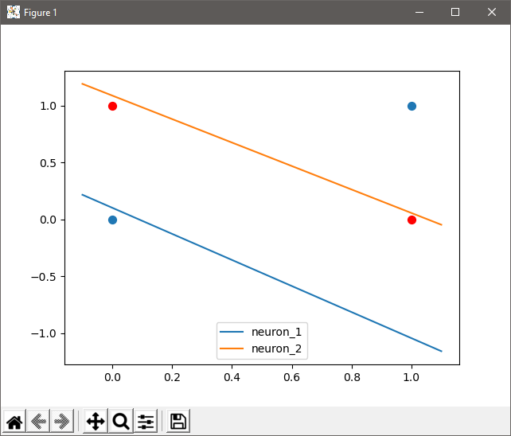
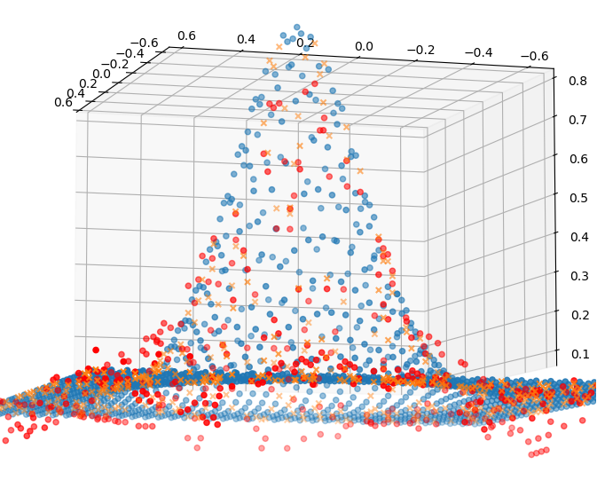
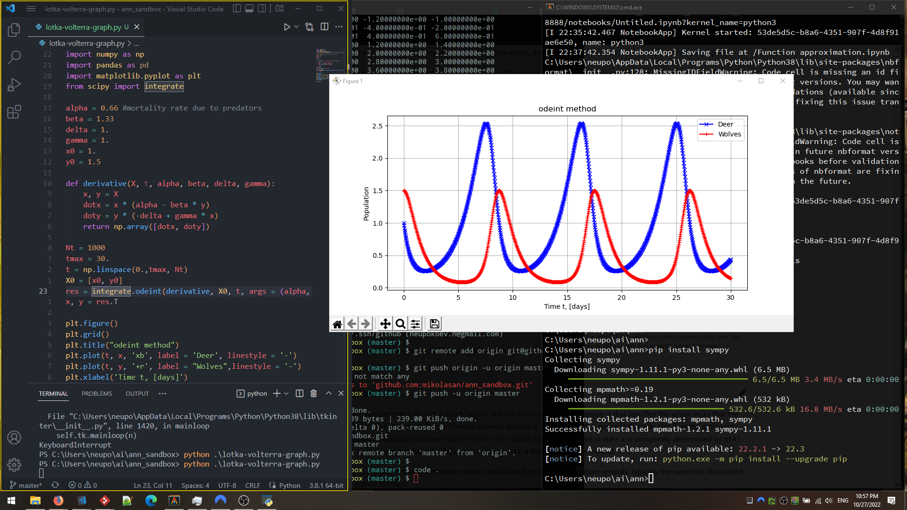

In this post we collect known research about Artificial Neural Networks and their property to approximate non-linear functions and logical statements. We review simple examples, and in the end we implement Reinforcement Learning purely as a Neural Network.

> ANN are universal function approximators
>
> Julien Pascal [mentioning the theorem and writing code in Julia](https://julienpascal.github.io/post/ann_1/)

This is our first step that carries important hypotesis that **any algorithm can be approximated by Neural Networks**.

But before we start, one word from our guest star, Mathuccino.

> My advice is **don't focus too much on articles**
>
> _@mathuccino_


So practice, practice, practice! We focus on examples implemented with PyTorch and also very transparent version without any ML framework.


## Backpropagation formally introduced

- classic and also biologically reasonable in [Artificial Neural Networks for Neuroscientists](https://www.sciencedirect.com/science/article/pii/S0896627320307054)
- superscript indecies for layers in [this big SO question](https://stats.stackexchange.com/questions/154879/a-list-of-cost-functions-used-in-neural-networks-alongside-applications) based on [free online book](http://neuralnetworksanddeeplearning.com/) by Michael Neilsen
- sequence of matrix-vector tuples in [Limitations of neural network training due to numerical instability of backpropagation](https://arxiv.org/pdf/2210.00805.pdf)
- multivariate vector-valued function [An induction proof of the backpropagation algorithm in matrix notation](https://arxiv.org/pdf/2107.09384.pdf)
- function on matrices [The Convex Geometry of Backpropagation: Neural Network Gradient Flows Converge to Extreme Points of the Dual Convex](https://arxiv.org/pdf/2110.06488.pdf)
- tensors, preactivation, activation finctions and Hadamard product in [DITHERED BACKPROP: A SPARSE AND QUANTIZED BACKPROPAGATION ALGORITHM FOR MORE EFFICIENT DEEP NEURAL NETWORK TRAINING](https://arxiv.org/pdf/2004.04729.pdf)
- neuron is a tree in [Backpropagation Neural Tree](https://arxiv.org/pdf/2202.02248.pdf)
- composition of functions in [INVARIANT BACKPROPAGATION: HOW TO TRAIN A TRANSFORMATION-INVARIANT NEURAL NETWORK](https://arxiv.org/pdf/1502.04434.pdf)
- Moore-Penrose pseudoinverse of a matrix in [ZORB: A Derivative-Free Backpropagation Algorithm for Neural Networks](https://arxiv.org/pdf/2011.08895.pdf)
- integrate-and-fire neurons with integration variable and threshold in [SpikeGrad: An ANN-equivalent Computation Model for Implementing Backpropagation with Spikes](https://arxiv.org/pdf/1906.00851.pdf)


## The simpliest ANN

First of all lets create the simpliest but non trivial perceptron - [neuron system that works as a XOR function](https://medium.com/mlearning-ai/learning-xor-with-pytorch-c1c11d67ba8e).
Two input neurons, two in the hidden layer, and one neuron - output. Simple as that:

- [nn.Module](https://pytorch.org/docs/stable/generated/torch.nn.Module.html)
- [MSELoss](https://pytorch.org/docs/stable/generated/torch.nn.MSELoss.html)

```py
import torch
import torch.nn as nn

epochs = 2001
X = torch.Tensor([ [0,0], [0,1], [1,0], [1,1] ])
Y = torch.Tensor([0,1,1,0]).view(-1,1)


class XOR(nn.Module):
    def __init__(self, input_dim = 2, output_dim=1):
        super(XOR, self).__init__()
        self.linear1 = nn.Linear(input_dim, 2)
        self.linear2 = nn.Linear(2, output_dim)
    
    def forward(self, x):
        x = self.linear1(x)
        x = torch.sigmoid(x)
        x = self.linear2(x)
        return x


def train(model):
    # initialize the weight tensor and bias
    linear_layers = [m for m in model.modules() if isinstance(m, nn.Linear)]
    for m in linear_layers:
        # here we use a normal distribution
        m.weight.data.normal_(0, 1)

    mseloss = nn.MSELoss() # mean squared error
    optimizer = torch.optim.SGD(model.parameters(), lr=0.02, momentum=0.9)

    for i in range(epochs):
        y_hat = model.forward(X)
        loss = mseloss(y_hat, Y)
        loss.backward()
        optimizer.step()
        optimizer.zero_grad()

```

[Full code](./ann_xor_function_pytorch.py) (plotting function is skipped for clarity)



I have a problem with 2000 epochs on some seed values. [This](https://machinelearningmastery.com/introduction-to-regularization-to-reduce-overfitting-and-improve-generalization-error/) might give an answer.

Later you might be tempted to review such simple systems further

- [The simplest artificial neural network possible](https://github.com/gokadin/ai-simplest-network) explained and demonstrated. Even if you don't code in Go, check out the theory - it's the "bone structure" you need to understand. [Better matrix pictures](https://towardsdatascience.com/understanding-backpropagation-algorithm-7bb3aa2f95fd)
- But if in the first place you want **math stuff**, then here is a [simple explanation](https://towardsdatascience.com/applied-deep-learning-part-1-artificial-neural-networks-d7834f67a4f6), or [about gradients](https://cs231n.github.io/optimization-2/), or [this chapter from free book](http://neuralnetworksanddeeplearning.com/chap2.html).
- [Machine-learning-without-any-libraries](https://github.com/pavankalyan1997/Machine-learning-without-any-libraries/blob/master/8.%20ANN/ANN.py) repo is designed to teach Machine Learning without any framework, no external dependencies (actually it requires: numpy, pandas, scikit-learn, matplotlib). In this example ANN has one hidden layer, tanh and sigmoid functions for activation, and backpropagation as learning algorithm. But it has wrong gradient for the output neuron. The way how functions pass values is far from readability, data loading can be orginized better, together with plotting functions it can eliminate all extra dependencies when only numpy will remain.
- Another [NumPy only version](https://github.com/ahmedfgad/NumPyANN/blob/master/TutorialProject/ann_numpy.py). My mistake, I started fiddling with ANN implementations by taking this code first. It doesn't have biases, no backpropagation, and no gradient descent in particular. Don't repeat my mistake.
- I don't know why all these examples are similar, like copied one from another without thinking, but [this article](https://towardsdatascience.com/how-to-build-a-deep-neural-network-without-a-framework-5d46067754d5) and [code](https://github.com/marcopeix/Deep_Learning_AI/blob/master/1.Neural%20Networks%20and%20Deep%20Learning/4.Deep%20Neural%20Networks/dnn_utils_v2.py) can be a good starting point. Someone tried to orginize code in small functions with some flexibility in mind. This and very space-y coding style make it hard to read. Take a look on the `cache` carried between forward and backward passes - it's very important concept for efficient implementation.
- In case you want to see how it can be orginized in classes, then here's [another post on Medium](https://towardsdatascience.com/how-neural-networks-solve-the-xor-problem-59763136bdd7)
- To do it clearly with no libraries, check out unbeatable and legendary Jason Brownlee [here](https://machinelearningmastery.com/implement-backpropagation-algorithm-scratch-python/). He has _some_ explanation about backpropaganation to the hidden layer (about multiplication on the weight matrix).
- [ANN Primer](https://www.sciencedirect.com/science/article/pii/S0896627320307054) for Neuroscientists. It covers the mathematical foundational aspects as well as the code for "hands on" experience. Around 30 examples are in [the repo](https://github.com/gyyang/multitask) (written for Tensorflow 1.8.0, Python 2.7 / 3.6)
- [Why cross-entropy better than mean squared error](https://jamesmccaffrey.wordpress.com/2013/11/05/why-you-should-use-cross-entropy-error-instead-of-classification-error-or-mean-squared-error-for-neural-network-classifier-training/) (better converges to 0 1 limits if we are using softmax on output)
- Play with another [cost functions](https://stats.stackexchange.com/questions/154879/a-list-of-cost-functions-used-in-neural-networks-alongside-applications)


So if you think library for machine learning is not making this example any simpler, then look how it would look with no external libraries (only numpy for matrix operations [don't know numpy - help!](https://numpy.org/devdocs/user/absolute_beginners.html)) 

```py
```


## Function approximation

Then let's [approximate the sin function](https://machinelearningmastery.com/neural-networks-are-function-approximators/) and generalize our knowledge for any function. What requirements stand for functions in order to be approximable by neural networks?

Later we will focus out research on aspects such as

- function sophistication (hypothesis: you get an excellent approximation but with apparently many more epochs needed)
- function properties: differentiable, continuous, smooth
- sinusoid and exponential (infinitely differentiable so no problems) -> approx with linear regression
- structural limitations of the network
- accuracy control

[Here is a blog post](https://blog.cubieserver.de/2019/approximate-function-with-neural-network/) which tackles a few of the last bullet points.



## Numerical differentiation

### Lotka Volterra model

[Theory and graphs](https://observablehq.com/@mbostock/predator-and-prey)

So I'm trying to find Python library for numerical differentiation. numpy should do it, but I don't see an example for function of two variables f(x, y) that depend on time - x(t), y(t).

For the multivariable thing you don't use numpy but [SymPy](https://docs.sympy.org/latest/tutorials/intro-tutorial/calculus.html).
[A more digestible tuto](https://www.askpython.com/python/examples/derivatives-in-python-sympy).
It also explains how to use the chain rule

For Lotka-Volterra ordinary differential equations

- sympy and scipi http://bebi103.caltech.edu.s3-website-us-east-1.amazonaws.com/2015/tutorials/r6_sympy.html
- algebraic solution with sympy https://ipython-books.github.io/157-analyzing-a-nonlinear-differential-system-lotka-volterra-predator-prey-equations/
- scipy with plot https://scientific-python.readthedocs.io/en/latest/notebooks_rst/3_Ordinary_Differential_Equations/02_Examples/Lotka_Volterra_model.html



## Logic statements in ANN

I've found two articles, more of a good read than a coding tutorial, it seems relevant:

1. [Emulating logical gates with a neural network](https://towardsdatascience.com/emulating-logical-gates-with-a-neural-network-75c229ec4cc9)
2. [How to teach logic to your neural networks](https://medium.com/autonomous-agents/how-to-teach-logic-to-your-neuralnetworks-116215c71a49). And in this last link, you will find a link to [TensorFlow Playground](https://playground.tensorflow.org/#activation=sigmoid&regularization=L2&batchSize=10&dataset=xor&regDataset=reg-plane&learningRate=0.03&regularizationRate=0&noise=0&networkShape=2,2,1&seed=0.00814&showTestData=false&discretize=false&percTrainData=90&x=true&y=true&xTimesY=false&xSquared=false&ySquared=false&cosX=false&sinX=false&cosY=false&sinY=false&collectStats=false&problem=classification&initZero=false&hideText=false), that could help you visualize your network. And the associated [GitHub page](https://github.com/tensorflow/playground)


## Develop new actions

> If it uses fixed model of states and actions then it's not good. Is there a model that can develop new actions and adapt to the environment?

I worked on [adaptive algos](https://www.allerin.com/blog/everything-you-need-to-know-about-adaptive-neural-networks) for my med internship. it's the natural extension of ANNs apparently when coupled with the neural network approach

A man-made adaptive neural network, also called an artificial neural network, is modeled after the naturally occurring neural networks in the brains of humans and animals.

It's the same thing as an ANN pretty much

Ok so the main use is for a single-layer algo. It's called [Adaline](https://www.allerin.com/blog/everything-you-need-to-know-about-adaptive-neural-networks) if you want

Seems like a good start before having to deal with 5364 layers

Activity Recognition with Adaptive Neural Networks - [Notebook](https://www.kaggle.com/code/malekzadeh/activity-recognition-with-adaptive-neural-networks) and [paper](https://arxiv.org/abs/2008.02397)


[Multi Layer Perceptron](https://scikit-learn.org/stable/modules/neural_networks_supervised.html) - I don't like this approach too much but just sending in case


I think conventional "training" is wrong because it stops once errors on test set are minimized which obviously reveals the flaw - the network can only do what it trained to do), but I see that ANN can approximate functions, can follow logical statements, can store information as memory. It creates a base for my theory. Some insights can be borrowed from neuroscience to advance ANN quality, but there must be a way to transfer connections into symbolism - extract functions, logic and memories encoded in ANN. So what we just did, but in reverse.


## Bonus reading

[This repo](https://github.com/ArztSamuel/Applying_EANNs) simulates a car that mustn't touch walls. "A 2D Unity simulation in which cars learn to navigate themselves through different courses. The cars are steered by a feedforward neural network. The weights of the network are trained using a modified genetic algorithm." Cars on C# is basically a "game" made on Unity game engine - hard to use as a standalone project. It was created 6 years ago - may be problems to run it on current Unity version. Also training by genetic algorithm is no go. The result is cool tho. (Unity, Genetic algorithm)

[Neural Network Zoo](https://www.asimovinstitute.org/neural-network-zoo/) and [a prequel](https://www.asimovinstitute.org/neural-network-zoo-prequel-cells-layers/) by Fjodor van Veen

Just another Python library - PyGAD. It's focused on optimization algorithms and genetic algorithms. Specifically [ANN module](https://pygad.readthedocs.io/en/latest/README_pygad_nn_ReadTheDocs.html) can be interesting in regards the current topic.