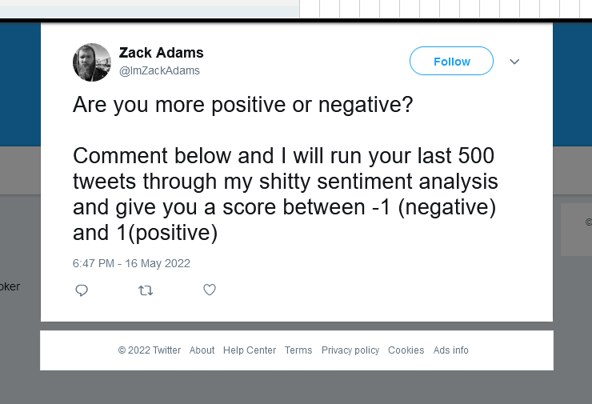
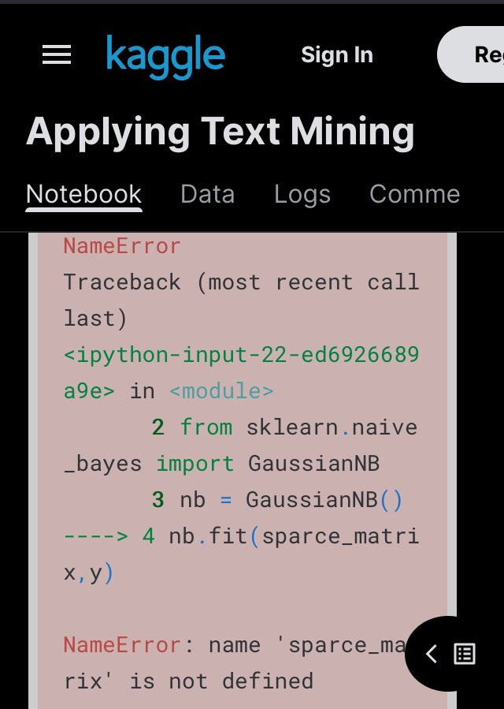

This idea based on [Zack's tweet](https://web.archive.org/web/20220517014800/https://twitter.com/ImZackAdams/status/1526378770277576704)

Let me repeat it here:

> run last 500 tweets through shitty sentiment analysis and give a score between -1 (negative) and 1(positive)

I also want to generate a special pretty badge that you can post to Twitter that will display a special trait like 😇 or 😈

First I might start with Twitter’s API to get some data that I want to work with. But I will start with manually crafted sentences first, then I will have understanding what programming language, where it can be hosted, then I will decide how to get fresh data and how to put all services together.

That already sounds fun. Also I want to touch the system from my master’s thesis, but rewrite it on Rust. Ideally host it for free or on a server powered by potato.

Normally first step would be to study deeply the theory of this topic. But let’s find some open source implementation on GitHub

[https://github.com/search?q=sentiment+analysis](https://github.com/search?q=sentiment+analysis)

Two projects seem to be very popular, so I will start with them.

- A set of [Python notebooks](https://github.com/bentrevett/pytorch-sentiment-analysis) using cool libraries and neural networks (start [https://towardsdatascience.com/how-to-launch-jupyter-notebook-quickly-26e500ad4560](https://towardsdatascience.com/how-to-launch-jupyter-notebook-quickly-26e500ad4560), set dark theme [https://stackoverflow.com/questions/46510192/change-the-theme-in-jupyter-notebook](https://stackoverflow.com/questions/46510192/change-the-theme-in-jupyter-notebook) `pip install jupyterthemes` `jt -l` `jt -t theme-name`
- [JavaScript tool](https://github.com/thisandagain/sentiment) based on a dictionary

While I’m reading about the process I see that the first step is always tokenization - in simple words a sentence understandable by humans is converted into a vector of words for ease procession by the algorithm. In such vector position of words is not important, which in my opinion removes like 90% of context and initial sentence with original meaning might be not possible to reconstruct.

install pytorch

`pip3 install torch==1.8.2 torchvision==0.9.2 torchaudio===0.8.2 --extra-index-url <https://download.pytorch.org/whl/lts/1.8/cu111`>

Holistic software

I don’t like super cool libraries that solve the problem for you. Because you need to grasp on their API first. It is always surrounded by new terms or data structures.

My plan is to get an idea about the methodology for about 10 min max. Set a timer and be conscious about it. Like on an exam, track your time left: 5 min, 2 min, 1 min.
## Sentiment analysis of the tweets dataset

Some threads collect thousands likes, but seems like no one really going through the links. For example [this kaggle](https://www.kaggle.com/code/kanncaa1/applying-text-mining/notebook) about text mining slowly going with string manipulation and regexes, but interesting classification at the end fails because some names are not defined 😖

Nevertheless it uses very interesting dataset. Guys from CrowdFlower decided to gues gender by text we write. Amazing, right?

> CrowdFlower team: to run a text mining experiment we pulled 20,000 tweets with the word “the” and the word “and”.
>
> me: Why?
>
> CrowdFlower team:
> 
<iframe src="https://giphy.com/embed/8GclDP2l4qbx6" width="100%" height="100%" style="position:absolute" frameBorder="0" class="giphy-embed" allowFullScreen></iframe>

<a href="https://giphy.com/gifs/lol-gif-shrugging-shrug-8GclDP2l4qbx6">via GIPHY</a>

Reading about it here: https://kdnuggets.com/2015/11/machine-learning-predict-gender.html

Data on kaggle: https://kaggle.com/datasets/crowdflower/twitter-user-gender-classification