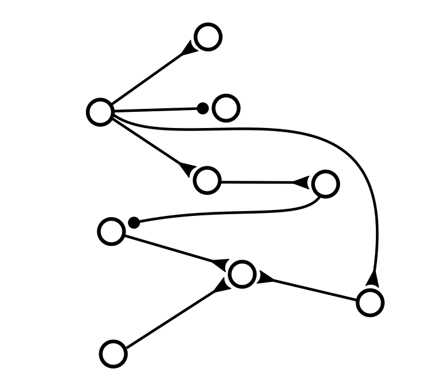
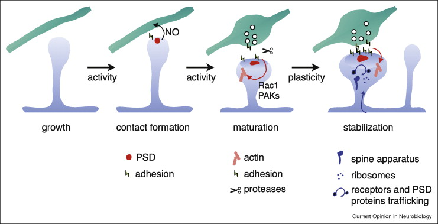

[The Cart Pole problem](http://www.derongliu.org/adp/adp-cdrom/Barto1983.pdf) was introduced by A.G. Barto, R.S. Sutton, and C.W. Anderson in "Neuronlike adaptive elements that
can solve difficult learning control problems". [Usually](https://www.tensorflow.org/tutorials/reinforcement_learning/actor_critic) it's solved by [Reinforcment Learning](/ai/reinforcement-learning)


Sutton and Burto wrote [the whole book](https://inst.eecs.berkeley.edu/~cs188/sp20/assets/files/SuttonBartoIPRLBook2ndEd.pdf) about Reinforcment Learning, so no wonder why their problem is solved this way, but today we will use [Spiking Neural Networks](/ai/spiking-neural-networks) to achieve one-shot learning and smooth movements

There's [an environment](https://gymnasium.farama.org/environments/classic_control/cart_pole/) where different implementations can be compared and scored (?). But the same as in original computer simulation from the paper the gym only allows to push the cart with constant force, but at any time interval. Controlling the amount of force will be our second goal.

## Design the network


1. The graph is not fully connected
2. Connections defined randomly and never change (presence of the connection, not its strength)
3. Simultaneous connections to layers deep inside the network
4. Feedback connections making closed loops




[This article](https://www.ncbi.nlm.nih.gov/pmc/articles/PMC4071954/) about dendrites led me to many important statements.

I searched for pictures of axon to dendrite connections. One lame artist made a picture for sale where many axon terminals from one neuron are connected to many dendrites of another neuron. Is this how synaptic strength can be increased?

> a dendritic arbor avoids multiple hits with the same axon, which could multiply not just actual synapses, but also potential ones. 
> Such avoidance results in a statistical repulsion between branches. 
>
> [_Maximization of the connectivity repertoire as a statistical principle governing the shapes of dendritic arbors_](https://pubmed.ncbi.nlm.nih.gov/19622738/)

Obviously that illustration was a dud. One neuron when excited sends the message to many postsynaptic neurons. Which corresponds to fully connected feed-forward network if we consider a local region in a column (otherwise we should change from _fully_ connected to _locally_ connected in some region).

If spines define synaptic strength, when do we make adjustments to this strength? Constantly.

> most spines that appear in adult animals are transient, and the addition of **stable spines and synapses is rare**.
>
> [_Anatomical and physiological plasticity of dendritic spines_](https://sabatini.hms.harvard.edu/files/sabatinilab/files/2007_alvarez_annrevnsci.pdf)

How many spines per dendritic shaft are we talking about? Some constant amount, but they can appear and disappear.

> motor learning induces rapid growth of new dendritic spines at mice contralateral motor cortex neurons, and subsequent elimination of spines existing before training, so the **overall spine density is relatively constant**
>
> [_Dendritic Spines Shape Analysis—Classification or Clusterization? Perspective_](https://www.frontiersin.org/articles/10.3389/fnsyn.2020.00031/full)


Answering my questions, How important for different axon terminals (coming from different axons) to be on one dendritic shaft comparing to connections on different shafts

> Signaling molecules may spread from active to inactive synapses. [...] the priming effect can spread about 10 μ, thereby sensitizing neighboring spines to an induction stimulus that would otherwise not lead to plasticity.
>
> [_Spike timing dependent plasticity: a consequence of more fundamental learning rules_](https://www.frontiersin.org/articles/10.3389/fncom.2010.00019/full)

Hebbian Rule -> Spike time-dependent plasticity -> Calcium-dependent plasticity [link](https://www.frontiersin.org/articles/10.3389/fncom.2010.00019/full)


If you stop the signal, then you stop the whole branch.

> In contrast to excitatory synapses, the vast majority of inhibitory synapses are located at the dendritic shaft and the cell body, while only a few inhibitory synapses in the neocortex are spine synapses
>
> [_Cytoskeletal makeup of the synapse: Shaft versus spine_](https://onlinelibrary.wiley.com/doi/10.1002/cm.21583)

Surprisingly, signals can go to nowhere

> In the adult rat, 80% of parallel fiber terminals occur on dendritic spines, 9% contact dendritic shafts, and approximately 11% do not have a postsynaptic partner. 
> Moreover, 20% of terminals can be shared by two dendritic spines. 
> [...] **a vast majority of the axonal terminals are not motile.**
>
> [_Dynamics of dendritic spines and their afferent terminals: spines are more motile than presynaptic bouton_](https://www.sciencedirect.com/science/article/pii/S0012160604006657#aep-section-id29)


When spines are developed and when they are pruned https://www.frontiersin.org/articles/10.3389/fnsyn.2020.00036/full

**Dendritic spine formation and stabilization** (no access) https://www.sciencedirect.com/science/article/abs/pii/S0959438809000518




> Each muscle fiber is innervated by only one motor neuron but a single motor neuron can innervate multiple muscle fibers.
>
> [_Nervous System Control of Muscle Tension_](https://open.oregonstate.education/aandp/chapter/10-4-nervous-system-control-of-muscle-tension/)

The total muscle tension is the sum of tension generated by all motor units in the muscle.


```bash
C:\Users\neupo\miniconda3\Scripts\activate.bat
conda create -n cartpole python=3.10
conda activate cartpole
pip install notebook
jupyter notebook
```

```jupyter
!pip install gymnasium
import gymnasium as gym
env = gym.make('CartPole-v1')

observation, info = env.reset()
action = env.action_space.sample()
num_actions = env.action_space.n

observation, reward, terminated, truncated, info = env.step(action)

if terminated or truncated:
  observation, info = env.reset()

env.close()
```