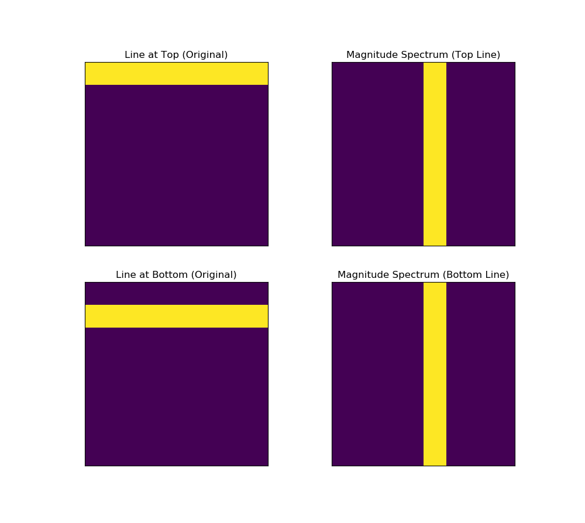

What are invariants in ANN? If some features extracted from the input data stay unchanged under some types of transformation like rotation, translation, scaling or other, then such features are invariant. This allows, for example, to recognize the same object from different angles. For models like YOLO (and other CNN networks) the training data is prepared in a special way (data augmentation) when transformations like scaling, rotation, adding different backgrounds applied to the original images. Also this way more training data will be available which is usually better for deep neural networks.

We are going to review here such mathematical method as the Fourier Transform. It decomposes a signal into its frequency components. 


The Discrete Fourier Transform (DFT) is computed as:
$$
F(k) = \sum_{n=0}^{N-1} f(n) e^{-2\pi i kn / N}
$$
where 
- $N$ is the total number of samples,
- $f(n)$ is the $n$-th sample, and
- $k$ is the frequency bin index.

The magnitude spectrum of the Fourier Transform can help us to extract invariants because the translation of a signal in the spatial domain only affects the **phase** of its Fourier Transform, not the magnitude. Thus, if two signals are identical except for a translation, their magnitude spectra will be the same.

Let's work through an example to illustrate how this works. It will be a 2D example where we apply the DFT on an 8x8 matrix of integers in the $[0, 10]$ interval. Let's consider horizontal lines: one line at the top of 8x8 matrix and horizontal line at the bottom of that matrix, what magnitude spectrums are they going to have?

```python
import numpy as np
import matplotlib.pyplot as plt

# Random
#np.random.seed(42)  # For reproducibility
#signal_2d = np.random.randint(0, 11, size=(8, 8))

# Create two 8x8 matrices: one with a horizontal line at the top, 
# and one with a line at the bottom
line_top = np.zeros((8, 8), dtype=int)
line_bottom = np.zeros((8, 8), dtype=int)

# Horizontal line at the top (first row filled with 1s)
line_top[0, :] = 1

# Horizontal line at the bottom (last row filled with 1s)
line_bottom[1, :] = 1

# Compute the 2D Fourier Transform for both matrices
dft_top = np.fft.fft2(line_top)
dft_bottom = np.fft.fft2(line_bottom)

# Shift the zero frequency component to the center
dft_top_shifted = np.fft.fftshift(dft_top)
dft_bottom_shifted = np.fft.fftshift(dft_bottom)

# Calculate the magnitude spectrum for both
magnitude_spectrum_top = np.abs(dft_top_shifted)
magnitude_spectrum_bottom = np.abs(dft_bottom_shifted)

# Plot both signals and their magnitude spectrums
fig, axs = plt.subplots(2, 2, figsize=(10, 10))

# Original signals
axs[0, 0].imshow(line_top)
axs[0, 0].set_title('Line at Top (Original)')
axs[0, 0].set_xticks([])
axs[0, 0].set_yticks([])

axs[1, 0].imshow(line_bottom)
axs[1, 0].set_title('Line at Bottom (Original)')
axs[1, 0].set_xticks([])
axs[1, 0].set_yticks([])

# Magnitude spectrums
axs[0, 1].imshow(np.log(1 + magnitude_spectrum_top))
axs[0, 1].set_title('Magnitude Spectrum (Top Line)')
axs[0, 1].set_xticks([])
axs[0, 1].set_yticks([])

axs[1, 1].imshow(np.log(1 + magnitude_spectrum_bottom))
axs[1, 1].set_title('Magnitude Spectrum (Bottom Line)')
axs[1, 1].set_xticks([])
axs[1, 1].set_yticks([])

plt.show()

print(magnitude_spectrum_top, magnitude_spectrum_bottom)
```

The result looks like this
