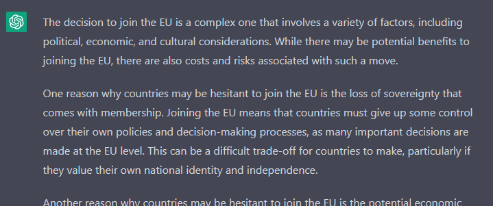

Last Sunday on a hike I was thinking if robots can love. I somehow came to that topic after reviewing [associative memory](/ai/bidirectional-associative-memories) and an ability of NNs to represent abstract concepts. Of course I easily moved from connectionism to symbolism considering ontologies and logical rules.

## Idea

If there was such a system, I would tell it historical events and ask to predict alternative course of actions. If it managed to convince me of the realism of the predictions, then the system successfully passed the test.

I decided to give ChatGPT (version 3) a chance. I started with the possibility to join the European Union and also asked about the world without borders and free trade.

> The decision to join the EU is a complex one that involves a variety of factors, including political, economic, and cultural considerations. While there may be potential benefits to joining the EU, there are also costs and risks associated with such a move.
>
> One reason why countries may be hesitant to join the EU is the loss of sovereignty that comes with membership. Joining the EU means that countries must give up some control over their own policies and decision-making processes, as many important decisions are made at the EU level. This can be a difficult trade-off for countries to make, particularly if they value their own national identity and independence.
>
> Another reason why countries may be hesitant to join the EU is the potential economic costs. While there may be benefits to joining the EU, there are also costs associated with meeting the EU's strict regulatory and economic requirements. In some cases, these costs may outweigh the potential benefits, particularly for smaller countries that may struggle to compete with larger economies within the EU.
>
> Finally, it's worth noting that the EU is not a perfect institution, and there are legitimate criticisms of its policies and practices. Some people may feel that the costs of membership, including the financial costs of paying bureaucrats and maintaining borders, outweigh the benefits of joining the EU.

Seems like this AI says that EU countries do not value their identity and independence

> The question of why countries still maintain borders and trade barriers if removing them could boost trade and economic growth is a complex one, and there are many factors at play. Here are a few possible reasons:
>
> - Political factors: Removing borders and trade barriers requires a high level of political will and cooperation between countries. Political differences or tensions between countries can make it difficult to reach agreements that would remove trade barriers and open up markets.
> - Protectionism: Some countries may maintain trade barriers to protect their domestic industries from foreign competition. This can be driven by concerns about job losses or unfair competition, or by a desire to protect strategic industries.
> - Regulatory differences: Differences in regulations and standards between countries can also create barriers to trade, as companies must navigate different regulatory environments and meet different requirements to sell their products in different countries.
> - Legal issues: Removing trade barriers can require complex legal negotiations, including the negotiation of trade agreements and the resolution of disputes between countries. These legal issues can be time-consuming and costly to resolve.
> - National security concerns: Some countries may maintain trade barriers for national security reasons, such as restricting the export of certain goods that could be used for military purposes.

But the system that I'd like to interrogate must rely heavily on concrete facts and demonstrate logic behind it. However, GPT systems floating somewhere at the level near to random guesses. Proof: https://github.com/google/BIG-bench/tree/main/bigbench/benchmark_tasks/fact_checker

## Research

But can NNs make logical conclusions? Induction, deduction, abduction?

This topic is called **logical reasoning**.

> Combining research in hint related education and learning research, a few general rules for hint design could be summarized. For example, a typical design of the hint should not directly explain the intended concept in full, but partially suggest the concept with pieces of indirect but practical information. Moreover, common usage of the hints is through a series of logical deductions exhausting all possible hints in combination with the knowledge learned to arrive at the most likely concept in question, which is similar to human deductive reasoning from known clues.

https://www.frontiersin.org/articles/10.3389/frobt.2018.00086/full

---

**Abductive learning**; logic level affects neural network

> while logical reasoning can exploit _symbolic domain_ knowledge and correct the wrongly perceived facts for improving the machine learning models

https://proceedings.neurips.cc/paper/2019/file/9c19a2aa1d84e04b0bd4bc888792bd1e-Paper.pdf