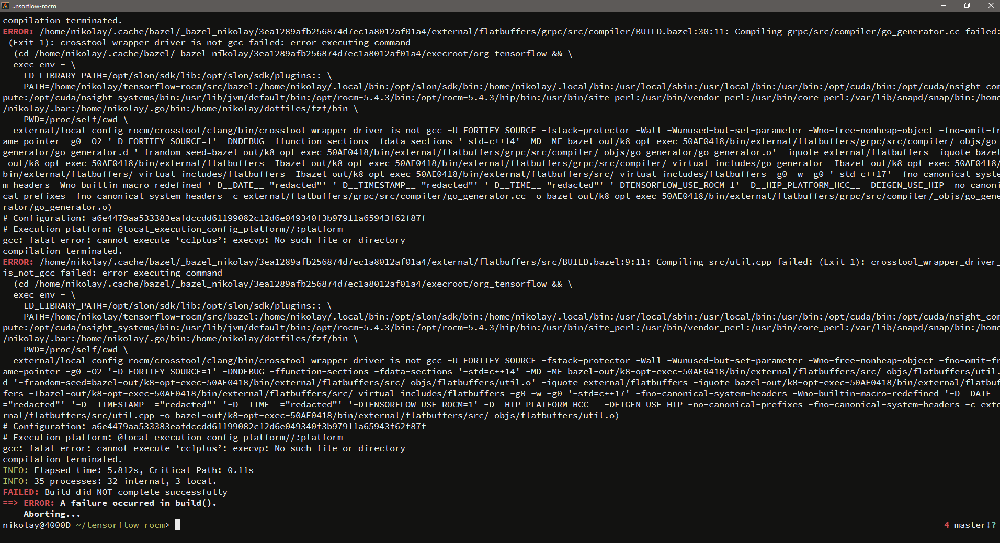
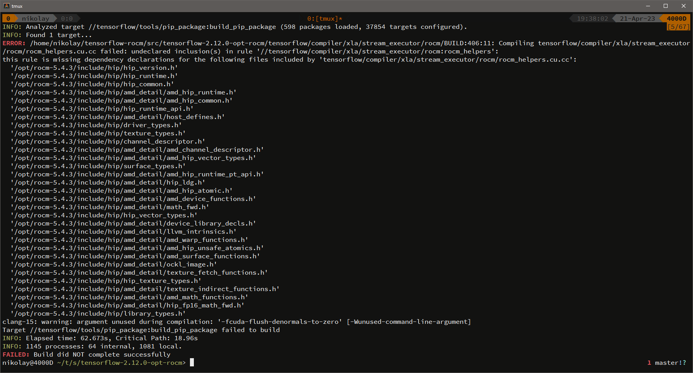
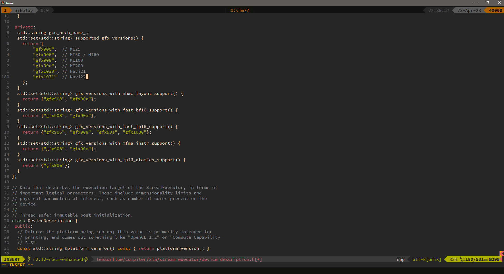
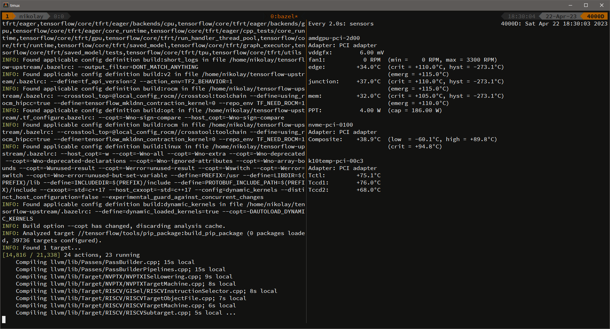
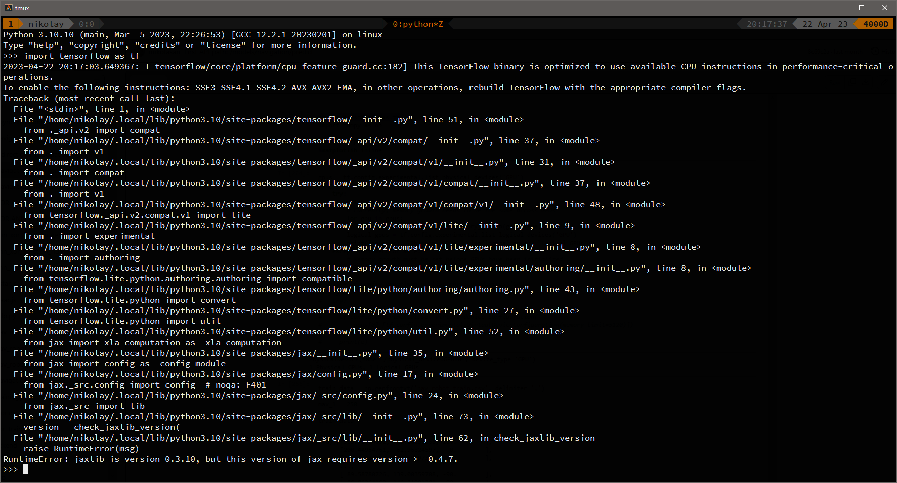
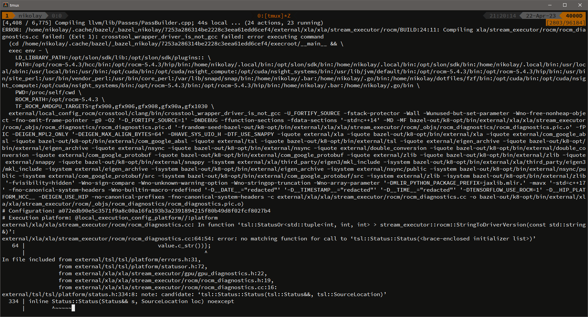
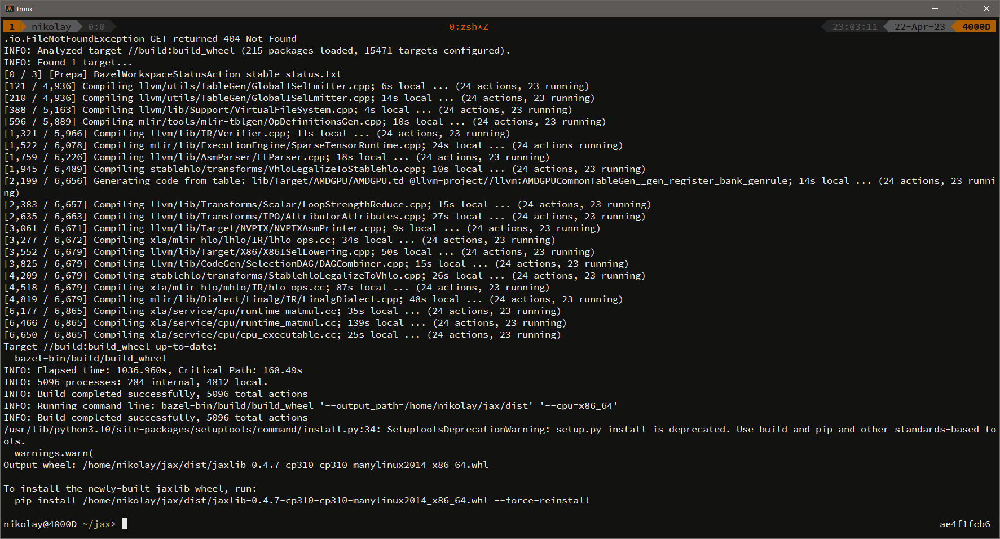
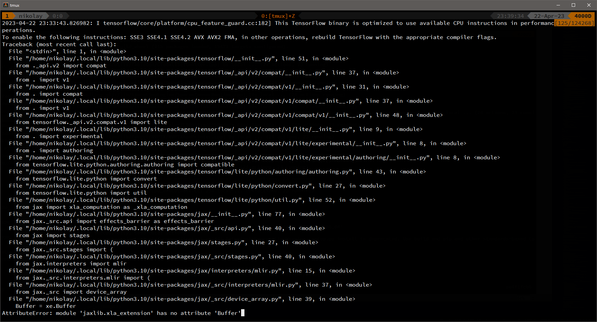
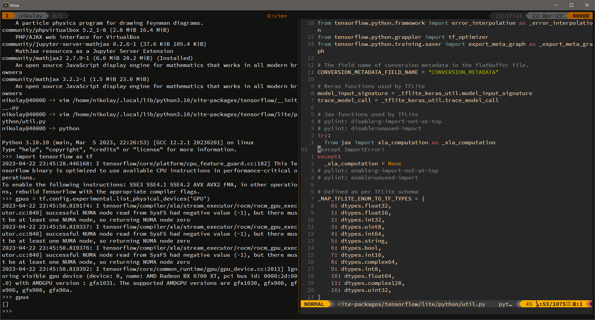
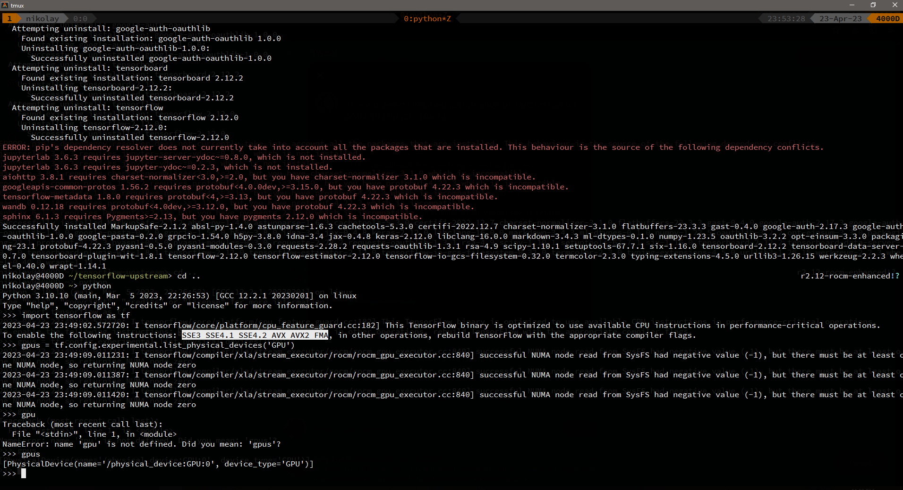

[Previously I compiled](/science/how-to-run-dalle-locally) TensorFlow 2.3 on Windows. This time I want to use a more powerful Linux workstation with an AMD graphics card. Thus I'm compiling TensorFlow with ROCM support.

- TensorFlow 2.12 (ROCM fork)
- ROCM 5.4.3 (yay -S opencl-amd-dev)
- gcc 12.2.1
- JAX 0.4.8 (git)
- XLA (git)
- Python 3.10.10

**CPU**: AMD Ryzen 9 5900X 12-Core

**GPU**: Navi 22 Radeon RX 6700

OS Manjaro 4/22/23

For some reason [this AUR package](https://aur.archlinux.org/packages/tensorflow-rocm) didn't compile for me. I tried to improve the **PKGBUILD** file, but to no avail.






## TensorFlow

Rocm [fork](https://github.com/ROCmSoftwarePlatform/tensorflow-upstream/blob/develop-upstream/README.ROCm.md) from [here](https://github.com/elixir-nx/xla/issues/29)

1. apply [patch](https://raw.githubusercontent.com/roelaaij/gentoo-overlay/master/sci-libs/tensorflow/files/tensorflow-2.10-sparse-transpose-op.patch) ([info](https://github.com/tensorflow/tensorflow/issues/58881))
2. [hack](https://stackoverflow.com/questions/71759248/importerror-cannot-import-name-builder-from-google-protobuf-internal) protobuf
3. add support for **gfx1031** [ref 1](https://github.com/RadeonOpenCompute/ROCm/issues/1726) [ref 2](https://github.com/RadeonOpenCompute/ROCm/issues/1668) ([list of AMD processors](https://llvm.org/docs/AMDGPUUsage.html#processors))



```shell
pip uninstall tensorflow
pip install -U --user pip numpy wheel packaging requests opt_einsum
pip install -U --user keras_preprocessing --no-deps

git clone https://github.com/ROCmSoftwarePlatform/tensorflow-upstream.git
cd tensorflow-upstream
export ROCM_PATH=/opt/rocm-5.4.3
export HCC_HOME=$ROCM_PATH/hcc
export HIP_PATH=$ROCM_PATH/hip
export PATH=$HCC_HOME/bin:$HIP_PATH/bin:$PATH
export ROCM_TOOLKIT_PATH=$ROCM_PATH

pip install --upgrade protobuf
cp /home/nikolay/.local/lib/python3.10/site-packages/google/protobuf/internal/builder.py builder.py.bak
cp builder.py.bak /home/nikolay/.local/lib/python3.10/site-packages/google/protobuf/internal/builder.py

./configure
bazel build \
  --config=opt \
  --copt="-Wno-error=stringop-overflow" \
  --config=rocm \
  //tensorflow/tools/pip_package:build_pip_package \
  --verbose_failures

./bazel-bin/tensorflow/tools/pip_package/build_pip_package /tmp/tensorflow_pkg
pip install /tmp/tensorflow_pkg/tensorflow-2.12.0-cp310-cp310-linux_x86_64.whl
```




## jax



Official docs [here](https://jax.readthedocs.io/en/latest/developer.html), but example commands I found in [this issue](https://github.com/google/jax/issues/2012)

The following error

```
external/xla/xla/stream_executor/rocm/rocm_diagnostics.cc:204:57: error: no matching function for call to ‘tsl::Status::Status(<brace-enclosed initializer list>)’
```

[fixed](https://github.com/openxla/xla/pull/2437) but not merged, so we need to compile **xla** externally from source using that pull request.




```shell
git clone https://github.com/openxla/xla.git
cd xla
git merge origin/test_517685288
cd ..

git clone https://github.com/google/jax.git
cd jax
git checkout jax-v0.4.8

python3 build/build.py \
  --enable_rocm \
  --rocm_path /opt/rocm-5.4.3 \
  --rocm_amdgpu_targets=gfx900,gfx906,gfx908,gfx90a,gfx1030,gfx1031 \
  --bazel_options=--override_repository=org_tensorflow=/home/nikolay/tensorflow-upstream \
  --bazel_options=--override_repository=xla=/home/nikolay/xla

pip install /home/nikolay/jax/dist/jaxlib-0.4.8-cp310-cp310-manylinux2014_x86_64.whl --force-reinstall
pip install -e .
```




## xla

Fix `has no attribute 'Buffer'`



by changing the catch condition



## Test

Test it with code from [my notebook](https://github.com/mikolasan/ai_sandbox/blob/master/ann/Navigation%20ANN%20keras.ipynb)

```py
‌gpus = tf.config.experimental.list_physical_devices('GPU')
```

