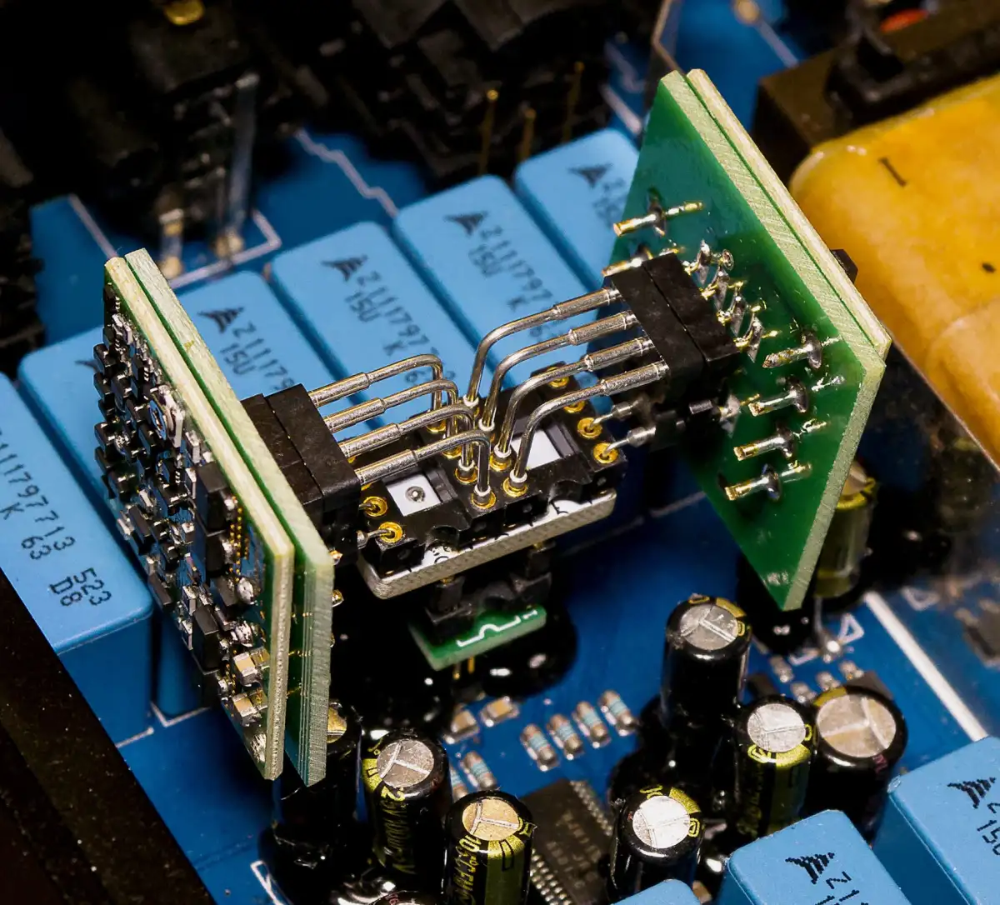
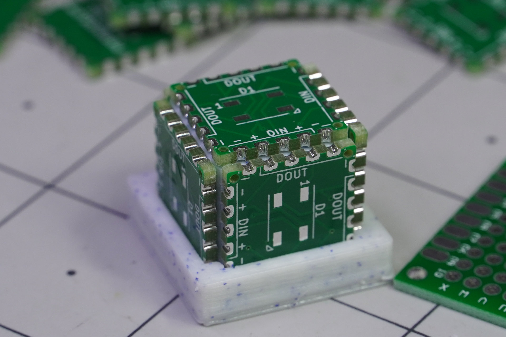

Today I'm thinking about the best way to stack boards (to support extensions in other words). In my search I [stumbled upon](https://hallmanlabs.com/2020/07/20/discrete-review-update-isoregen-over-troubled-dip8-waters/) these DIP adapters

I find Arduino shields bulky. And they can only grow upwards. I want to have flexibility in this regard.

There's such technique as "[castellated vias](https://learn.sparkfun.com/tutorials/how-to-solder-castellated-mounting-holes/all)" where connections are on the edge of the board. Like through holes that metallized inside but located on the edge and cut in half

First I shook off this idea, because it's used mainly for adding daughter boards, so I was considering pinheads. But they restrict the direction of attachments—it only goes in the way it's designed to go.

But then I revisited initial limitations, and soldering wasn't in the list. The credit goes to [Jeremy Cook](https://jeremyscook.com/) and his [LED cubes](https://hackaday.com/2022/03/15/led-flower-bouquet-is-a-radiant-hacker-desk-decoration/)

I'm thinking about an extension board for 2 more bi-directional motors. I put one full row of vias on the edge and get castellated edge (I do the bottom row as well). OSH Park [can manufacture such edge](https://docs.oshpark.com/tips+tricks/castellation/) but with possible imperfections
