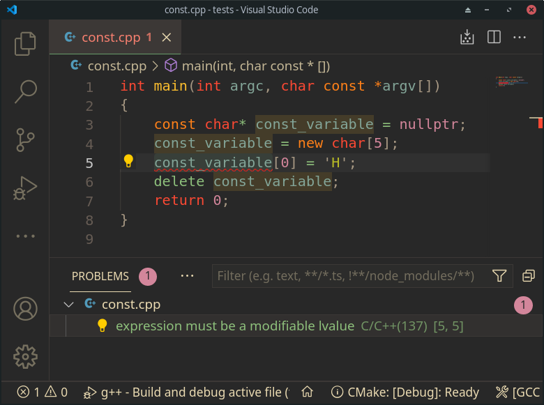
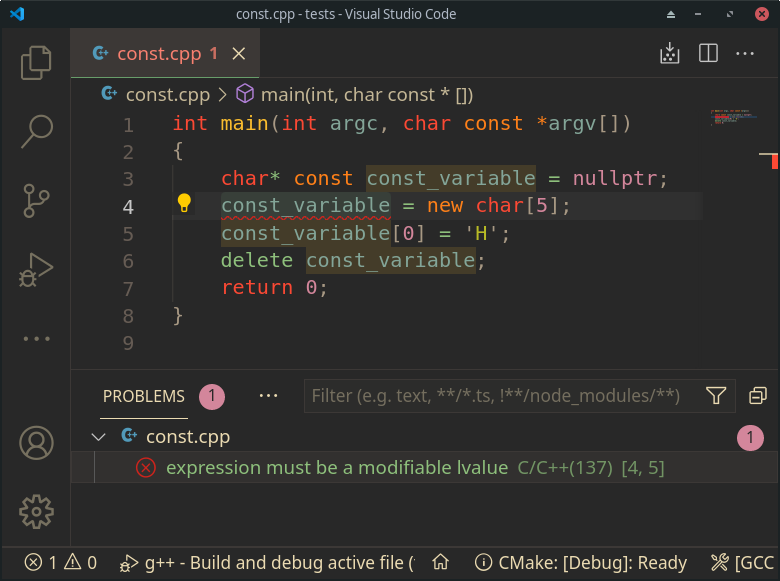
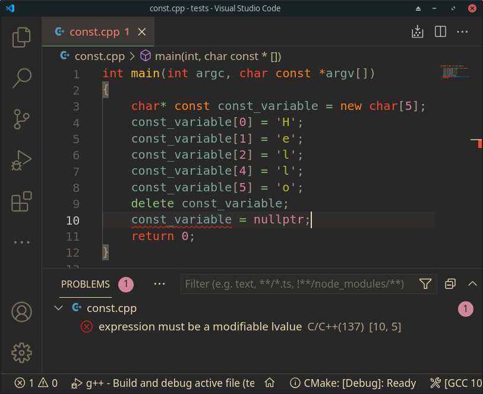
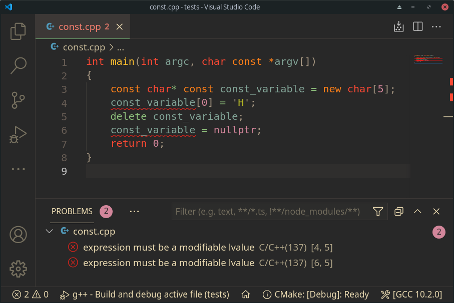

Can I just show four slides. They are totally self-exlanatory

## `const` before type

The structure itself is const, cannot change its integrity, but can assign new value to the variable

## `const` after type

Cannot assign new value. This is handy for declaring the value returned from a function.

Cannot assign new value, but can change the internals

## `const` before and after type

Const variable with constant data
 

As usual all code for your experiments and slides are in [**cpp-skill** repository](https://github.com/mikolasan/cpp-skill/tree/master/const).

## Similar posts

- ["Pointing" arguments](/blog/cpp-pointing-arguments)
- [C++ question: exec](/blog/cpp-question-exec)
- [C++ State Machine](/blog/cpp-state-machine)
- [Variadic templates in C++](/blog/cpp-variadic-templates)
- [Virtual call in C++](/blog/cpp-virtual-call)
- [Leak in std::map](/blog/cpp-leak-in-std-map)