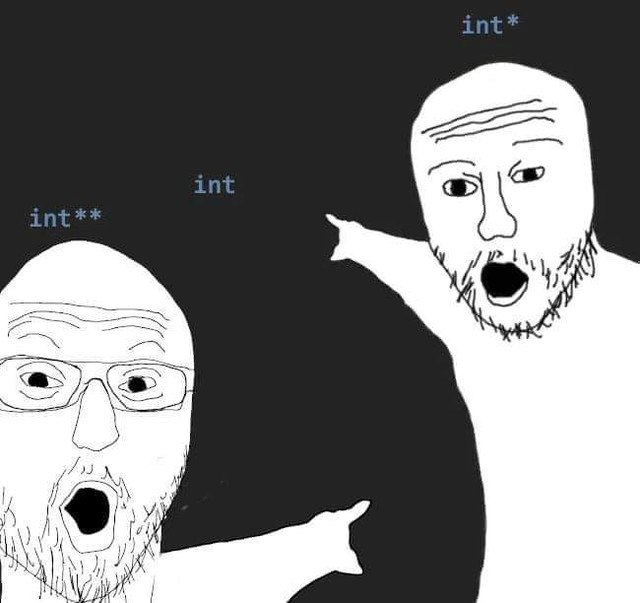

Honestly, I encounter this problem not for the first time ☹️ Because after languages like Java, Python, JavaScript where non trivial objects passed by reference, you may forget that in C/C++ values are passed by value. In another words, functions always work with copies.

Simple question today: what is the outcome?

```cpp
#include <iostream>

struct SimpleStruct {
    int bar;
};

void foo(SimpleStruct* s) {
    s = new SimpleStruct;
    s->bar = 42;
}

int main(int argc, char const *argv[])
{
    SimpleStruct* x = nullptr;
    foo(x);
    std::cout << x->bar << std::endl;
    return 0;
}
```

Sadly but program from my example will crash with seg fault. Function foo does only local changes, while x stays equal to 0.

Let's review another example, this time trying to free memory in the `foo` function.

```cpp{8-10,16,18}
#include <iostream>

struct SimpleStruct {
    int bar;
};

void foo(SimpleStruct* s) {
    std::cout << s->bar << std::endl;
    delete s;
    s = nullptr;
}

int main(int argc, char const *argv[])
{
    SimpleStruct* x = new SimpleStruct;
    x->bar = 42;
    foo(x);
    if (x) std::cout << x->bar << std::endl;
    return 0;
}
```

To fix seg fault and to implement our intent properly we can pass the pointer by reference


```cpp{7,17}
#include <iostream>

struct SimpleStruct {
    int bar;
};

void foo(SimpleStruct* &s) {
    s = new SimpleStruct;
    s->bar = 42;
}

int main(int argc, char const *argv[])
{
    SimpleStruct* x = nullptr;
    foo(x);
    std::cout << x->bar << std::endl;
    delete x;
    return 0;
}
```

Maybe hide pointer behind a typedef and it will look fine. Another solution that I've seen in many C interfaces is a double pointer

```cpp{7-9,15}
#include <iostream>

struct SimpleStruct {
    int bar;
};

void foo(SimpleStruct** s) {
    *s = new SimpleStruct;
    (*s)->bar = 42;
}

int main(int argc, char const *argv[])
{
    SimpleStruct* x = nullptr;
    foo(&x);
    std::cout << x->bar << std::endl;
    delete x;
    return 0;
}
```

I just recently saw a meme about pointers that will explain what's going on under the hood 🤣



By the way, all of my initial examples are leaking memory. Nothing of it would happen if I have used smart pointers. So take a look on a clean C++ approach:

```cpp
#include <iostream>
#include <memory>

struct SimpleStruct {
    int bar;
};

void foo(std::unique_ptr<SimpleStruct>& s) {
    s = std::make_unique<SimpleStruct>();
    s->bar = 42;
}

int main(int argc, char const *argv[])
{
    std::unique_ptr<SimpleStruct> x;
    foo(x);
    std::cout << x->bar << std::endl;
    return 0;
}
```

The output is `42` now.

As usual all code for your experiments and slides are in [**cpp-skill** repository](https://github.com/mikolasan/cpp-skill/tree/master/pointing_arguments).