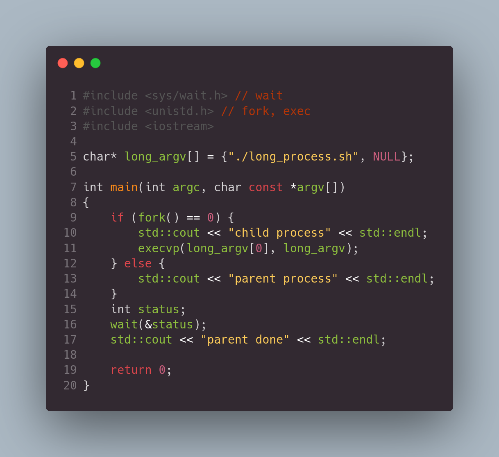

Today I found this code extremely confusing.

## C/C++ question

What output do you expect? (disregard output from the long_process.sh script)

## Answer

If you have never dealt with exec() before, then you would wait for 2 lines of "parent done".

Believe me, I ran this code many times today, and it prints "parent done" only once 😱

## Explanation

The exec() function replaces new child process with whatever is in the long_process.sh script. So at line 11 the child fully transforms into another program.

## Similar posts

- ["Pointing" arguments](/blog/cpp-pointing-arguments)
- [const in C++](/blog/cpp-const)
- [C++ State Machine](/blog/cpp-state-machine)
- [Variadic templates in C++](/blog/cpp-variadic-templates)
- [Virtual call in C++](/blog/cpp-virtual-call)
- [Leak in std::map](/blog/cpp-leak-in-std-map)