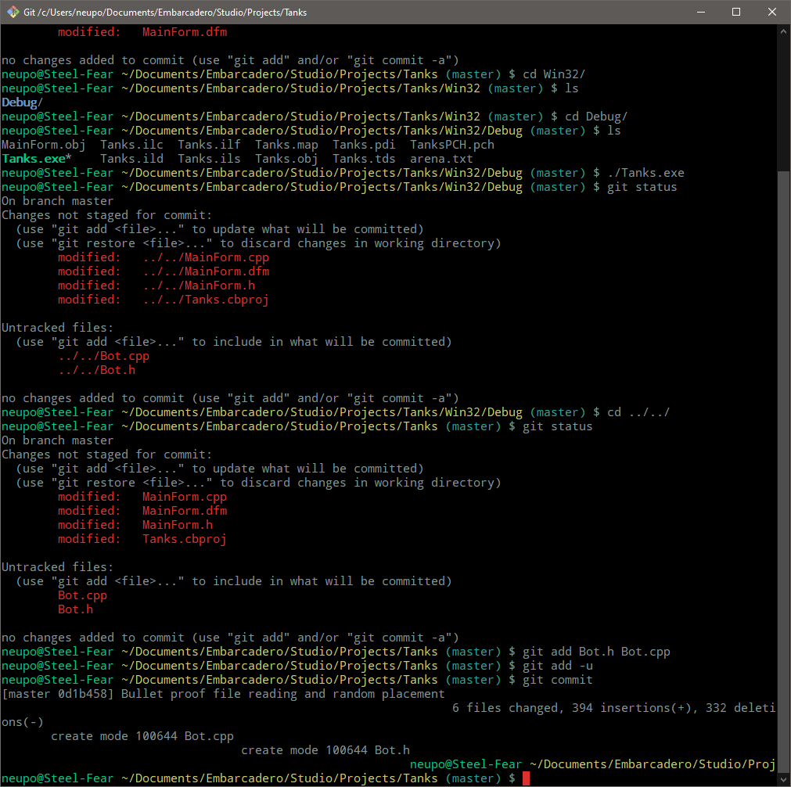
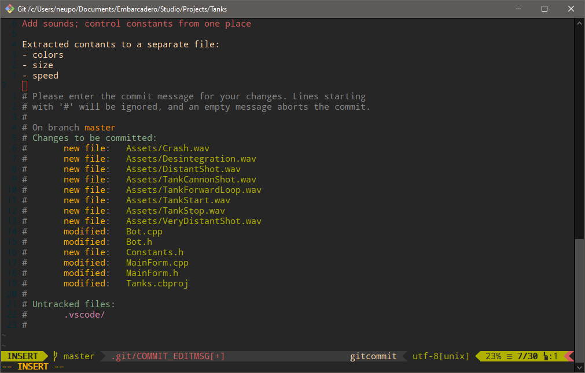
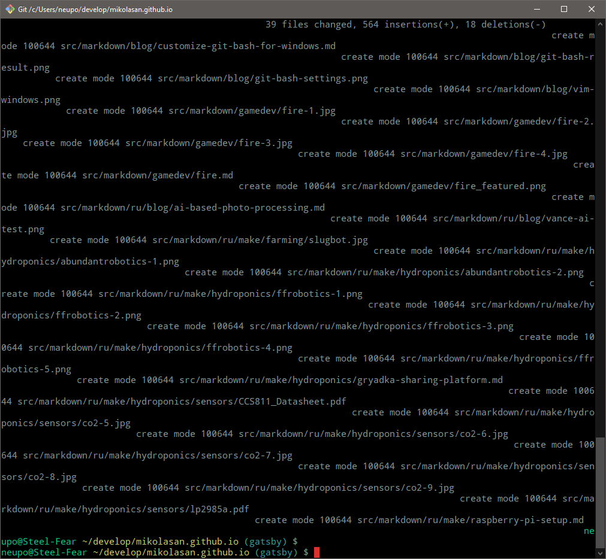
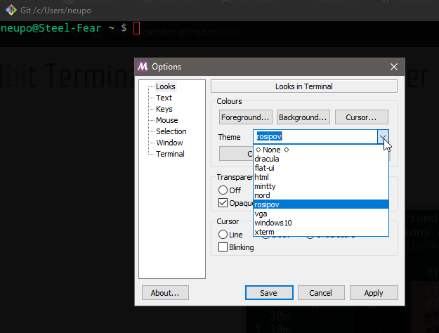

Do you want to see a terminal on Windows like this



And write commits in customized vim



Then here is what you should do.

## Terminal

1. Install [Git for Windows](https://git-scm.com/download/win)
1. Delete line `PS1="$PS1"'\n'` from **C:/Program Files/Git/etc/profile.d/git-prompt.sh**. Originally it has this content

```bash
if test -f /etc/profile.d/git-sdk.sh
then
	TITLEPREFIX=SDK-${MSYSTEM#MINGW}
else
	TITLEPREFIX=$MSYSTEM
fi

if test -f ~/.config/git/git-prompt.sh
then
	. ~/.config/git/git-prompt.sh
else
	PS1='\[\033]0;$TITLEPREFIX:$PWD\007\]' # set window title
	PS1="$PS1"'\n'                 # new line
	PS1="$PS1"'\[\033[32m\]'       # change to green
	PS1="$PS1"'\u@\h '             # user@host<space>
	PS1="$PS1"'\[\033[35m\]'       # change to purple
	PS1="$PS1"'$MSYSTEM '          # show MSYSTEM
	PS1="$PS1"'\[\033[33m\]'       # change to brownish yellow
	PS1="$PS1"'\w'                 # current working directory
	if test -z "$WINELOADERNOEXEC"
	then
		GIT_EXEC_PATH="$(git --exec-path 2>/dev/null)"
		COMPLETION_PATH="${GIT_EXEC_PATH%/libexec/git-core}"
		COMPLETION_PATH="${COMPLETION_PATH%/lib/git-core}"
		COMPLETION_PATH="$COMPLETION_PATH/share/git/completion"
		if test -f "$COMPLETION_PATH/git-prompt.sh"
		then
			. "$COMPLETION_PATH/git-completion.bash"
			. "$COMPLETION_PATH/git-prompt.sh"
			PS1="$PS1"'\[\033[36m\]'  # change color to cyan
			PS1="$PS1"'`__git_ps1`'   # bash function
		fi
	fi
	PS1="$PS1"'\[\033[0m\]'        # change color
	PS1="$PS1"'\n'                 # new line
	PS1="$PS1"'$ '                 # prompt: always $
fi

MSYS2_PS1="$PS1"               # for detection by MSYS2 SDK's bash.basrc

# Evaluate all user-specific Bash completion scripts (if any)
if test -z "$WINELOADERNOEXEC"
then
	for c in "$HOME"/bash_completion.d/*.bash
	do
		# Handle absence of any scripts (or the folder) gracefully
		test ! -f "$c" ||
		. "$c"
	done
fi
```

I remove the new line - it breaks some output from git, so be ready for messy outcome after commits. 



Also I remove useless for me `SYSTEM` part. Here is my resulting script

```bash
if test -f /etc/profile.d/git-sdk.sh
then
	TITLEPREFIX=SDK-${MSYSTEM#MINGW}
else
	TITLEPREFIX=Git
fi

if test -f ~/.config/git/git-prompt.sh
then
	. ~/.config/git/git-prompt.sh
else
	PS1='\[\033]0;$TITLEPREFIX $PWD\007\]' # set window title
	PS1="$PS1"'\[\033[32m\]'       # change to green
	PS1="$PS1"'\u@\h '             # user@host<space>
	PS1="$PS1"'\[\033[33m\]'       # change to brownish yellow
	PS1="$PS1"'\w'                 # current working directory
	if test -z "$WINELOADERNOEXEC"
	then
		GIT_EXEC_PATH="$(git --exec-path 2>/dev/null)"
		COMPLETION_PATH="${GIT_EXEC_PATH%/libexec/git-core}"
		COMPLETION_PATH="${COMPLETION_PATH%/lib/git-core}"
		COMPLETION_PATH="$COMPLETION_PATH/share/git/completion"
		if test -f "$COMPLETION_PATH/git-prompt.sh"
		then
			. "$COMPLETION_PATH/git-completion.bash"
			. "$COMPLETION_PATH/git-prompt.sh"
			PS1="$PS1"'\[\033[36m\]'  # change color to cyan
			PS1="$PS1"'`__git_ps1`'   # bash function
		fi
	fi
	PS1="$PS1"'\[\033[0m\]'        # change color
	PS1="$PS1"' $ '                # prompt: always $
fi

MSYS2_PS1="$PS1"               # for detection by MSYS2 SDK's bash.basrc

# Evaluate all user-specific Bash completion scripts (if any)
if test -z "$WINELOADERNOEXEC"
then
	for c in "$HOME"/bash_completion.d/*.bash
	do
		# Handle absence of any scripts (or the folder) gracefully
		test ! -f "$c" ||
		. "$c"
	done
fi
```

Change color scheme to your taste



## vim

1. Install **vim** to MSYS64

```
pacman -S vim
```

1. add to **C:\Users\your_user_name** your `.vimrc`. Mine (probably without changes from [dotfiles](https://github.com/mikolasan/dotfiles/blob/master/.vimrc))

```vimrc
set nocompatible              " be iMproved, required
filetype off                  " required

" set the runtime path to include Vundle and initialize
set rtp+=~/.vim/bundle/Vundle.vim
call vundle#begin()
" alternatively, pass a path where Vundle should install plugins
"call vundle#begin('~/some/path/here')

" let Vundle manage Vundle, required
Plugin 'VundleVim/Vundle.vim'
Plugin 'bling/vim-airline'
Plugin 'vim-airline/vim-airline-themes'
Plugin 'scrooloose/nerdtree'
Plugin 'Xuyuanp/nerdtree-git-plugin'
Plugin 'tpope/vim-fugitive'
Plugin 'scrooloose/syntastic'
Plugin 'easymotion/vim-easymotion'
Plugin 'haya14busa/incsearch.vim'
Plugin 'haya14busa/incsearch-fuzzy.vim'
Plugin 'haya14busa/incsearch-easymotion.vim'
Plugin 'pangloss/vim-javascript'
Plugin 'flazz/vim-colorschemes'
Plugin 'calviken/vim-gdscript3'
Plugin 'tpope/vim-surround'

" All of your Plugins must be added before the following line
call vundle#end()            " required
filetype plugin indent on    " required
" To ignore plugin indent changes, instead use:
"filetype plugin on
"
" Brief help
" :PluginList       - lists configured plugins
" :PluginInstall    - installs plugins; append `!` to update or just :PluginUpdate
" :PluginSearch foo - searches for foo; append `!` to refresh local cache
" :PluginClean      - confirms removal of unused plugins; append `!` to auto-approve removal
"
" see :h vundle for more details or wiki for FAQ
" Put your non-Plugin stuff after this line

syntax enable
set number
set relativenumber
colorscheme gruvbox
set background=dark
set t_Co=256

" NERDTree
map <C-n> :NERDTreeToggle<CR>
autocmd bufenter * if (winnr("$") == 1 && exists("b:NERDTree") && b:NERDTree.isTabTree()) | q | endif

" NERDTress File highlighting
function! NERDTreeHighlightFile(extension, fg, bg, guifg, guibg)
 exec 'autocmd filetype nerdtree highlight ' . a:extension .' ctermbg='. a:bg .' ctermfg='. a:fg .' guibg='. a:guibg .' guifg='. a:guifg
 exec 'autocmd filetype nerdtree syn match ' . a:extension .' #^\s\+.*'. a:extension .'$#'
endfunction

call NERDTreeHighlightFile('jade', 'green', 'none', 'green', '#151515')
call NERDTreeHighlightFile('ini', 'yellow', 'none', 'yellow', '#151515')
call NERDTreeHighlightFile('md', 'blue', 'none', '#3366FF', '#151515')
call NERDTreeHighlightFile('yml', 'yellow', 'none', 'yellow', '#151515')
call NERDTreeHighlightFile('config', 'yellow', 'none', 'yellow', '#151515')
call NERDTreeHighlightFile('conf', 'yellow', 'none', 'yellow', '#151515')
call NERDTreeHighlightFile('json', 'yellow', 'none', 'yellow', '#151515')
call NERDTreeHighlightFile('html', 'yellow', 'none', 'yellow', '#151515')
call NERDTreeHighlightFile('styl', 'cyan', 'none', 'cyan', '#151515')
call NERDTreeHighlightFile('css', 'cyan', 'none', 'cyan', '#151515')
call NERDTreeHighlightFile('coffee', 'Red', 'none', 'red', '#151515')
call NERDTreeHighlightFile('js', 'Red', 'none', '#ffa500', '#151515')
call NERDTreeHighlightFile('php', 'Magenta', 'none', '#ff00ff', '#151515')

" Airline
let g:airline_theme='base16'
let g:powerline_pycmd='py3'
let g:airline_powerline_fonts = 1

" Syntastic
set statusline+=%#warningmsg#
set statusline+=%{SyntasticStatuslineFlag()}
set statusline+=%*

let g:syntastic_always_populate_loc_list = 1
let g:syntastic_auto_loc_list = 1
let g:syntastic_check_on_open = 1
let g:syntastic_check_on_wq = 0
let g:syntastic_cpp_checkers = []
let g:syntastic_cpp_config_file = '.vim_syntax'
let g:syntastic_clang_tidy_config_file = '.vim_syntax'
let g:syntastic_cpp_check_header = 1
let g:syntastic_c_checkers = []

filetype plugin indent on
" show existing tab with 4 spaces width
set tabstop=4
" when indenting with '>', use 4 spaces width
set shiftwidth=4
" On pressing tab, insert 4 spaces
set expandtab

set pastetoggle=<F2>

" Easymotion
" <Leader>f{char} to move to {char}
map  <Leader>f <Plug>(easymotion-bd-f)
nmap <Leader>f <Plug>(easymotion-overwin-f)

" s{char}{char} to move to {char}{char}
nmap s <Plug>(easymotion-overwin-f2)

" Move to line
map <Leader>L <Plug>(easymotion-bd-jk)
nmap <Leader>L <Plug>(easymotion-overwin-line)

" Move to word
map  <Leader>w <Plug>(easymotion-bd-w)
nmap <Leader>w <Plug>(easymotion-overwin-w)

function! s:config_easyfuzzymotion(...) abort
  return extend(copy({
  \   'converters': [incsearch#config#fuzzyword#converter()],
  \   'modules': [incsearch#config#easymotion#module({'overwin': 1})],
  \   'keymap': {"\<CR>": '<Over>(easymotion)'},
  \   'is_expr': 0,
  \   'is_stay': 1
  \ }), get(a:, 1, {}))
endfunction

noremap <silent><expr> <Space>/ incsearch#go(<SID>config_easyfuzzymotion())

" incsearch
map /  <Plug>(incsearch-forward)
map ?  <Plug>(incsearch-backward)
map g/ <Plug>(incsearch-stay)
map z/ <Plug>(incsearch-fuzzy-/)
map z? <Plug>(incsearch-fuzzy-?)
map zg/ <Plug>(incsearch-fuzzy-stay)

" Move lines
nnoremap <A-j> :m .+1<CR>==
nnoremap <A-k> :m .-2<CR>==
inoremap <A-j> <Esc>:m .+1<CR>==gi
inoremap <A-k> <Esc>:m .-2<CR>==gi
vnoremap <A-j> :m '>+1<CR>gv=gv
vnoremap <A-k> :m '<-2<CR>gv=gv
```