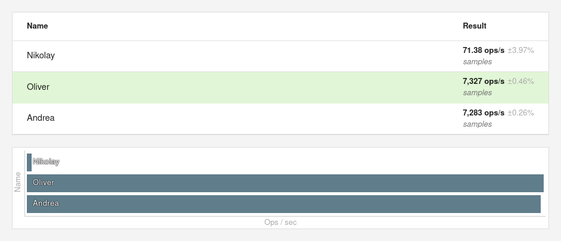

Let's take a look on slightly different implementations of Fisher-Yates shuffle algorithm.

```JavaScript
// https://developer.mozilla.org/en-US/docs/Web/JavaScript/Reference/Global_Objects/Math/random#getting_a_random_integer_between_two_values_inclusive
function getRandomIntInclusive(min, max) {
    min = Math.ceil(min);
    max = Math.floor(max);
    return Math.floor(Math.random() * (max - min + 1) + min); //The maximum is inclusive and the minimum is inclusive
}

const shuffleNikolay = function(array) {
    const t = array.splice(0, array.length);
    while (t.length > 0) {
        const index = getRandomIntInclusive(0, t.length - 1);
        array.push(t.splice(index, 1)[0]);
    }
    return array;
};

const shuffleOliver = function(array) {
    let current;
    let top;
    let tmp = (current = top = array.length);

    if (!top) {
        return array;
    }

    while (--top) {
        current = getRandomIntInclusive(0, top);
        tmp = array[current];
        array[current] = array[top];
        array[top] = tmp;
    }
    return array;
};

const shuffleAndrea = function(array) {
    let {length} = array;
    while (length--) {
        let i = getRandomIntInclusive(0, length);
        [array[i], array[length]] = [array[length], array[i]];
    }
    return array;
};

const array_10000 = Array.from(Array(10000).keys());
```

## ESBench



## MeasureThat


## Benchmarks

- ESBench https://esbench.com/bench/615570c16c89f600a5701191
- MeasureThat https://measurethat.net/Benchmarks/Show/15103/0/fisher-yates-shuffle

## Conclusion

<blockquote class="twitter-tweet"><p lang="en" dir="ltr">neither in Chrome or WebKit ... it&#39;s both engine dependent and optimizations dependent. Modern v8 would create mostly equivalent JITted code, Firefox clearly doesn&#39;t optimize array swaps 🤷‍♂️<br><br>gotta consider my code is smaller too but congrats to Oliver 🍻</p>&mdash; Andrea Giammarchi 🍥 (@WebReflection) <a href="https://twitter.com/WebReflection/status/1443511991436460032?ref_src=twsrc%5Etfw">September 30, 2021</a></blockquote>