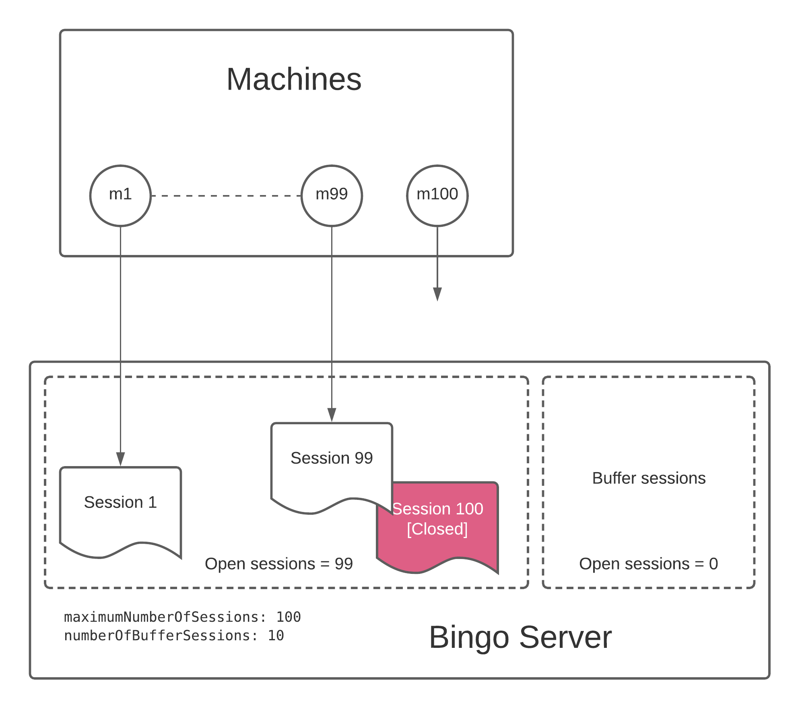
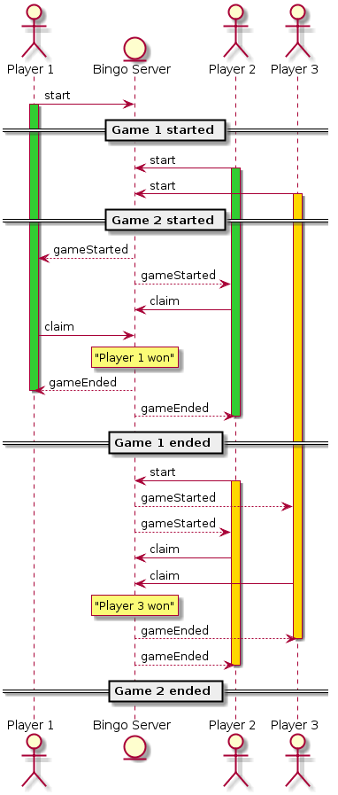
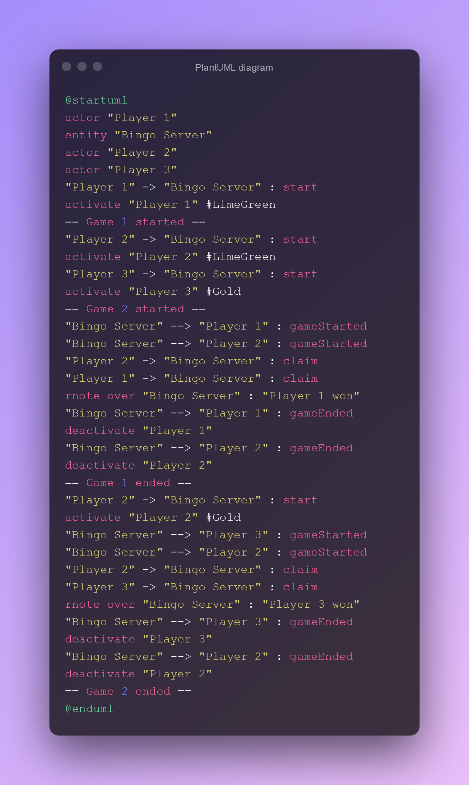

Diagrams. You may have heard about services like EdrawMax, SmartDraw, Visual Paradigm or Lucidchart. I showed them in [some type of review](https://youtu.be/OCclRU_ILEI) on my channel.

My conclusion: they all suck. Except Lucidchart which is limited on free account, but at least produces professional results.

I showed circuit diagram examples in [this post](/make/free-circuit-drawing-software).

There is simple free diagram editor [PlantText](https://www.planttext.com/). You will find it at the bottom of the 2nd page googling by "uml diagram online". They did UI update this year, so it's pretty now.

It's script based, which means you don't need to drag and drop and then align stuff. Scripts force you to keep your diagrams neat and clear. There are plenty of examples to get started. Here is an example

