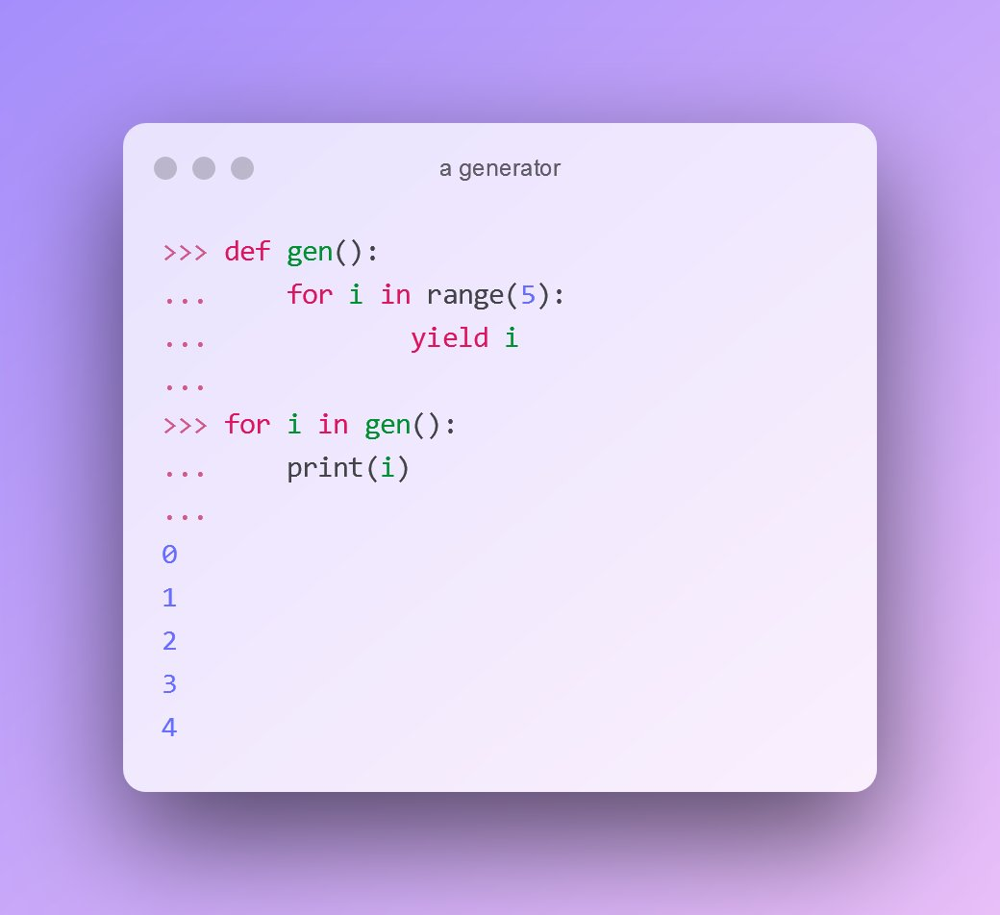

I'm having a depression and I've been working on my website this weekend 😑 I post different stuff, but it definitely lacks interconnections. I'm going to visialize the current situation and later I will use it as a site map (something like a brain map, but for navigation).

Thus we need to find all links on the home page, filter them and keep only the ones that point to another pages of our site, but not any that lead us outside. Then use the list of links from the home page and on every page repeat the same thing. Sometimes links will direct us back to the home page, or to another page that we already visited on the step before - remember such things otherwise we will go circles. 

I was thinking do crawl my site [with JavaScript](https://github.com/rchipka/node-osmosis) first, but then looked on API and changed my mind. 

## Generators in Python

I'm building a graph of interlinks, using **Scrapy** for that. I found something interesting about generators in Python.

A quick tutorial on how to make generators. We want to achieve this simple behavior and the same output:

Define a function where each call to 'yield' makes a new step in the loop that uses this generator:

Here is where the interesting stuff starts. What if on each step you have more than one value ready to deliver. Then there is such thing as 'yield from'

The way how yield stops the execution in the generator itself is strange for my brain, so here's one more test: what if we have 2 loops, in what order the yield will be called?

## Scraping

After such experiments one can better understand the example from scrapy's main page. 

I'd recommend to ignore it. Instead go to [the docs](https://docs.scrapy.org/en/latest/intro/tutorial.html#our-first-spider) and run a spider [from a script](https://docs.scrapy.org/en/latest/topics/practices.html#run-scrapy-from-a-script)

Note: about text response https://docs.scrapy.org/en/latest/topics/request-response.html?highlight=htmlresponse#scrapy.http.TextResponse

## Drawing

Nevertheless for drawing we are going to use a JS library. There are so many of them, and I don't have any preference, so my choice it more or less random here.

It's goint to be **Cytoscape**.

I check [their examples](https://github.com/cytoscape/cytoscape.js-popper/blob/master/demo.html) and from there I see how the result should be formatted on its way of recursive search

I found 9017 nodes, 8703 edges, total of 17720 elements. It took Cytoscape 4 minutes in the browser (on the client) to draw the graph

After a little bit of cleaning of my algorithm and fixing dozens of broken links, I clearly see 3 clusters. Also pagination makes very strong connections, which should be replaced by categories.

