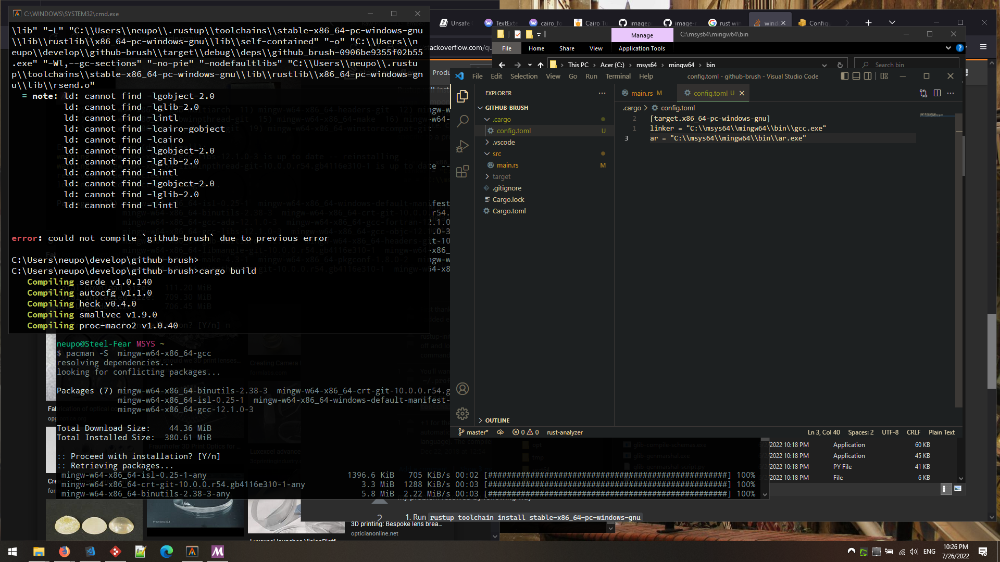
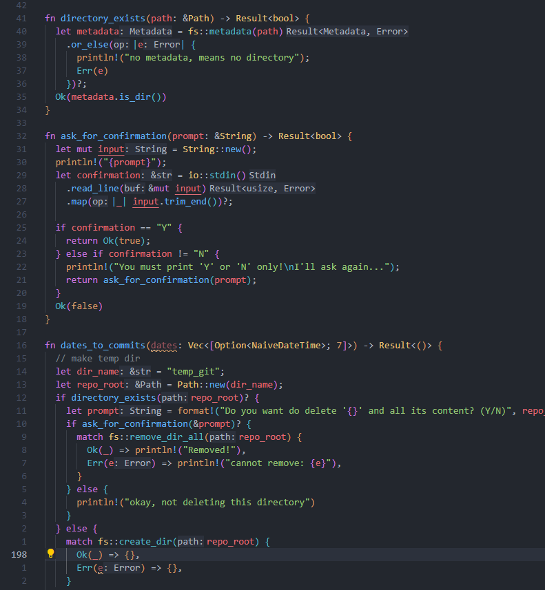

# Get the books

There are many online books about Rust. Here is my top 5:

1. [The Book](https://doc.rust-lang.org/book/ch04-02-references-and-borrowing.html) - start here
2. [Rust by example](https://doc.rust-lang.org/rust-by-example/std/result/question_mark.html) - the same concepts from the book, but oriented more to practice examples
3. [Cookbook](https://rust-lang-nursery.github.io/rust-cookbook/file/read-write.html) - about using crates in real life problems, solutions, best practices
4. [Rustonomicon](https://doc.rust-lang.org/nomicon/send-and-sync.html) - when you are ready for something spicy
5. [Learning Rust](https://learning-rust.github.io/docs/combinators/) - back to origin


# Have a fun project

It's never late to get a grasp on another programming language

One cheesy project pop into my head—I must do it. I believe that it boils down into several small tasks. Think about each of them as solving kata.
I [opened replit](https://replit.com/@stakanmartini/GithubBrush#src/main.rs) and start experimenting

At the first day I learned basic types and control flow.

I installed Rust on Windows, first time in years updated MSYS2 retrying many times until I updated the keyring, I installed cairo, and when I decided to tweet about it, Twitter went down!


... a few weeks later ...

I [finished my project](/projects/github-activity-brush). I like how the code looks. I was afraid that it will be mix of Ruby with Java call chaining, but it actually look very neat. HTTP requests do not take many lines, it's far from monstrosity in Java. All json conversion back and forth is seamless.


# Prepare the environment




I changed the editor's theme to One Dark Pro for more comfortable type deduction highlights.

- https://stackoverflow.com/questions/1710922/how-to-install-pkg-config-in-windows
- https://sourceforge.net/projects/pkgconfiglite/
- https://github.com/msys2/MSYS2-packages/issues/2343
- https://www.gtk.org/docs/installations/windows/#using-gtk-from-msys2-packages
- https://rust-analyzer.github.io/manual.html#rust-analyzer-language-server-binary


# Practice, practice, practice

**Note:** I totally understand that usage of screenshots of code is a total disrespect, but content was intended specifically for superficial acquaintance. At the time of delivering I was a total newbie. But I might review this article letter in the format of educational post.

Converting C code to Rust. Every `cairo_` call is unsafe and requires raw pointers. I should probably chose another crate, because THIS betrays all Rust principles


The `cairo-rs` crate requires some [features](https://doc.rust-lang.org/cargo/reference/features.html) to be enabled. Like this:

```toml
[dependencies]
cairo-rs = { version = "0.15.12", features = ["use_glib", "freetype", "png"] }
```


### cairo alternatives

- [cairo-rs](https://crates.io/crates/cairo-rs)
- https://docs.rs/embedded-graphics/0.5.0/embedded_graphics/
- https://github.com/image-rs/imageproc
- https://github.com/image-rs/imageproc/blob/master/examples/font.rs


Well, let's see if I can tidy up this function. 


### C/C++ cairo examples

- https://zetcode.com/gfx/cairo/cairotext/
- https://cairographics.org/tutorial/#L1understandingtext
- https://cpp.hotexamples.com/site/file?hash=0x93852e41a43231ccbb8588101a712592ffc7cc49c9fb67b4a5f34c8fb22bc301&fullName=Gadgets-master/deps/cairo/imagediff.c&project=jwmcglynn/Gadgets
- https://imolodetskikh.wordpress.com/2018/07/16/gsoc-2018-safe-shared-access-to-cairo-image-surfaces/


It has one call after another that can return an error (like exceptions in other languages, but these are silent). Type `vec<>` might look similar to generics in Java. On this slide it's a type definition. Tricky one: 2D array, one dimension is dynamic `vec`, allows to store arbitrary number of fixed-length (7) arrays that may contain datetime value.For generics they (Rust and Java) both use angle brackets `<>`. The generic is used on the next slide `Result<>`


I use the match blocks (similar to the switch blocks) to check for error conditions and to act accordingly. In another language I'd put everything into one big try-catch thing. It's like: close your eyes and run through a minefield.


This looks better, but it doesn't work 🙂 The previous variant also didn't work if directory already exists. You are puzzled? Me too.


Extracted 2 functions. Return `bool` as I would to in C/C++


But proper Rust-ish idiomatic approach would be to return `Result<bool>`. Also before we do that look at the 2 new functions


`match` doesn't look great, and I will use `or_else` and `map` to write straight forward code in Rust style




- idiomatic Rust for handling Result as return value
- https://learning-rust.github.io/docs/e6.combinators.html#ok-or-and-ok-or-else
- https://programming-idioms.org/


# Topics

- Rust cheatsheet ?

## Raw pointers

- Initialising Empty Structs in Rust https://gist.github.com/ChrisWellsWood/84421854794037e760808d5d97d21421
- Using Rust like C https://stevedonovan.github.io/rustifications/2018/08/13/using-rust-like-c.html
- raw pointers https://web.mit.edu/rust-lang_v1.25/arch/amd64_ubuntu1404/share/doc/rust/html/book/first-edition/raw-pointers.html
- more about ffi https://blog.guillaume-gomez.fr/articles/2021-07-29+Interacting+with+data+from+FFI+in+Rust

## Async

- https://tokio.rs/tokio/tutorial/spawning
- https://github.com/rayon-rs/rayon
- https://smallcultfollowing.com/babysteps/blog/2015/12/18/rayon-data-parallelism-in-rust/


## Iterators

Trying to finish up with current Rust project, learning about iterators. Getting my first overflow. Looks pretty dramatic


I added the Copy closure type ("+ Copy" after type definition). It helped. But it didn't help to my understanding. I'll keep it in the back of my mind with all other strange things that I didn't get yet.


the tutorial about [the Iterator trait](https://aloso.github.io/2021/03/09/creating-an-iterator) by [@LudwigStecher](https://twitter.com/LudwigStecher). It's written very clear 👏 Though I'm looking forward to [coroutines being implemented](https://doc.rust-lang.org/beta/unstable-book/language-features/generators.html) in Rust


- https://depth-first.com/articles/2020/06/22/returning-rust-iterators/
- https://docs.github.com/en/developers/apps/building-oauth-apps/authorizing-oauth-apps#device-flow
- https://docs.github.com/en/rest/repos/repos#delete-a-repository


# Troubleshooting

Okay, I have a problem. I found a [question on StakOverflow](https://stackoverflow.com/q/53584631/1104612). And the answer is great and it makes total sense. But… But it doesn't make sense, because it's not working 😵‍💫


That's why I spend 30 minutes writing my own investigation 🤓 risking to lose my precious carma if someone will smack the downvote button 😨 Plus I'm only like one week into Rust, thus I don't feel like an expert