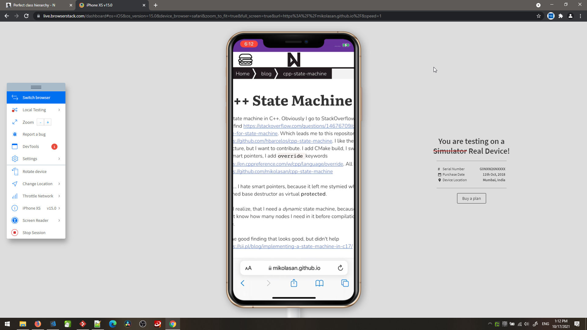
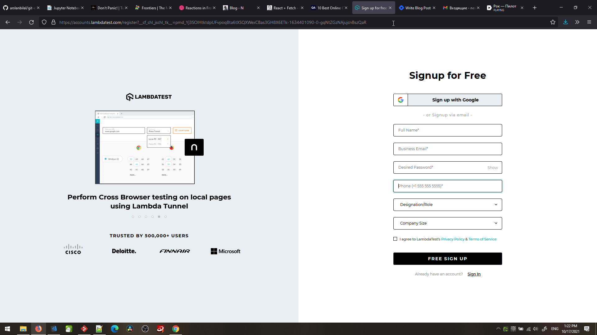
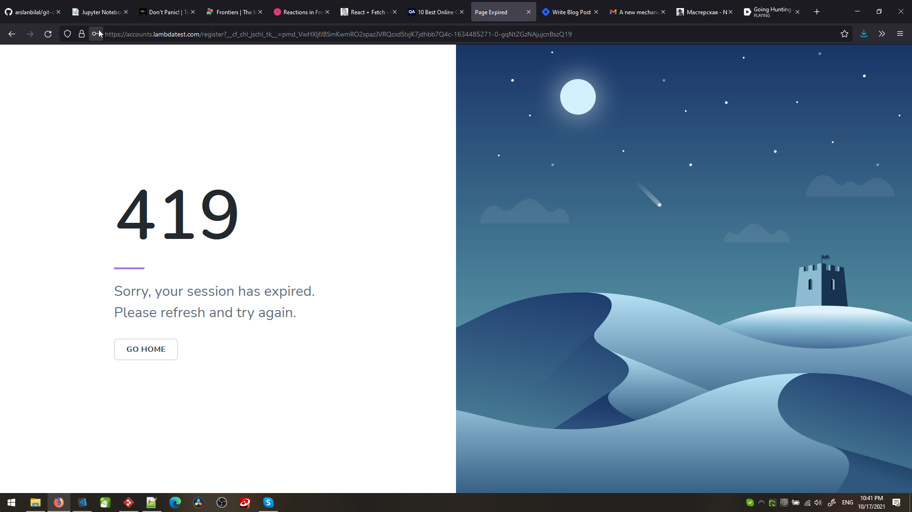
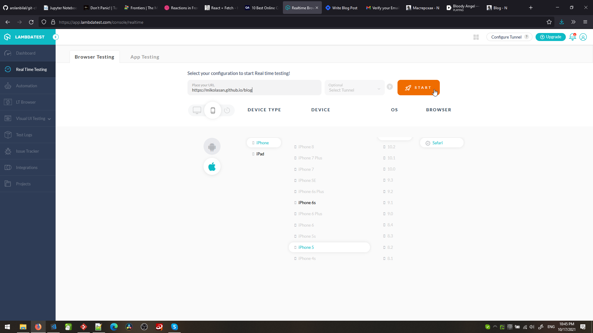
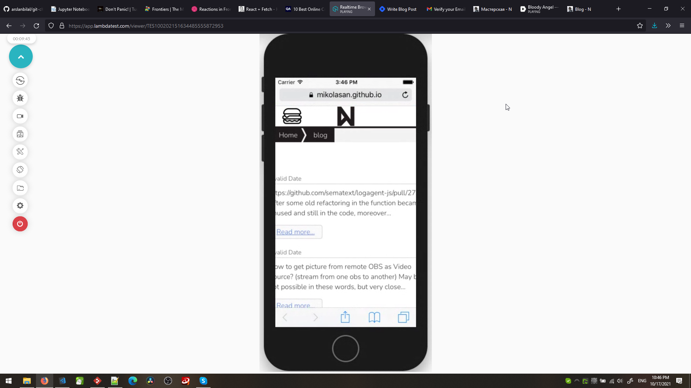
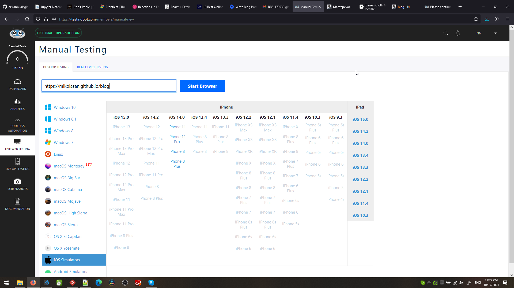
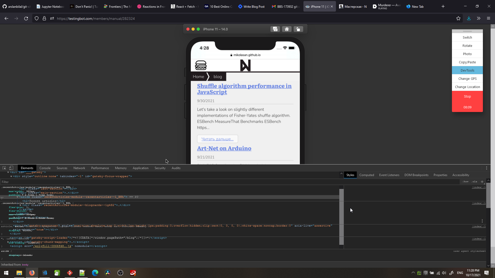

<i>Photo by <a href="https://unsplash.com/@randyfath?utm_source=unsplash&utm_medium=referral&utm_content=creditCopyText">Randy Fath</a> on <a href="https://unsplash.com/s/photos/safari?utm_source=unsplash&utm_medium=referral&utm_content=creditCopyText">Unsplash</a></i>
  
I was so happy to finish my site design improvements. I followed best practices from highly rated advice on Twitter, I do mobile first, I test with Ctrl+Shift+M in Firefox – everything looks good. 

Then I deploy.

I open Firefox on mobile and my design is wrecked ☹️ Same thing in Safari, but seems okay in Chrome tho it feels differently. 

I like more predictable programming\*, not this.
(\* we will discuss why I call it "programming" later)

# Go native

I am a Windows guy, I can install Firefox, Chrome, and even Safari, though Apple stopped supporting the PC version [in august](https://support.apple.com/en-us/HT204416) and [version 5.1.7](http://appldnld.apple.com/Safari5/041-5487.20120509.INU8B/SafariSetup.exe) is the last available for Windows 10 ([reference](https://apple.stackexchange.com/questions/68836/where-can-i-download-safari-for-windows)).

Honestly, I don't want to install useless software on Windows. I know that with every software installed it becomes slower because it's just how Windows is designed. Even after uninstalling programs leave garbage everywhere: registry entries, user files, cache - and cleaning tools cannot find all traces. So every Windows user is used to reinstalling their OS.

# Online services

So let's forget about installing anything to our system. Today we are going to find online services that will display the website in production and will provide us tools to investigate the problem in place. Also, it must be free, because I am doing "web development" for my portfolio site and I don't get any income from it, so I wouldn't spend a dime on a hobby project.

## BrowserStack

[BrowserStack](https://www.browserstack.com) has a very very weird sign up process. First, it requires having a business email, so it rejected my gmail (or their field verification confused me). Okay, I have a personal domain and email on it, can we call it "business"? It accepts it and I'm in, but it says that devtools only work in Chrome... Side note: my life only happens in Firefox, I have other browsers only for such situations when some stupid services work only in Chrome. Why have you sold your soul to the software giant? End of the side note.

In Chrome I need to sign in again, but it already knows that I'm in their system and asks for a password. I assume "Forgot password?" should work for this case, but I decided to check my "business" email, where I find steps to finish my account from BrowserStack. I like when companies invent new ways of registering accounts.

Two fields **New Password** and **Confirm New Password** filled by password generator with identical passwords recognized as not matching. 

### Live Testing

It uses real devices from India. It's so creepy to think that my website will popup on someone's device. So creepy, I'm out.

> Each device is available for up to 1 minute during Free Trial

And 30 minutes total.

### Conclusion

I would not consider this service for my business if I had one. Not worth a hassle.

## Lambdatest

Next in line [Lambdatest](https://www.lambdatest.com) that scares me with a long list of private data required to sacrifice. US phone, seriously?

Email confirmation with PIN code, not a link - funny. I found this, it's beautiful.

### Live Testing

Limited amount of devices to choose from. But small iPhones with Safari are present. Nevertheless, communication with VM is very slow which makes interaction with devtools very unpleasant.

> Your 10 minutes are up!!
> You still have 5 sessions left. You can kickstart another session.
> Sessions Remaining: 5/6 | Min Remaining: 50

### Conclusion

10 minutes is a good time for debugging session. But the lagging interface and lags between devtools and VM are terrible.

## Testingbot

How about oneshot debugging on [Testingbot](https://testingbot.com)?

> Free 100 minutes of manual/automated testing. No credit card needed.

For such throw away accounts I usually go with only initials. So I hate when the service is smarter than this:

> Please fill in your first name (2 chars minimum)

Double N, hahaha 😁

### Live testing

Bad news. Each session is limited to 10 minutes. The trial is only for 14 days. iPhones only 8 and 11, and surprisingly my website works fine on them. Should I add a popup to my website: for a better experience you should purchase iPhone 8 or newer?

To expand an element in Devtools you need to double-click. Strange. The Styles tab is glitching in Firefox. 

### Conclusion

Smooth sign in process, but testing is not good for me. Potentially this platform is bigger than just for site testing.

# Are we done?

Yes, I'm done with this type of service. I believe that my short test of these services proved that they are all the same, there is no "free forever" option, and testing of websites on all possible devices remains a nightmare.

If someone knows a free alternative with just one iPhone model available, but with normally working devtools running in Firefox, please let me know in the comments. Also, you can DM me on Twitter 😉