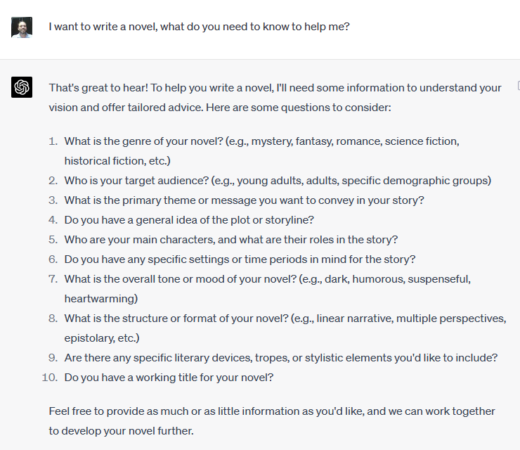

Hmm, I will go through this questionnaire.

## 1. Genre

One of my favorite authors is Howard Phillips Lovecraft. He writes horror, but I will go with mystery because I want my characters to keep their sanity (all Lovecraft's protagonists end up in madhouse

Not that I'm good at writing, but maybe in the future I will find this plan and confirm if I still want to write such a story

## 2. Target audience

I would write for young adults. That age when you might study at a university and when you are looking for true love. When everyone around you is a braggart liar, and you are trying to find a job that will make this world better

## 3. Primary theme

Primary theme? This is hard. Can I just write? I like the sound of my keyboard. Okay, just kidding.
My main message will be YOLO. Don't look back. Live the life that you enjoy.

## 4. Plot

Approximate plot idea.

Our main protagonist is a guy who studies at the university and falls in love with a girl from his class. But he doesn't tell her about it.

One day she disappears, and the guy finds the courage to ask around. But unexpectedly, people who knew her began revealing strange facts about her life. Some secret project she was conducting at night. A bit of mystery, a bit of conspiracy...

## 5. Main characters

So we have a guy and a girl. We need a sidekick. Or it can be an internal monologue as I always do in real life. But if I add the sidekick, then there will be a place for betrayal. What is life without betrayal from your friend?

## 6. Setting

The setting for this novel is very mundane: life on campus and work in a laboratory. Present days, but maybe going back to the 60s

## 7. Mood

The overall mood will be dark. Like all my life. But some moments are going to be heartwarming like when the main character overcomes challenges, finds a deep connection with another person, and has a moment when he finds a glimmer of hope

## 8. Structure

I can only think of a linear narrative. At least the first draft can be written this way. But when Tarantino will start a movie adaptation, he will divide everything into episodes and shuffle anyway.

t reminds me of beatnik literature. Their narrative is very specific. To achieve it, they split the page into two columns, then write the main plot in one column, and some thoughts and hardly relevant text in another column, then mix it in the final version. Example: Naked Lunch.

## 9. Literary devices

Literary tropes and stylistic elements? Something like this: the whole novel is a big flashback, and the main narrative starts and ends in the last chapter.

I remember my mom complained about one of Paulo Coelho's books like what is the message in this book. The allegory was too incomprehensible. And her friend said: now think that the main character is a small chicken and you will understand. My mom: no, the book is stupid.

So I should be careful with literature devices. But I want to use irony - when the opposite of what is expected happens. For example, our guy who thinks he has found his calling in a particular subject ends up discovering a new passion in an unexpected area.

## 10. Working title

...