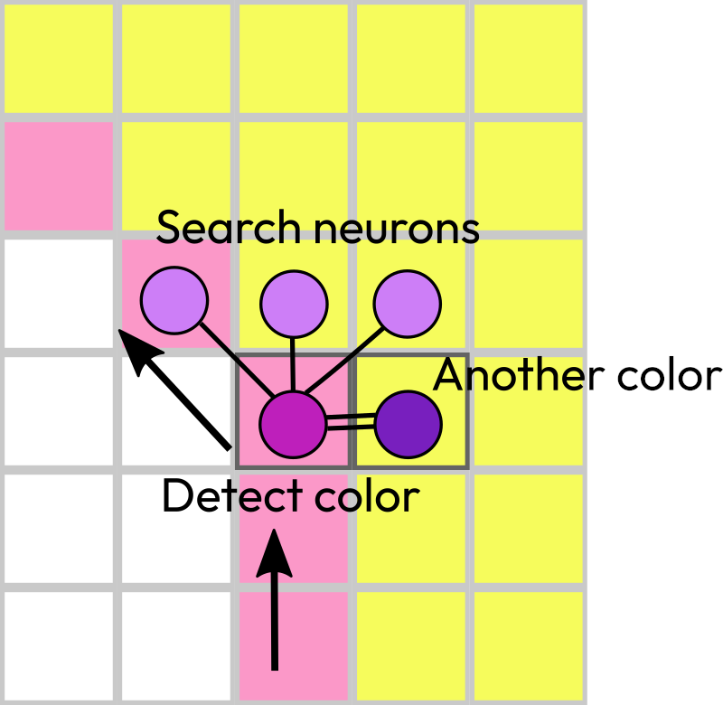
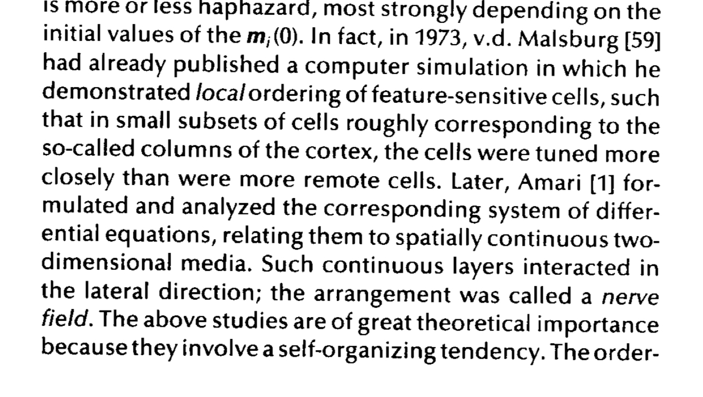
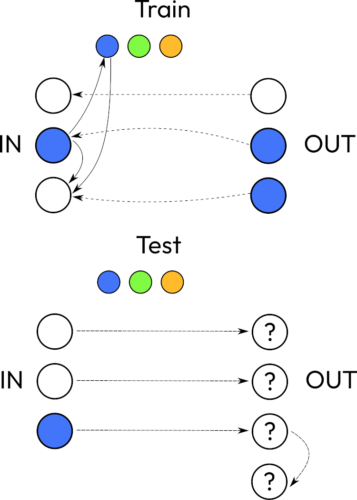
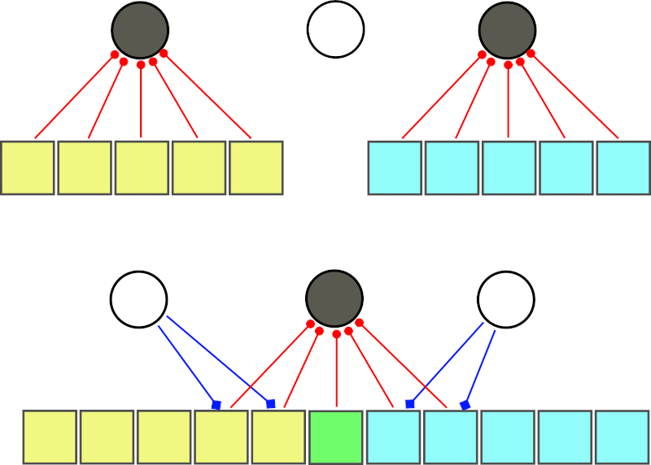

If you were to create AGI, where would you start?
What do people miss when they try to develop a system that conforms to AGI principles?

I was thinking about [ARC challenge](/ai/arc), how my [discrete spiking network](/ai/discrete-spiking-networks) and memory-inference paradigm can solve it. Some people say that good system for ARC would not be a good generalized system. But I think it would.

## Memory-inference paradigm

There should be a network that can recognize a space of one color surrounded by a line or other shape of another color. Should it follow the edge? Or verify the internal area? (I think there should be another “network” that can point out to another qualities and something else will combine the qualities together.)

1. Image goes to memory
2. We try to predict the result
3. Error in inference detected
4. Error applied to the input again. 
5. Problematic places used in new inference.
6. …
7. We need to get a notion of a closed contour.

When inference improvements are finished on one image, you verify it on other images. Or most likely next training samples will be used for formulating the transformation properly. Also for describing the property, like a closed contour.

When there are two error patches, you need to compare them between each other - that’s how you define the property. As with the outline, you need to know the full picture, only one patch is not enough.

Such network of 5 neurons would be sufficient (5 is not exact, it’s simplified because there should be parts for movement actuators or area detection, color detection and comparison). But neurons don’t move. Though [the vision area can move if we add muscle actuators](/ai/spiking-autoencoder-with-embodied-actions). Or another approach would be to [select a section from a vision field and bring it to these neurons](/ai/spiking-mnist). Like convolution networks and information from the higher layers (feature, latent space).

So, it should work similar to RNN where it starts from one point, then goes one by one and builds on top of the previous input. It follows the edge until it reaches the starting point or for some reason cannot follow to that point. Either search neurons cannot find the right move or the outline has a hole. 
This means we need one signal coming from the starting point and comparison with the sliding position. And an external network that waits an answer.
**But how do we make a question? Why does this network exist?** = How to formalize questions?

## Inference 

One thing is to say that all our actions heavily use [background inference](/ai/active-inference) (for more context I will send an reader to Anil Seth book) because that is how we quickly react or correct noise (quickly, because no need to apply layers of processing according to specific plans appropriate to current data type only). But another thing is to look at standard pyramidal hierarchy of artificial neural networks and try to figure out where is that inference. The closest would be autoencoders that have a shape of hourglasses: information from sensors passed through layers, features extracted, then these features used in a reverse process. But I don’t think it would work as inference 

I thought that the input should go to memory, be stored there or processed from noise using another memory. But now thinking about inference and how to compare two inputs (one real input and the second is inference), I see that the result of inference is what we call memory, but there is no any storage as we represent like shelves with books, archives and so on. When something processed through that inference block, that’s how memory is retrieved.

## Self organizing maps

Kohonen designed self organizing maps explaining them by neurological evidence that similar features located near each other. But they are located close because during plasticity only those neurons were turned into a special mode. So, som is not a training method it’s a consequence of training.

I was trying to figure out that example with triangles. So the distribution has two values that define how one point is connected to other two points in one dimensional list. It cannot go to two directions simultaneously so that is why it cannot be a full 1 square unit but only a triangle. It’s diagonal from (1,0) to (0,1) is when the sum is 1 (maximum strength, I suppose) but it also possible to have values under that line. So when the line evenly distributed itself in that triangle it didn’t look great and authors decided to transform it to evenly sided triangle using an affine transformation.
https://people.sc.fsu.edu/~jburkardt/presentations/cg_lab_mapping_triangles.pdf

## Specific region - specific purpose

How cells grow and connect simply encoded in DNA. Though I like the idea of Self Organizing Maps, but that is a way to uncontrollable network development, chaotic organization  with heuristic assistance. While as the brain has always specific regions for specific purposes. Always. In every different human despite all the mutations. 

A side note. Some little flexibility still possible, a brain can replace damaged functions (in case of trauma) utilizing other neurons. But this process is slow and unusual. 

Language processing is in specific area. Was it always there? **How such specialization evolves?** Is it a subregion in a region? **Is there always extra space for more regions?** If not, then do they overwrite each other?

Could be that the brain consists of small systems that just carry their input? Some start from sensory data, some—from outputs from other systems.

## Inference again

Now, back to comparing ANN inference with the input. That is by definition the loss function. We use it to update weights in the network. But normally we don’t use it during inference (after training is over).
So well, I don’t want to use the loss function for inference but essentially that is what I want to use, so then how to search for articles about it?
It seems like I need a comparator. And that can be achieved by classification ANN. I thought that this could be a discriminator from GAN (that is trained on real images and it tries to classify output from the generator as such, and if it cannot identify the image as real then it is fake and generator got punished for producing fakes). But discriminator from GAN doesn’t compare two images.

But then, if we have two inputs: one with noise and another is output from memory that could be another noisy version or cleaned version then we either produce the clean version or just use the clean version “from memory”.

Maybe training input and output are together and there’s another output. Equal to training output in training mode and calculates the output during evaluation. During evaluation it only uses one input, so it skips a comparison loop and goes straight to learned heuristics. But it should be able to return to the training examples in evaluation phase. Because it doesn’t learn distribution, it really only knows about several training cases and can explain reasoning step by step.
Some priors should include knowledge about 9 colors and geometry and separate objects. 

## Invariants

Every pixel is represented by three neurons for red, green and blue. Positions are important for the initial layer, but the system must retrieve an invariant in the later layers along the way.

Some neurons will be encoding color qualities. If you think about canonical ANN to predict colors, then it would have output neurons marked for a specific color. But we will not be setting labels. Moreover, the last output layer normally means no interaction between nodes. But here, color neurons should work together inform nearby neurons, inhibit other colors or excite and create color combinations.

[Something](https://techxplore.com/news/2024-09-language-communication-artificial-networks.html) that is related to my [ultra-planar theory](/ai/ultra-planar-theory). 
Language is a way to exchange invariants (?) between people. Or a way to express it (give meaning) and receive a confirmation from another person. It’s like active inference but using another person as a teacher. ([A framework for the emergence and analysis of language in social learning agents](https://www.nature.com/articles/s41467-024-51887-5))

Imagine that you are trying to communicate with someone who doesn't speak your language. Nothing you say would be understood by them and vice versa. And you are in a life-and-death situation like, you are deciding if a plant is poisonous or not.
Basically, what the article confirms, your actions would follow exactly the same steps as it occurs in the training process for a plane: input, memory, correction, feedback and going on the next loop. 

How to teach AI about perfectionism? With unsupervised learning we don’t explain what a line is, we give examples of lines. (And we need to give A LOT of examples to deep learning models) And because it’s possible to have diagonal pixelated lines with not an ideal 45 degrees diagonal then not all pixels will be touching each other only by corners but will be some touching by edges, being on the same horizontal or vertical line. Some pixels that break the perfection. Or this can happen during prediction (like with very common artifact of six fingers) when horizontal (or vertical) segment will be predicted instead of a strict diagonal.
What is that feeling and need for perfection? How to explain it?

In order to formalize active inference, we need to have memory where some image representation used for comparison would be stored. But this memory is not like programmers used to think about memory, like when you have an object, snap your fingers, and it’s saved in a region of memory as it is, byte by byte.

Memory that we are going to build cannot be that way in active inference. Why?
Don’t forget, we use spiking networks, so data is not represented by numbers. It's more like binary signals that repeat itself (synaptic strength and frequency could play a role too but inhibitions or excitations are more important). So, as a result of these spikes, it just opens or closes gates to direct a flow of the signal. 

Where can we have an object stored inside the network if the network only defines a path? Let’s say every part of the object is a specific neuron activated, and if we activate all these neurons then that’s how an object is retrieved. There is a big assumption here, that these neurons represent something (or somehow assigned to this object). But again, it’s not like in computer’s memory where numbers represent an object, these activated neurons are not the end of the flow. 

Then, in this circuit will it be possible to activate neurons for two objects simultaneously, and when they are retrieved, provide an operation on them (for example, summation or measure a spatial distance). 
There is no way if the flow propagates only forward and every unique pattern activates specific objects? Then this type of system (very similar to any pyramidal ANN architecture where there are inputs and outputs) would be very limited.

The first problem would arise from similar images that use overlapping regions, so they cannot be activated as completely separate groups of neurons.
Which means that objects are not retrieved as independent entities and they are not parts of operations. (Worth mentioning that there is a theory viewing the flow itself is an operation - **enactive memory**).

The second problem is to understand how these operations are represented in the flow. 

Let’s say we have a prior knowledge about lines and rectangles. What is the process of drawing a diagonal line from a point? In programming language it would be: find the dot, choose direction, put another dot in that direction, repeat. Or for pixel art perfection, use specific cells and repeat the pattern. Analyze some pixels in some combinations. See the grid, change the grid size virtually.

In order to understand the flow direction and what meaning behind all interactions on its way is better to start with simple circuits (understand = describe its goal).
So forget for a moment about artificial neural networks, where the only way is forward and the only action is classification (activation of singular neurons in the output).
One simple circuit is a link between motor sensors (proprioception) and muscles (actuators). Besides the external part that notifies about required movement, this circuit executes the movement and detects when it reaches the goal.
The external part works with bidirectional flow: it sends signals and listens for feedback.

Let’s review another primitive action like satisfying hunger. The trigger is an emotion. This emotion is everywhere in the brain (it initiates the flow from specific regions where our experience about food is stored (but again, this in assumption that experience is represented in solid values like numbers)) and it forces to take actions (when the food is consumed and hunger is gone, dopamine (or whatever) will be released to award the taken course of actions. And that is when this flow is over. It dissipates. Everything stops). From experience we know how to solve that. Find food, eat it. Go to the fridge and cook a meal. Or stalk the prey and kill it.

In computational biology scientists usually ignore how emotions are important.

Now we will clarify what is our experience associated with hunger. It’s not about moments when you feel it, or random thoughts happening during this state. Though we can extract such things and relive some of them. But we know that it’s the wrong path that is not going to resolve the problem. That’s why our experience is all important decisions, good and bad, that we take to make that feeling go away.

Let’s imagine that every neuron in one of the shortest paths is a step. Like go to the fridge, get frozen pizza, unwrap it, put in the oven, wait, eat. There are parallel neurons where many associated things can be triggered if we wanted to (to alter the path into that direction we would need another signal in joint). Like visual images of the fridge or picture on the package of frozen pizza. Or many ways how to unpack the plastic: pull along the seal, use scissors or knife.

But how do we advance in that path? Is it like a progress bar? It is initiated from one starting point and will be retriggered as far as the feeling persists?
Or we go through this path as a plan and at the end of this path we see a promise and then we return back to the first step and start completing it. Getting feedback that it is done and continue to the next step.

...i drew a diagram with the steps...

If we look at the diagram, some steps look complex. And we ask themselves how an agent must learn these things for the first time? 

The `go to fridge` task can be an input to another network of decisions: 
- `am I at home?`
- `do I see it?`
- `go to kitchen`

And again all these questions sound very complex and could be answered only with the symbolic approach. But definitely not by an artificial neural network that can only [approximate functions](/ai/reinforcement-learning-using-artificial-neural-networks).

However, these neurons don’t really have these complex labels attached to them. The labels only help us to understand what happened during training. But every neuron is not holding an answer that can be put in the label. It’s quite different. These neuron, it’s a way to organize our sensory patterns (memory, experience) and a set of learned actions. So basically they are blocks in a diagram that define the flow. Valves that open into a specific direction based on previous events.

On the contrary to current surge of generative models, the brain, that we want to mimic, is not good at reproducing visual scene with their initial vividness.
(Here should be a question about dreams and such phenomenon as astral projections that in this context should be viewed as very realistic and even more detailed and vivid than a real life experience. And dreams possible just mean that we have a feedback connection to our visual input and able to trigger paths from previous experience. But such feedback is not something that is controlled by our thoughts)
Though we unknowingly alter what we really perceive (some things that seem like something else)

Then what is a training process for such neurons?

Some input and output components should be placed first. There should be a neural path between them. Like unconditional or it won’t let the signal through. Then first added condition can make it work. But it should learn as in reinforcement learning—by trying and improving its path to the goal. Leaving all experience in the network but only going through the path with maximum reward. Other paths should be inhibited. 

So how new paths and supplementary 

So there is a short memory (based on hippocampus functions), it’s very flexible, all inputs quickly create paths and stay in use. Later they can be transferred to the long term memory or be forgotten. 

Another difference about memory. Memory in ANN viewed as something that indeed affects the flow through the network depending on previous steps. We are talking about RNN here. But again, the input is numbers and synaptic strength is numbers too. Previous input plays a role in recurrent formulas (the previous step works as a bias to computations on the current one ). Is it similar (or some equivalent simplification ) to spiking neurons ? In SNN signal comes from one neuron as a train of spikes. Which can be considered as a boolean value. Frequency affects if this signal would be enough to propagate further. (In case of an inhibitory signal it tells if propagation should stop, ( that is a false value, where also should be no value when the neuron is not receiving any signals, which makes it ternary ))
Actually, input value plus synaptic weights give us the amount of spikes collected and then they are converted into the following spike by the activation function . 

Something about field of perception and initial configuration. ANN is always filled in the beginning with a tiny random noise. If the weight matrix was left with zeros then the algorithm would not work.
For sparse networks I assume it works the same. But neurons should have localized connections. In some radius in the previous layers (correct, not only one previous layer, it connects simultaneously to several previous layers), and some radius in the same layer. Technically it will have connections in a bigger radius but through higher layers. 

## Reasoning

What is reasoning? Why LLMs have so low rating? What prior knowledge should be loaded into the system? What if it doesn’t need priors?
Let’s first answer, How training/inference works in the standard ML framework? Training pattern does something with the state of the system and quality of this change we can verify using the testing data. But what if we don’t understand the task? How can we proceed to verification without spending some time on training. I don’t mean here that we need a bigger dataset. I’m just saying that the training pattern should give the correct output. And not because the system can remember it. Actually the output is obtained after a long chain of actions that cannot reliably memorize the pattern. So the chain is an understanding of transformations. Later this chain can be applied to the testing pattern.
So when we eliminated a possibility of memorizing the pattern, we need to answer, what happens when the output is not correct?