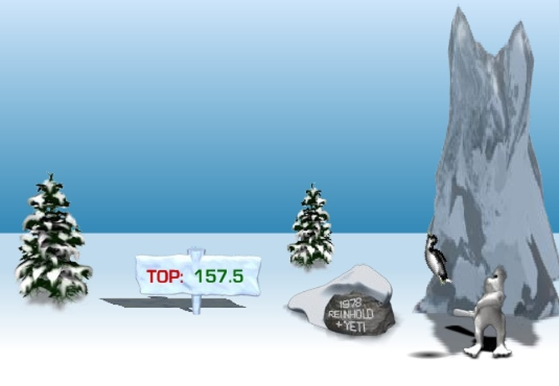
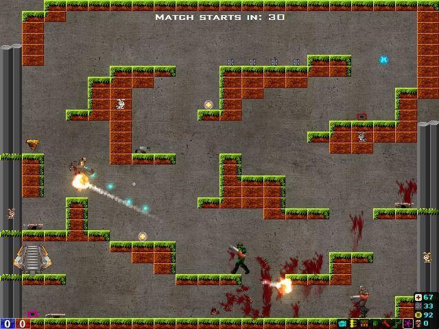
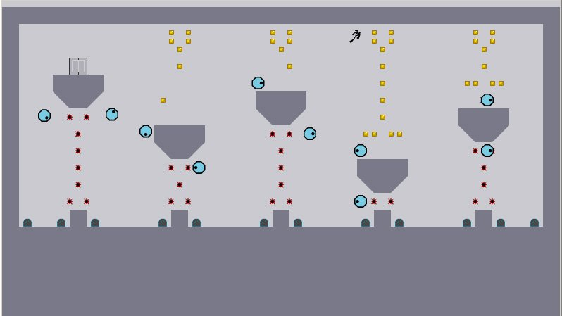
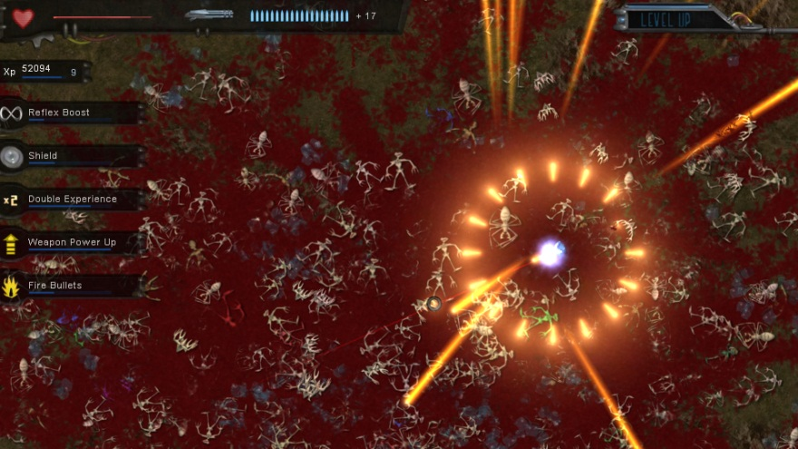

Here is my list of the most addictive games. (I purposely do not include games from the current century 😄)

## 1. Yetisports

Where you need to send penguins into a free flight as far as you can. Beating your highscore is always addictive. And sliding penguins are awesome.

## 2. Need for kill

It's Quake in 2D. The best hot-seat game where 2 friends can play with one keyboard and one mouse.

## 3. N

Very complex puzzle-muscle game about ninja and his hard way through very gray gray life.

## 4. Crimsonland

Very high pace top view shooter. It's almost the same fun as Serious Sam: Second Encounter, but darker. It influenced me a lot during creation of [Fire!](/gamedev/fire)

## New technologies

Old games, how good they can be with new technologies?

1. Yetisports using Nintendo Switch controller
2. NFK on Smart TV with wireless set of keyboard and mouse
3. N. Looking for gold cubes using augmented reality
4. Crimsonland in VR.