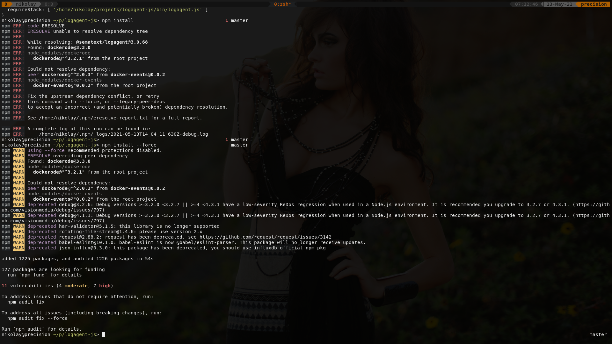
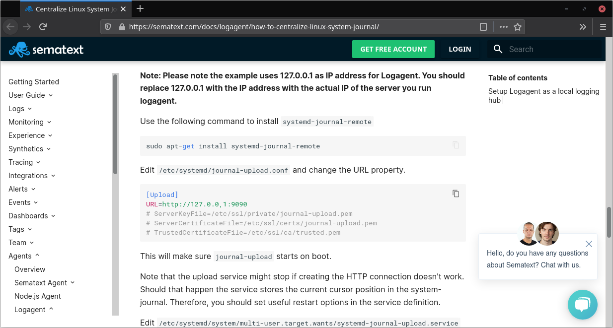

I found logagent from a google search. It should solve a very simple thing: get logs from systemd, focus on one service, format a message and send to Slack with webhooks. After six months I have found some time to make another effort and make it finally work.


## Preface

For example you have a very small software company. You are using only free services and you do not have resources to write custom solutions.

When you work with real users, anything can happen. You have a system that requires constant monitoring. Normally one will setup alerts, but you do not know what alerts you need.

Then you decide to keep an eye on it, set a simple service redirecting important log messages into Slack, that way your managers can spot a problem and later formulate what alerts they need.


## Install logagent

First thing first, get the code

```
git clone https://github.com/sematext/logagent-js.git
git rev-parse HEAD
af1661efcb69812bc495524cbc07a1c55e0767ec
```
Commit `af1661efcb69812bc495524cbc07a1c55e0767ec` is the place of my investigation. Also

```
node --version
v16.0.0
npm --version
7.11.2
```

install modules from npm

```
npm install
```

Here is my first error.



Flag `--force` makes it swallow the pill

```
npm install --force
```

Let's ignore deprecated warnings, we will fix it later. Now it's time to check the "binary":

```
node ./bin/logagent -h 
```

Great! After this we can continue with the [official tutorial](https://sematext.com/docs/logagent/how-to-centralize-linux-system-journal/) on how to forward systemd logs to sematext (output from sematext will be configured in the second stage).

The howto has good explanations that I'm not going to repeat. I will only list here the steps you need to make everything work.


## Configure logagent

Create example config file

```
node ./bin/logagent --writeConfig logagent.yml
```

It is huge! It has 1085 lines. Okay, just make a new one, we keep it simple:

```yaml
input:
   journal-upload:
    module: input-journald-upload
    port: 9090
    worker: 0
    systemdUnitFilter: 
      include: !!js/regexp /.*/i
    removeFields:
      - __CURSOR
      - _TRANSPORT
      - _BOOT_ID
      - _UID
      - _GID
      - _CAP_EFFECTIVE
      - _MACHINE_ID
      - _HOSTNAME
      - _SYSTEMD_SLICE
      - _STREAM_ID
      - _PID
      - _COMM
      - _EXE
      - _CMDLINE
      - _SYSTEMD_CGROUP
      - _SYSTEMD_INVOCATION_ID
      - SYSLOG_FACILITY
      - PRIORITY
      - SYSLOG_IDENTIFIER

output: 
  stdout: yaml
```

More about configuration options of `input-journald-upload` in input plugin spec: https://sematext.com/docs/logagent/input-plugin-journald-upload/

Run the logagent. This will start a web server on our localhost on port 9090 waiting for journal info to come. Keep this terminal open.

```
node ./bin/logagent --config logagent.yml
```


## Send systemd logs to logagent

There is no such package as `systemd-journal-remote` on Arch. This thing is already in the system:

```
pacman -Qo /usr/lib/systemd/system/systemd-journal-upload.service
/usr/lib/systemd/system/systemd-journal-upload.service is owned by systemd 247.6-1.0
```

So just add this URL `URL=http://127.0.0.1:9090/00000000-0000-0000-0000-000000000000` to `/etc/systemd/journal-upload.conf`

```
sudo vim /etc/systemd/journal-upload.conf
```

Be carefull with instructions in the howto, their URL has a comma... and missing a token (which is some UUID, but we do only local work, so no need to create free account, because any UUID should be fine - I use zeroes). I figured that out from the source code (somewhere in [these lines](https://github.com/sematext/logagent-js/blob/8add66df1ba1e250266f2622c500b3f4c9012367/lib/plugins/input/journald-upload.js#L266) when I searched for "invalid logs token in url" message).



To edit systemd services I will use the righteous way of doing it. This way edits will survive Noah's Flood and the system update/upgrade.

```
sudo systemctl edit systemd-journal-upload
```

Add this content

```
[Unit]
StartLimitIntervalSec=5

[Service]
WatchdogSec=0
Restart=always
TimeoutStartSec=1
TimeoutStopSec=1
StartLimitBurst=1000
```

Settings from the main file `/usr/lib/systemd/system/systemd-journal-upload.service` are used, except those that we just have overwritten.

Be aware of "recent" systemd updates not reflected in the howto:

> StartLimitInterval was moved from [Service] to [Unit] section in 6bf0f408e4833152197fb38fb10a9989c89f3a59, but the old location was still accepted for compatibility. The new StartLimitIntervalSec name is valid only in [Unit].

Reference: https://lists.freedesktop.org/archives/systemd-devel/2017-July/039255.html

Fire it up.

```
sudo systemctl enable systemd-journal-upload.service
sudo systemctl start systemd-journal-upload.service
```

At this point your terminal with logagent should start spitting out all logs from systemd into the air. Stop it. Ctrl+C.

Now it is time to tame the output with filters.


## Mockup service

As I said earlier, I only want to receive logs from one specific service. Like this simple [Python](/gamedev/why-do-i-hate-python) service: https://gist.github.com/mikolasan/917455a42152eeab24a0bb3fcb549647.

```
sudo mkdir /opt/my-python-project
sudo chown $USER:$USER -R /opt/my-python-project
vim /opt/my-python-project/main.py
chmod +x /opt/my-python-project/main.py

sudo vim /etc/systemd/system/my-python-project.service
sudo systemctl start my-python-project
```


## Fixing bugs in logagent

Instead of `include: !!js/regexp /.*/i`, should be one specific service, right? Like `include: !!js/regexp /my-python-project/i`.

I actually see many many audit messages. They are not from my service. The thing about these messages - they do not have `_SYSTEMD_UNIT` attribute, hence it cannot be sorted out by any include/exclude logic.

Next, if you are curious, I will give you a hint where the bug is in `journald-upload.js`:

```javascript
const _SYSTEMD_UNIT = '_systemd_unit'
console.log(log[_SYSTEMD_UNIT])
console.log(log._SYSTEMD_UNIT)
```

I hope you already have that gut feeling.

And how about unused function `parseLine`? I have started "blaming". And first thing I see:

```diff
+  // fastest loop is counting down
+  for (let i = lines.length; i >= 0 ; --i) {
```

> fastest loop is counting down

In JavaScript. I laughed. 

It was true on assembler level for Intel 8086. But current processors have parallel conveyers. I doubt that it is true in simple loops for modern compilers with `-O3`.

At this point you may need to wait until all prevoius messages will be ignored. Also I did restart the `systemd-journal-upload` several times, I do not know if that helped. Also try to make a break, get a cup of tea and it will work eventually. That's my boss' favourite word: eventually.


## Add filters

This part must be really straight forward. Just look at [the doc](https://sematext.com/docs/logagent/input-filter-grep/). But no. The `journald-upload` input plugin  is not producing "raw input". It produces objects. Which means instead of input filters we must use otput filters. It is perfectly explained in ... comments in the source code.

> DATA_RAW events are emitted by input-plugins, producing text lines, and must be handled by text based input-filters and parser.

> DATA_OBJECT events are emitted by input plugins, producing structured data, with no need to be parsed. Such data needs to be processed by output-filters and output plugins. Skipping text based input filters and parser, and continue with directly output filters improves performance by saving serialisation to JSON and back to JS objects.

```yaml
input:
   journal-upload:
    module: input-journald-upload
    port: 9090
    worker: 0
    systemdUnitFilter: 
      include: !!js/regexp /my-python-project/i
    removeFields:
      - __CURSOR
      - _TRANSPORT
      - _BOOT_ID
      - _UID
      - _GID
      - _CAP_EFFECTIVE
      - _MACHINE_ID
      - _HOSTNAME
      - _SYSTEMD_SLICE
      - _STREAM_ID
      - _PID
      - _COMM
      - _EXE
      - _CMDLINE
      - _SYSTEMD_CGROUP
      - _SYSTEMD_INVOCATION_ID
      - SYSLOG_FACILITY
      - PRIORITY
      - SYSLOG_IDENTIFIER

outputFilter:
  remove-fields:
    module: remove-fields
    matchSource: !!js/regexp .*
    fields:
      - _systemd_unit
  dropEvents:
    module: drop-events
    debug: false
    filters:
      message: 
        exclude: !!js/regexp /bad/

output: 
  stdout: yaml
```

When we add new `drop-events` filter, one can notice that developers like to debug with `console.log` and usually forget to remove it from production. I have a fix for that as well.

## Send logs to Slack

This part must be really straight forward. Just look at [the doc](https://sematext.com/docs/logagent/output-plugin-slack/). But no. Slack has new API for their [fancy](https://api.slack.com/messaging/webhooks#advanced_message_formatting) [Block Kit framework](https://api.slack.com/block-kit). 

For the sake of a good example I will show how to print a timestamp from logs. It is not that easy as you think. 

Time from `journald-upload` is received in microseconds, it is not a Unix timestamp, but Slack [only understands](https://api.slack.com/reference/surfaces/formatting#date-formatting) Unix timestamps. Somewhere in logagent we have to divide our value by 1000. So how to transform values in logagent? It doesn't seem hard to add a new plugin, but I will add transform function to `slack-webhook.js` and define it in `logagent.yml`.

## Results

- Final [config file](/blog/logagent/logagent.yml)
- [Patch](/blog/logagent/parse-systemd-and-post-in-slack.patch) for `af1661efcb69812bc495524cbc07a1c55e0767ec` (tag `3.0.68`)