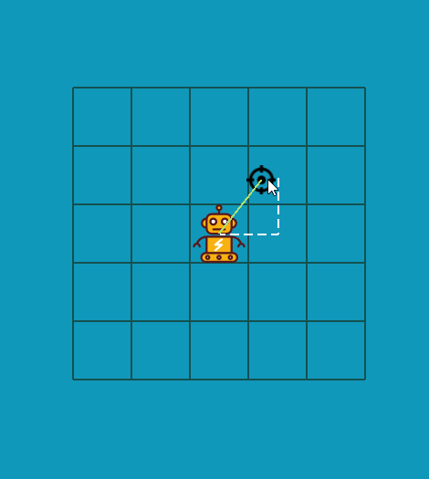
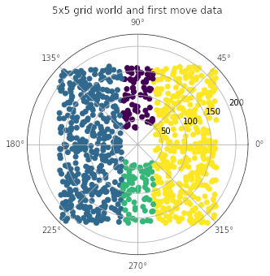
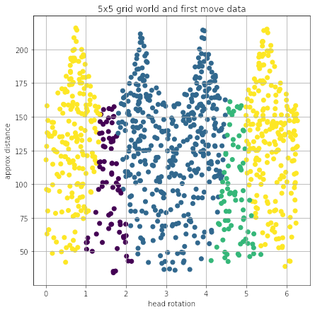
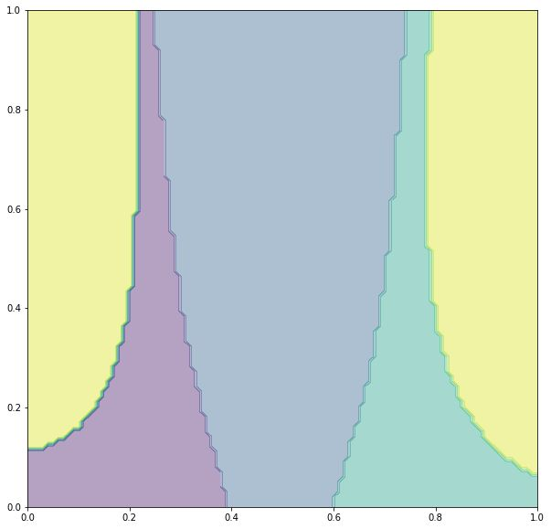
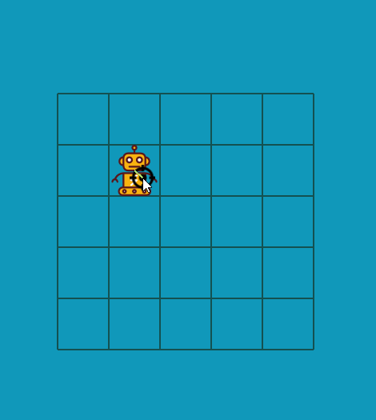

I've used A* algorithm to search for the shortest path but I didn't know that it was created in the course of the Shakey project. Shakey the robot was able to reason about its own actions. This development dated back to 1968 😯

Technically speaking I'm creating Shakey 2023. I plan to make it smaller.



Here's a visualization of the training data. Graph in polar coordinates showing points that supposedly come from robot's sensors, as head rotation angle and distance approximation.

Robot is in the center. Grid size is 5x5



I think it might be quite interesting to compare the previous graph with how the points are located in the Cartesian coordinate system



Proper classification should predict the first move  based on the color of the dot as follows

- blue -> left
- purple -> up
- yellow -> right
- green -> down

After robot makes the first move, it repeats the prediction

Model for non-binary classification in Keras

```python
model = tf.keras.models.Sequential()
model.add(tf.keras.layers.Dense(32, input_shape=(2,), activation='tanh'))
model.add(tf.keras.layers.Dense(16, activation='tanh'))
model.add(tf.keras.layers.Dense(8, activation='tanh'))
model.add(tf.keras.layers.Dense(4, activation='softmax'))
model.compile(
    optimizer='adam',
    loss='categorical_crossentropy',
    metrics=['accuracy'])
```

So far this model gives very convincing result

Notes: graph in the Cartesian coordinate system, distance and rotation normalized to [0, 1] interval



Jupyter notebook link: https://github.com/mikolasan/ai_sandbox/blob/master/ann/Navigation%20ANN%20keras.ipynb


Run Keras model and a web server in Python, get prediction using API from JavaScript.




Next step is macro behavioral model. We are going to use so called model free approach from [[Smart badger and Markov decision processes][1]] also leveraging physiological regulation.

So we will create some sandbox with [many independent agents](/ai/multi-agent-systems) following the model. Just for fun, Lotka-Volterra model will be the first


 [1]: https://arxiv.org/pdf/2211.10851.pdf