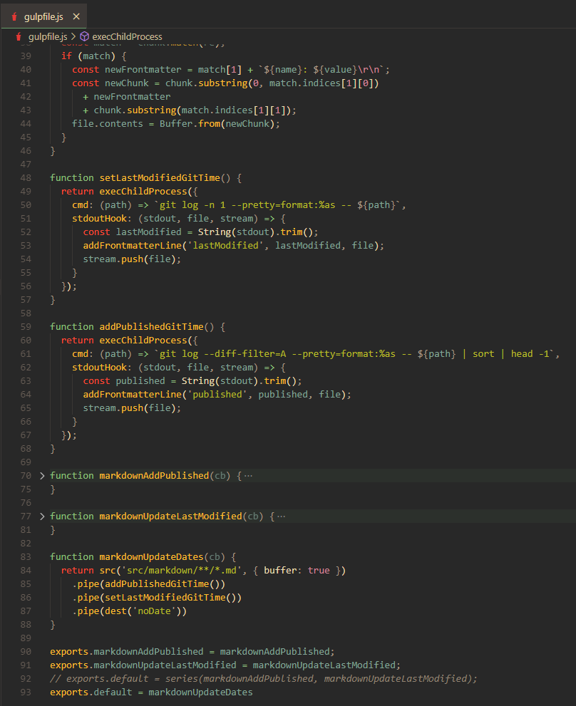

I'm trying to add "last updated" time to [my blog on Gatsby](blog/what-static-site-generator).

## Timeline

- Day 1. Install Gulp
- Day 2. Recursively get a list of files where date is needed 
- Day 3. I don't know about streams in Nodejs. How to use **through2**? 🤯
- Day 4. I don't want to read about **through2**, its API is irrational 🙊
- Day 5. No
- Day 6. Nope
- Day 7. Finished with the search bar
- Day 8. The light came, I understand how to use secrets in GitHub's actions
- Day 9. Updated Gatsby to 4. It broke GraphQL queries with `childImageSharp`. Fixed by undocumented feature mentioned in a comment on Gatsby's issue tracker.
- Day 10. Back to Gulp. I'm getting file contents 🥳. Am I following tutorials? No, I'm adopting code from other plugins 🤠
- Day 11. Crafted 2 `git log` commands to get date when file was initially published and last modification time. The result from child process comes in callback, so I will need to figure out how to wrap it in a `Promise` and return this thing from Gulp's task.
- Day 12. I wanted to report here that I was consumed by [Dapp investigation](/blog/all-that-web3-shit) and did 0 progress, but then opened my draft notes from the yesterday and did small refactoring. I still disagree with the statement:

> "Streams are node's best and most misunderstood idea"

- Day 13 - Day 20. No progress whatsoever.
- Day 21. Done. Final [gulpfile.js](https://github.com/mikolasan/mikolasan.github.io/blob/gatsby/gulpfile.js) file

## Takeout

Just for fun and educational purposes I tried to avoid new dependencies. I could use **gulp-git**, **gulp-replace** or **gulp-inject-string** modules, but instead I studied their code and used only bare minimum for my needs.

I learned about `/d` flag in RegEx and a little about Transform.

The turning point happened when I realized that transform inside transform is not going to work, and that `pipe()` doesn't take gulp's task as an argument. Sounds silly now, but lack of tutorials and dynamic types were telling me: why not? 👿

## Reference

- work with streams https://github.com/gulpjs/gulp/blob/master/docs/writing-a-plugin/dealing-with-streams.md
- no use of through2, use Transform https://github.com/lazd/gulp-replace/blob/master/index.js
- get file content https://github.com/eugeneware/replacestream/blob/master/index.js
- good example https://github.com/sindresorhus/gulp-filter/blob/main/index.js
- git: last modified time https://stackoverflow.com/questions/4784575/how-do-i-find-the-most-recent-git-commit-that-modified-a-file
- git: first published time https://stackoverflow.com/questions/11533199/git-find-commit-where-file-was-added
- git log https://git-scm.com/docs/git-log
- gulp git https://github.com/stevelacy/gulp-git/blob/master/lib/exec.js
- file content manipulation https://github.com/mikehazell/gulp-inject-string/blob/master/index.js
