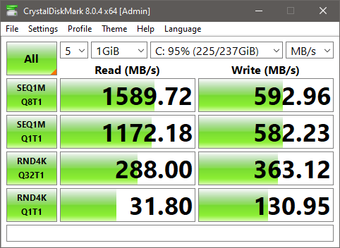
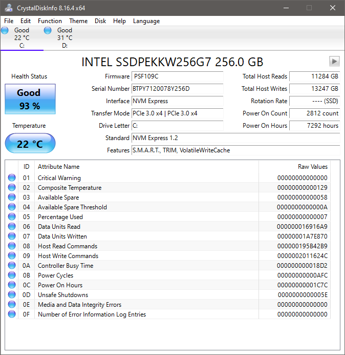
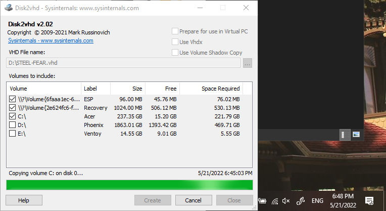
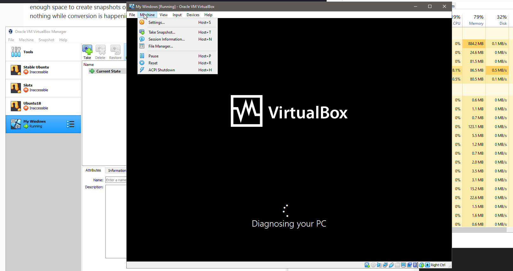
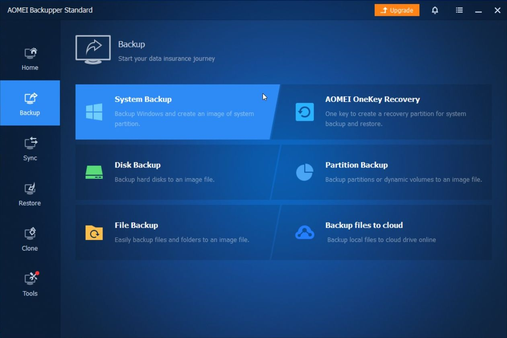
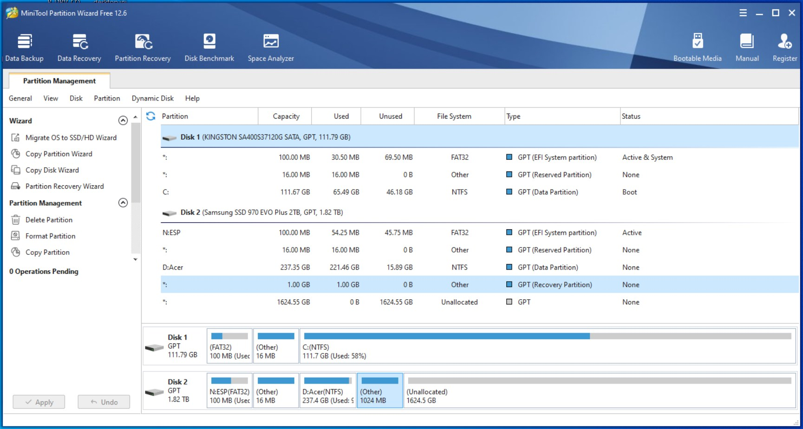
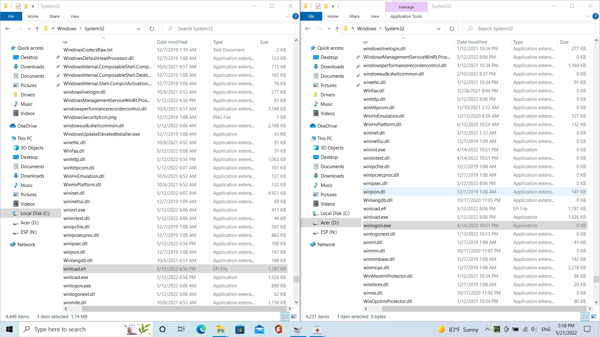
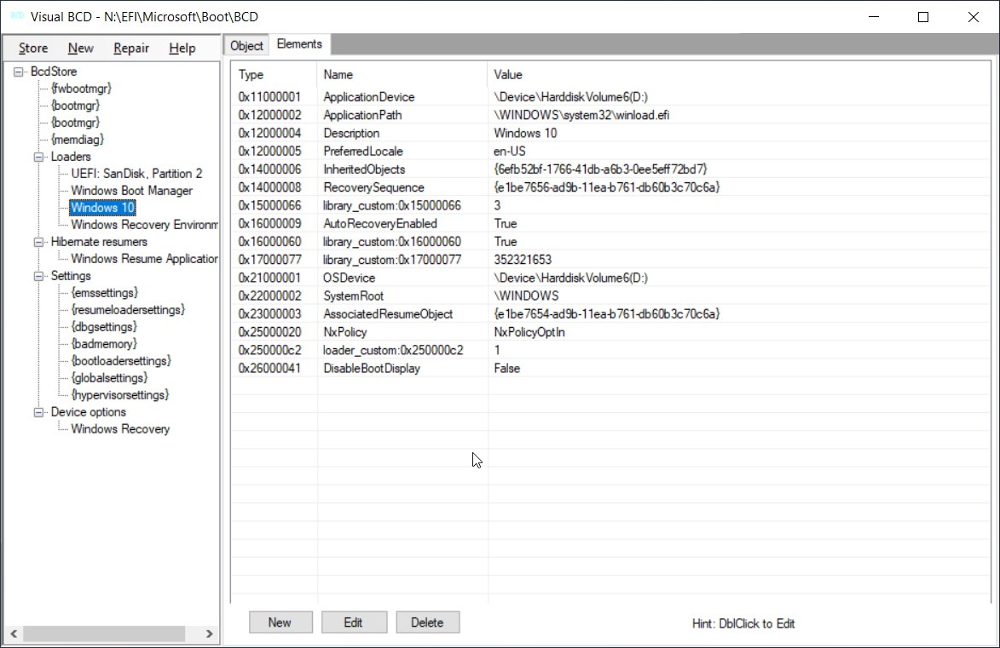

What do you need to know when you clone Windows 10 from one drive to another or How I spent one week without a computer trying to upgrade SSD on my laptop.

I’m a Linux guy. I feel very comfortable in a terminal and I know tools. If I don’t remember how tools work, I read man pages. I did many installations of Linux systems like Arch, Gentoo, I followed Linux From Scratch guide, I [build my own system](/blog/custom-linux) with Buildroot.

So I decided to clone my Windows system from the Linux environment. In this article you will see how I continuously failed along various approaches, but didn’t give up as many people do reinstall Windows from scratch, no, I pursued my goal every evening after work throughout a week, and I made a backup. And moreover I made a backup and a virtual box image.

But before I start my story here is a short recap of my new knowledge.

What you need to know when you clone Windows 10 from one drive to another

- All free/shareware tools suck. But we will find a way to deal with it
- I tried MiniTool Partition Wizard and got corrupted filesystem (200GB of written data on my new SSD wasted)
- I tried AOMEI Backupper and it was analyzing disk for hours, so I cancelled it
- I downloaded 700MB to install Acronis from Sabrent, but only after it polluted my system with files and services, it said that it’s going to work only with Sabrent drives installed into the motherboard. Wasted time.
- Do not copy from live OS - chances to get corrupted file system are much higher. Possibly Windows Volume Shadow Copy service can eliminate such problems, but this approach I leave for Windows gurus.
- Samsung Magician cannot copy from offline OS. It can only copy from the current live Windows system, which is not good, see above why

We recently purchased new computers with two M.2 slots on motherboards, so I had envisioned that copying 300GB from one SSD drive to another would be a blazing fast task. That’s why I start with stupid copy approach using my favorite copy tool rsync. 



We have PCIe Gen 4 and Gen 3 on the motherboard, and drives support PCIe Gen 3 x4 at maximum. So I expect the copy to be up to 3000MB/s, which means that 256GB of my data should be copied in less than 2 minutes. Awesome!

## Attempt 1: rsync

### Plan

Boot into live CD. I use Manjaro installer. 

Open Gparted and recreate partition table and partitions on new drive in the likeness of your old system. 

Note: Weirdly enough Windows requires 16MB after ESP partition for its own secret deals. So check out their [official docs about it]([https://docs.microsoft.com/en-us/windows-hardware/manufacture/desktop/configure-uefigpt-based-hard-drive-partitions?view=windows-11](https://docs.microsoft.com/en-us/windows-hardware/manufacture/desktop/configure-uefigpt-based-hard-drive-partitions?redirectedfrom=MSDN&view=windows-11))

Then format, set flags, set partition names and labels.

Then mount and run rsync.

### Pitfalls

Now, why you should never NEVER ever do this with NTFS filesystems:

you will mess up Windows permissions and on boot you will get error

- Your PC needs to be repaired, Error 0xc0000225 on Windows 10
A Required Device Isn't Connected or Can't Be Accessed

Any attempt to fix it will fail. Only reinstall will help. 

How to diagnose it. Boot Windows system from another drive and look at your new system in File Explorer. If system and hidden folders and files look like normal then you definitely screwed permissions and your system is toast. 

And even if sometime in this universe ALC permissions will be added to Linux drivers, then you will need to fix Windows drive mounting letter in the registry following [these steps]([https://superuser.com/questions/1235910/cloning-windows-10-partition-to-different-drive-not-working-in-dual-boot-setup](https://superuser.com/questions/1235910/cloning-windows-10-partition-to-different-drive-not-working-in-dual-boot-setup))

Even if we would have the ability to read and copy ACL permissions, I was not impressed by the speed of rsync. It was 80MB/s. So let’s move on to another approach.

## Attempt 2: dd

Apparently, after 28 years NTFS stays solely the file system for Windows and it still has minimal support on Linux. No one cares.

We will be above it. Actually we will go deeper on a lower layer and will copy data byte by byte ignoring all these higher level things as partition table, file systems, journals.

Using `dd` we can copy one small drive to the beginning of the big drive and then extend the last partition. You can even move partitions like I did: I moved windows recovery partition to the end and then extended system partition that goes behind it.

As before we boot into live USB and [use dd]([https://superuser.com/questions/1712900/how-can-i-clone-a-windows-10-disk-onto-a-larger-disk](https://superuser.com/questions/1712900/how-can-i-clone-a-windows-10-disk-onto-a-larger-disk)) or [cat or pv]([https://unix.stackexchange.com/questions/444019/how-can-i-clone-backup-restore-windows-10-from-linux](https://unix.stackexchange.com/questions/444019/how-can-i-clone-backup-restore-windows-10-from-linux))

Everything goes faster than rsync, I get 500MB/s but then after 100GB it halts after read error. I run it again and it aborts on the same spot. Again, 200GB of written data is wasted on my new SSD.

I [googled the read error problem]([https://askubuntu.com/questions/253117/how-do-i-fix-an-input-output-error-using-dd](https://askubuntu.com/questions/253117/how-do-i-fix-an-input-output-error-using-dd)) and was thinking if I should try [ddrescue]([https://lifeinhex.com/tag/ddrescue/](https://lifeinhex.com/tag/ddrescue/) 

```
sudo ddrescue /dev/sdc1 /dev/sda1 | pv
```

or [overwrite sectors with hdparm]([https://web.archive.org/web/20130608003739/http://www.sjvs.nl/forcing-a-hard-disk-to-reallocate-bad-sectors/](https://web.archive.org/web/20130608003739/http://www.sjvs.nl/forcing-a-hard-disk-to-reallocate-bad-sectors/))

hdparm –write-sector 1261069669 –yes-i-know-what-i-am-doing /dev/sdb

```
hdparm --write-sector 11233976 --yes-i-know-what-i-am-doing /dev/sdb
```

But of course I tried another solution first: add a flag to dd to ignore any errors

```
sudo dd if=/dev/sdc1 of=/dev/sda1 conv=noerror
```

You probably know the result at this point: additional 200GB of written data is wasted on my new SSD.

## Attempt 3: VHD

At this point I started worrying that my 5 year old SSD drive is going to die any time soon and I was afraid to do any other clone experiments before I am sure that my data is safe. 



So the priority has changed and I was looking for ways to make a backup first. From my experience, the backup that will work on Linux or Windows machine is a drive image recognized by virtual machines. Virtual Box can work with VHD and Windows has official tool for making such image - [Disk2vhd]([https://docs.microsoft.com/en-us/sysinternals/downloads/disk2vhd](https://docs.microsoft.com/en-us/sysinternals/downloads/disk2vhd)). 



So do not repeat my mistakes:

1. Disable VHDX format, because it’s not supported by ANY version of Virtual Box (not 4, not 5, not 6, not any other future version).
2. Do not copy live system or system that has read errors like I on the then with dd (how to detect such sectors is another question)



## Attempt 4: shareware tools

Despite my priority of making the virtual drive first, I realized that first I need to backup very critical data to an external drive. 

### Backup data

How do you define what data is critical or not?

You just imagine that in the following minute you are going to make actions that will erase all data without a chance to restore it.

Seriously, imagine that it has happened.

Then ask youself: how is it going to hurt if this folder will be erased? This folder? And this?

This way you do backup. Windows and programs can be reinstalled, but your files - they made out of sweat, pain and love, it’s tough to create again and it hurts when you lose it.

### Backup the drive

Boot from an another Windows drive while your system is connected as “external” drive.

Create a backup file. I used **AOMEI Backupper** for this purpose.



Boot again from another Windows drive, but this time connect new drive as “external”.

Restore backup.

Extend system partition possibly saving the Rescue partition. I didn’t find how to “move” the partition in standard Disk Management from Microsoft, that’s why I used **MiniTool Partition Wizard** for this purpose.



## Troubleshooting

If you found this article from a google search trying to fix a rare message on Blue Screen of death from Windows, then here are my few observations that can help.

### A Required Device Isn't Connected or Can't Be Accessed

If you see this error then you should take a look on your EFI boot record.

[Read more in this article]([http://woshub.com/how-to-repair-uefi-bootloader-in-windows-8/](http://woshub.com/how-to-repair-uefi-bootloader-in-windows-8/)), where the author understands what applied commands are doing. Comparing to all other copywriters, that appear first in the search results, but have no idea of what they are recommending.

### Access is denied (bootrec /fixboot)

If you get "Access is denied" error while running bootrec /fixboot then you have something broken in C:\windows. Like missing files, wrong permission.

 is missing")

### bcdboot failed to validate boot manager checksum

If you are trying to format ESP partition 

```
format N: /FS:FAT32
```

and recreate boot files with

```
bcdboot C:\windows /s N: /f UEFI /v
```

and you get “bcdboot failed to validate boot manager checksum”

then you have something broken in C:\windows. Like missing files, wrong permission.



BCD file itself can be reviewed and possibly fixed if you take a look in [free visual editor]([https://www.boyans.net/](https://www.boyans.net/)), know [basic commands]([http://woshub.com/how-to-rebuild-bcd-file-in-windows-10/](http://woshub.com/how-to-rebuild-bcd-file-in-windows-10/) ), aware of [Windows boot manager settings]([https://docs.microsoft.com/en-us/windows-hardware/drivers/devtest/adding-boot-entries](https://docs.microsoft.com/en-us/windows-hardware/drivers/devtest/adding-boot-entries)), and maybe even know [more commands]([https://docs.microsoft.com/en-us/windows-hardware/manufacture/desktop/bcd-system-store-settings-for-uefi?view=windows-11](https://docs.microsoft.com/en-us/windows-hardware/manufacture/desktop/bcd-system-store-settings-for-uefi?view=windows-11)). In the end bcdedit has [pages of help information]([https://www.itechguides.com/windows-boot-manager-how-to-edit-bootmgr-and-fix-boot-errors-in-windows-10/](https://www.itechguides.com/windows-boot-manager-how-to-edit-bootmgr-and-fix-boot-errors-in-windows-10/)).



Or it can [magically fix itself]([https://answers.microsoft.com/en-us/windows/forum/all/how-do-you-recover-from-missing-bootmgr-following/b02a0743-1dd5-4b15-a277-74b4f4f2446d](https://answers.microsoft.com/en-us/windows/forum/all/how-do-you-recover-from-missing-bootmgr-following/b02a0743-1dd5-4b15-a277-74b4f4f2446d))

## Conclusion

Notwithstanding that I tried to avoid any extra Windows software installed, I ended up trying many tools, but has chosen to keep 2 specific tools to repeat the similar procedure in the future without hassle like during this week.

I will keep **MiniTool Partition Wizard** for shaping partitions to my preferences: moving partitions, and to run filesystem check.

Also **AOMEI Backupper** for making and restoring backups. It uses it’s proprietary not common format, so I depend now on this software. But I assume they use some simple format like dd and with encryption on top and with handy metadata. Some info about their format would be helpful. Might be an interesting task to reverse engineer it and to find out why their software worked for me.

Optionally I install **Samsung Magician** for displaying beautiful pulsing health status of the drive. Of course it works only with Samsung, but pulsing animation can be scraped from the install folder for my hobby projects.

Linux tools for NTFS file system - never again.