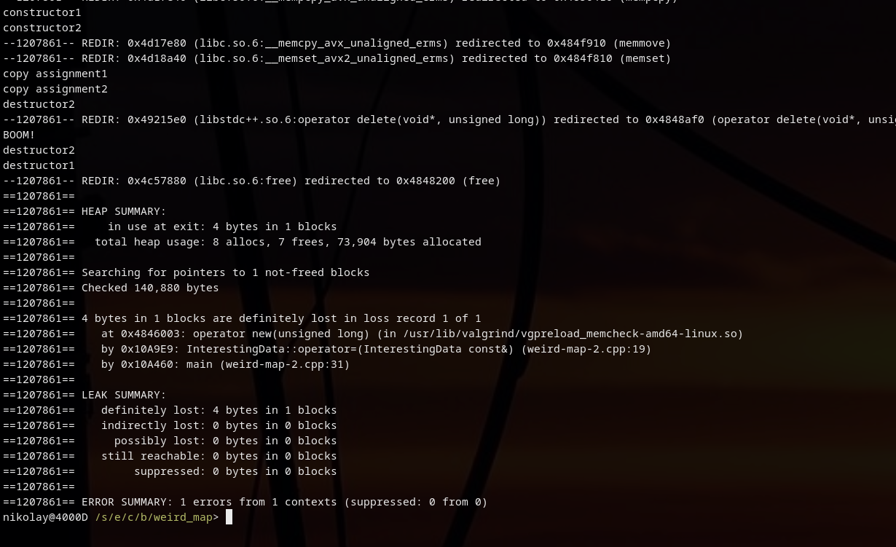

I find it quite interesting. Do you think it is going to compile?

```cpp
#include <iostream>
#include <string>
#include <unordered_map>

class InterestingData {
public:
    InterestingData() = delete; // map wants this !
    InterestingData(int id) : _id(id) {
        std::cout << "constructor" << _id << std::endl;
    }
    ~InterestingData() {
        std::cout << "destructor" << _id << std::endl;
    }
    InterestingData(const InterestingData& other) : _id(other._id) {
        std::cout << "copy constructor" << _id << std::endl;
    }
    InterestingData& operator=(const InterestingData& other) {
        _id = other._id;
        std::cout << "copy assignment" << _id << std::endl;
        return *this;
    }

    int _id;
};

int main(int argc, char const *argv[])
{
    std::unordered_map<std::string, InterestingData> map;
    InterestingData data1(1), data2(2);
    map["test"] = data1;
    map["test"] = data2;
    map.clear();
    std::cout << "BOOM!" << std::endl;
    return 0;
}
```

So I proudly present you a Weird Map. Can you explain it?

```cpp
#include <iostream>
#include <string>
#include <unordered_map>

class InterestingData {
public:
    InterestingData() {} // Ok, fine, here you go
    InterestingData(int* id) : _id(id) {
        std::cout << "constructor" << *_id << std::endl;
    }
    ~InterestingData() {
        std::cout << "destructor" << *_id << std::endl;
        delete _id;
    }
    InterestingData(const InterestingData& other) : _id(new int(*other._id)) {
        std::cout << "copy constructor" << *_id << std::endl;
    }
    InterestingData& operator=(const InterestingData& other) {
        _id = new int(*other._id);
        std::cout << "copy assignment" << *_id << std::endl;
        return *this;
    }

    int* _id;
};

int main(int argc, char const *argv[])
{
    std::unordered_map<std::string, InterestingData> map;
    InterestingData data1(new int(1)), data2(new int(2));
    map["test"] = data1;
    map["test"] = data2; // LEAK!
    map.clear();
    std::cout << "BOOM!" << std::endl;
    return 0;
}
```

Here's a screenshot from **valgrind**




As usual all code for your experiments and slides are in [**cpp-skill** repository](https://github.com/mikolasan/cpp-skill/tree/master/weird_map).


----

## Similar posts

- ["Pointing" arguments](/code/cpp/pointing-arguments)
- [const in C++](/code/cpp/const-ness)
- [C++ question: exec](/code/cpp/exec-function)
- [C++ State Machine](/code/cpp/finite-state-machine)
- [Variadic templates in C++](/code/cpp/variadic-templates)
- [Leak in std::map](/code/cpp/leak-in-std-map)