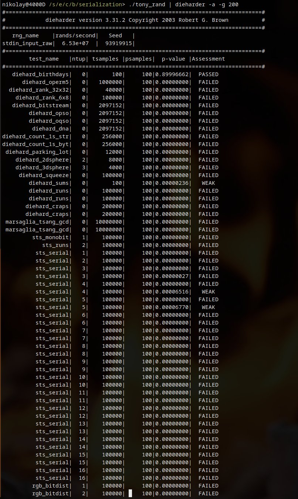
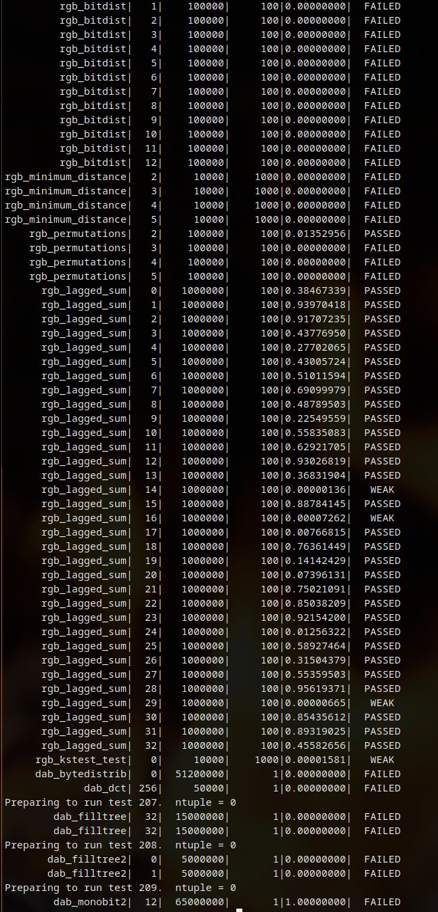

## Biased scaling

First things first. How to find a bias in random number generator? But not that bias that all statistical tests search for in a stream of 32 bit numbers, but the bias after scaling.

[This article](https://www.pcg-random.org/posts/bounded-rands.html), **Bounded rands** is the answer. It also will explain how to avoid biased scaling.

It's based on [this paper](https://arxiv.org/pdf/1805.10941.pdf), **Fast Random Integer Generation in an Interval** by Daniel Lemire which also has great insights.


Let's check the Isaac RNG implemented in Javascript ([original repo](https://github.com/rubycon/isaac.js), [npm package repo](https://github.com/StefanoBalocco/isaac.js)). The JavaScript implementation and the original C implementation from the [official website](http://burtleburtle.net/bob/rand/isaacafa.html) looks similar. Also it produces the same sequence when they start from the same seed.

```js
function random(){
  return 0.5 + this.rand() * 2.3283064365386963e-10; // 2^-32
}
```

Here `this.rand()` returns a random integer value in range [0, 2^32), then we divide it to convert it into a double (See paragraph **FP multiply** in the article). 
`0.5` is a fix for uint representation in JavaScript.

And this method probably in every browser and [MDN](https://developer.mozilla.org/en-US/docs/Web/JavaScript/Reference/Global_Objects/Math/random) warns you:

> If extremely large bounds are chosen (2^53 or higher), it's possible in extremely rare cases to reach the usually-excluded upper bound. 

And let's assume that you are going to generate a random value in a range by this code

```js
// return random value from [a, b) range
const random = function(a, b) {
  return a + Math.floor(isaac.random() * (b - a));
};
```

Surprisingly, this is [very common](https://stackoverflow.com/questions/1527803/generating-random-whole-numbers-in-javascript-in-a-specific-range) way to do it in the JavaScript world. 

So here is the way to properly use the `isaac` library implementing the OpenBSD algorithm

```js
const max_uint = 0x100000000;
const rand_uint = () => {
  const r = isaac.rand();
  return r < 0 ? r + 0x100000000 : r; // fix uint representation in JavaScript
}
const rand_in_range = (range) => {
  let result = rand_uint();
  const working_range = max_uint - (max_uint % range);
  while (result >= working_range) {
    result = rand_uint();
  }
  return result % range;
}
const random = function(a, b) {
  return a + rand_in_range(b - a);
};
```

### Reference

- More comments about the article https://stackoverflow.com/questions/61107920/how-does-bias-manifest-in-bounded-random-number-generation
- Some theory Random Number Generation by Chris Lomont http://lomont.org/papers/2008/Lomont_PRNG_2008.pdf
- From Daniel Lemire's website https://lemire.me/blog/2016/06/27/a-fast-alternative-to-the-modulo-reduction/
- Maybe a good read: Design Flaws in the Implementation of the Ziggurat and Monty Python methods (and some remarks on Matlab randn) https://arxiv.org/pdf/math/0603058.pdf
- The Debian PGP disaster that almost was https://rdist.root.org/2009/05/17/the-debian-pgp-disaster-that-almost-was/
- A Primer On Randomness https://espadrine.github.io/blog/posts/a-primer-on-randomness.html


## Plot the error

[Anatomy of a pseudorandom number generator](https://nakedsecurity.sophos.com/2013/07/09/anatomy-of-a-pseudorandom-number-generator-visualising-cryptocats-buggy-prng/) – visualising Cryptocat’s buggy PRNG 

```gnuplot
plot "chi-square.300.fixed.txt" w linesp, "chi-square.300.txt" w linesp
```

- https://nakedsecurity.sophos.com/2013/07/09/anatomy-of-a-pseudorandom-number-generator-visualising-cryptocats-buggy-prng/
- https://bic-berkeley.github.io/psych-214-fall-2016/arrays_and_images.html


## Test suites


### TestU01 / BigCrush

- http://simul.iro.umontreal.ca/testu01/tu01.html
- Test javascript in testU01 (by compiling the test suite with Emscripten) https://jtobin.io/crushing-isaac
- testing popular random-number generators https://github.com/lemire/testingRNG


### Dieharder


**isaac_test.js**

```js
isaac.seed([0]);

function delay(time) {
  return new Promise(resolve => setTimeout(resolve, time));
}

while (true) {
  const r = isaac.rand();
  const v = r < 0 ? r + 0x100000000 : r; // fix uint representation in JavaScript
  process.stdout.write(v + '\n');
  await delay(1);
}
```

**numbers-to-stream.cpp**

```cpp
#include <cstdint>
#include <iostream>
#include <limits>

constexpr auto max_size = std::numeric_limits<std::streamsize>::max();

int main(int argc, char const *argv[])
{
    uint32_t input_number = 0;
    while (true) {
        std::cin >> input_number;
        if (std::cin.eof() || std::cin.bad()) {
            break;
        } else if (std::cin.fail()) {
            std::cin.clear(); // unset failbit
            std::cin.ignore(max_size, '\n'); // skip bad input
        } else {
            char c = (input_number & 0xFF000000) >> 24;
            std::cout << c;
            c = (input_number & 0x00FF0000) >> 16;
            std::cout << c;
            c = (input_number & 0x0000FF00) >> 8;
            std::cout << c;
            c = (input_number & 0x000000FF);
            std::cout << c;
        }
    }
    return 0;
}
```

```bash
node isaac_test.js | ./numbers-to-stream | dieharder -a -g 200
```

Here's the result with ISAAC seed = 0. One test is marked as **WEAK** for this seed, but it passes on another seed.

```
#=============================================================================#
#            dieharder version 3.31.2 Copyright 2003 Robert G. Brown          #
#=============================================================================#
   rng_name    |rands/second|   Seed   |
stdin_input_raw|  6.37e+05  |2933234618|
#=============================================================================#
        test_name   |ntup| tsamples |psamples|  p-value |Assessment
#=============================================================================#
   diehard_birthdays|   0|       100|     100|0.08296096|  PASSED
      diehard_operm5|   0|   1000000|     100|0.90920381|  PASSED
  diehard_rank_32x32|   0|     40000|     100|0.15277816|  PASSED
    diehard_rank_6x8|   0|    100000|     100|0.98528270|  PASSED
   diehard_bitstream|   0|   2097152|     100|0.06634944|  PASSED
        diehard_opso|   0|   2097152|     100|0.22866042|  PASSED
        diehard_oqso|   0|   2097152|     100|0.04849016|  PASSED
         diehard_dna|   0|   2097152|     100|0.64789513|  PASSED
diehard_count_1s_str|   0|    256000|     100|0.95809155|  PASSED
diehard_count_1s_byt|   0|    256000|     100|0.43858498|  PASSED
 diehard_parking_lot|   0|     12000|     100|0.51526020|  PASSED
    diehard_2dsphere|   2|      8000|     100|0.58505752|  PASSED
    diehard_3dsphere|   3|      4000|     100|0.94691424|  PASSED
     diehard_squeeze|   0|    100000|     100|0.66015259|  PASSED
        diehard_sums|   0|       100|     100|0.34256512|  PASSED
        diehard_runs|   0|    100000|     100|0.81029323|  PASSED
        diehard_runs|   0|    100000|     100|0.78271848|  PASSED
       diehard_craps|   0|    200000|     100|0.79607382|  PASSED
       diehard_craps|   0|    200000|     100|0.76686571|  PASSED
 marsaglia_tsang_gcd|   0|  10000000|     100|0.76298025|  PASSED
 marsaglia_tsang_gcd|   0|  10000000|     100|0.99609551|   WEAK
         sts_monobit|   1|    100000|     100|0.64468356|  PASSED
```

Compare with [this homemade bitshift generator](https://twitter.com/mikolasan/status/1610747223868051456)

```cpp
// By Tony Swain. all rights preservered. 
//Nevermind you can have it, but you can't sue me.
// Actually just whipped it up for @Miklosan & @Mathicino
// **** Yet another random # generator. This one is designed for speed.
// compile gcc -o lrand lrand.c
// advantage; all done in inline and in register; zippidy do dah!
// No implied warranty, Based on code by Leo Schwab written a bazillion years ago.

#include <stdint.h>
#include <stdio.h>
#include <stdlib.h>
#include <time.h>

static uint32_t tRandomSeed=0;

static inline uint32_t lrand()
{
    tRandomSeed <<= 1;
    if(tRandomSeed & 0x80000000)
        tRandomSeed ^= 0x80000000;
    else
        tRandomSeed ^= 0x1D872B41;
    return tRandomSeed;
}

int main(int argc, char* argv[])
{
   time_t lt = time(NULL);
   tRandomSeed = (uint32_t)lt; // seed

   union {
      uint32_t value;
      uint8_t stream[4];
   } v;

   while(1)
   {
      v.value = lrand();
      for (int i = 0; i < 4; ++i)
      {
         fprintf(stdout, "%c", v.stream[4-i-1]);
      }
   }
   return 0;
}
```






- test through file (when your engine is in javascript) https://gist.github.com/blixt/9abfafdd0ada0f4f6f26
- about results http://www.bitbabbler.org/test-data/dieharder.html


### ent

[https://www.fourmilab.ch/random/](https://www.fourmilab.ch/random/)


## About PRNGs

### `rand()`

- About rand() and modulo https://stackoverflow.com/questions/10984974/why-do-people-say-there-is-modulo-bias-when-using-a-random-number-generator
- How much bias is introduced by the remainder technique? https://ericlippert.com/2013/12/16/how-much-bias-is-introduced-by-the-remainder-technique/
- Bias in C# random https://fuglede.dk/en/blog/bias-in-net-rng/
- All scary stories about rand() is in the past, because (at least on Linux) `RAND_MAX` is 2147483647. Check it for yourself https://en.cppreference.com/w/c/numeric/random/rand
- RNG in every language https://rosettacode.org/wiki/Random_number_generator_(included)


### Mersenne Twister

Mersenne Twister is very predictable. [Here](https://cryptopals.com/sets/3/challenges/23) some steps to get it reversed.

### ISAAC

[The official page](http://burtleburtle.net/bob/rand/isaacafa.html).

[Review](https://eprint.iacr.org/2006/438.pdf) of weak starting points.


## Statistical tests

We are working with discrete uniform distribution (not continuous!) https://en.wikipedia.org/wiki/Discrete_uniform_distribution. Kolmogorov-Smirnov test works only with  continuous distributions, so we have to use Chi-Square

### Chi-Square test

- Chi-Square Goodness-of-Fit Test https://www.itl.nist.gov/div898/handbook/eda/section3/eda35f.htm
- critical values https://www.itl.nist.gov/div898/handbook/eda/section3/eda3674.htm
- https://stats.stackexchange.com/questions/408861/did-i-do-this-chi2-test-for-discrete-uniform-distribution-correctly
- https://stats.stackexchange.com/questions/502719/testing-uniform-distribution-of-a-discrete-function-derived-from-a-random-number
- ELI5 tutorial https://www.mathsisfun.com/data/chi-square-test.html
- calculator code https://www.codeproject.com/Articles/432194/How-to-Calculate-the-Chi-Squared-P-Value


### Kolmogorov-Smirnov test

- https://daithiocrualaoich.github.io/kolmogorov_smirnov/
- https://stackoverflow.com/questions/37625280/kolmogorov-smrinov-test-in-c
- Biased into random: https://towardsdatascience.com/how-to-get-an-unbiased-rng-from-an-unbalanced-one-dbb44850e5f7
- how scientists prove that prng is biased https://arxiv.org/pdf/math/0603058.pdf
- test pairs https://math.stackexchange.com/questions/357672/density-of-sum-of-two-independent-uniform-random-variables-on-0-1


### Boost

For quantiles [use boost](https://valelab4.ucsf.edu/svn/3rdpartypublic/boost/libs/math/doc/sf_and_dist/html/math_toolkit/dist/stat_tut/weg/cs_eg/chi_sq_test.html). Include it with cmake in [this way](https://stackoverflow.com/questions/3897839/how-to-link-c-program-with-boost-using-cmake). [Strip the boost](https://stackoverflow.com/a/31293908/1104612) later.