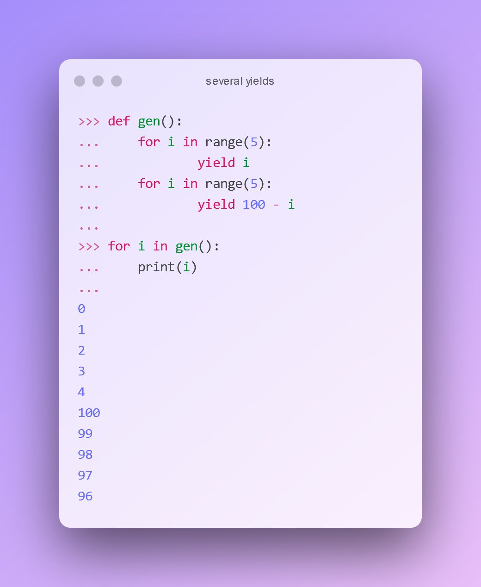

## Simple generators

A quick tutorial on how to make generators. We want to achieve this simple behavior and the same output:

```shell{outputLines: 4-8}
>>> for i in range(5):
...     print(i)
...
0
1
2
3
4
```

Define a function where each call to 'yield' makes a new step in the loop that uses this generator:

```shell{outputLines: 8-12}
>>> def gen():
...     for i in range(5):
...         yield i
...
>>> for i in gen():
...     print(i)
...
0
1
2
3
4
```

Here is where the interesting stuff starts. What if on each step you have more than one value ready to deliver. Then there is such thing as 'yield from'

```shell{outputLines: 8-17}
>>> def gen():
...     for i in range(5):
...         yield from (i, 100 - i)
...
>>> for i in gen():
...     print(i)
...
0
100
1
99
2
98
3
97
4
96
```

The way how yield stops the execution in the generator itself is strange for my brain, so here's one more test: what if we have 2 loops, in what order the yield will be called?

```shell{outputLines: 10-19}
>>> def gen():
...     for i in range(5):
...         yield i
...     for i in range(5):
...         yield 100 - i
...
>>> for i in gen():
...     print(i)
...
0
1
2
3
4
100
99
98
97
96
```



## Generators in Machine Learning

_Note:_ this is an part of [my answer](https://stackoverflow.com/questions/62090925/how-to-get-data-generator-more-efficient) following [my investigation](/blog/practice-skills-on-stackoverflow) of a random question on Stack Overflow. All for the bounty hunt ;)

I have found [GitHub repository][1] and 3 part video tutorial on YouTube that mainly focuses [on the benefits][2] of using generator functions in Python.
The data is based on [this kaggle][3].

You do not need to write a data generator from scratch, though it is not hard, but inventing the wheel is not productive. 

- Keras has the [ImageDataGenerator][4] class.
- Plus here is a more generic example for [DataGenerator][5].
- Tensorflow offers [very neat pipelines][6] with their `tf.data.Dataset`.

Nevertheless, to solve the kaggle's task, the model needs to perceive single images only, hence the model is a simple deep CNN. If you combine 8 random characters (classes) into one image to [recognize multiple classes][7] at once, you need R-CNN or YOLO as your model. I just recently opened for myself [YOLO v4][8], and it is possible to make it work for specific task really quick.


[1]: https://github.com/anujshah1003/custom_data_generator
[2]: http://www.jessicayung.com/using-generators-in-python-to-train-machine-learning-models/
[3]: https://www.kaggle.com/alxmamaev/flowers-recognition
[4]: https://keras.io/api/preprocessing/image/#imagedatagenerator-class
[5]: https://stanford.edu/~shervine/blog/keras-how-to-generate-data-on-the-fly
[6]: https://www.tensorflow.org/api_docs/python/tf/data/Dataset
[7]: https://machinelearningmastery.com/object-recognition-with-deep-learning/
[8]: https://github.com/AlexeyAB/darknet
