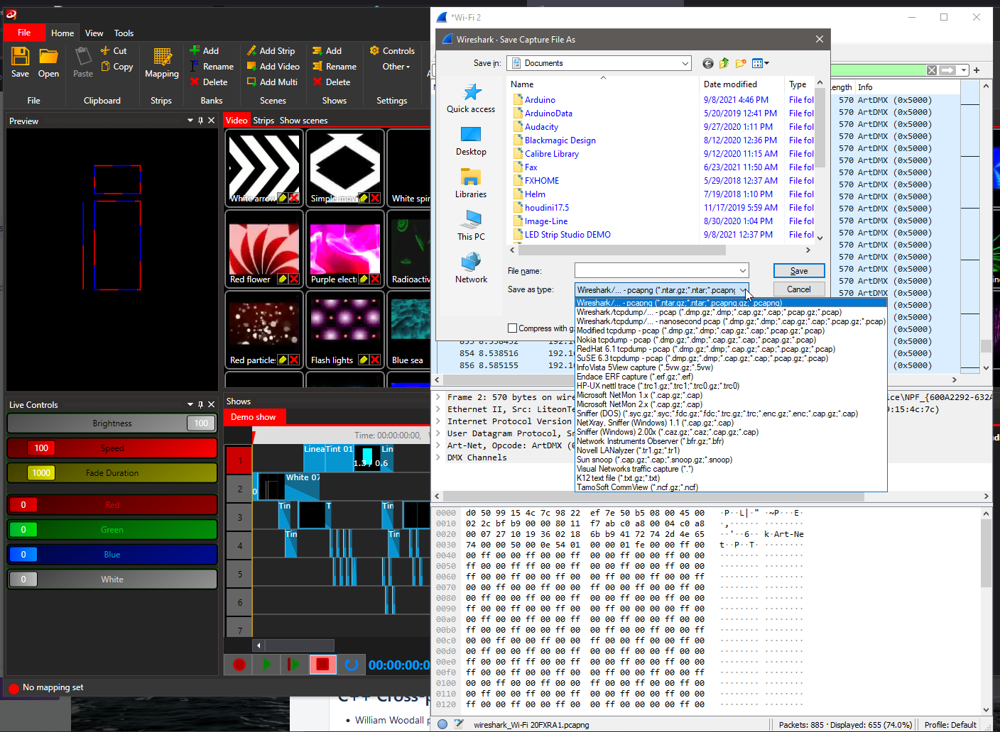

My own UDP client and Art-Net parser

First we use a tool like [Resolume](https://resolume.com/download/files?file=Resolume_Arena_7_5_0_rev_77960_Installer.exe) or LED Strip Studio 



Then we capture UDP packets from the software with the following wireshark capture settings: 

```
udp and src host 192.168.0.4 and port 6454
```

Wireshark saves packets in pcap format, then we will use pcap library to read them and then we need to parse Art-Net structures, make a few changes and send to LED controller. Yes, controller, not LED strip directly. It can be a specialized device like DMX King or Arduino board with [Art-Net library](https://www.arduino.cc/reference/en/libraries/artnet/) like [ArtneWifi](https://github.com/rstephan/ArtnetWifi)


## ArtneWifi

```cpp
Udp.begin(ART_NET_PORT);
```

The `Udp` object implementation depends on what board is selected in Arduino IDE. For Wemos W1 the[ESP8266WiFi](https://github.com/esp8266/Arduino/tree/master/libraries/ESP8266WiFi) library is used.
There in **WiFiUdp.cpp** we find implementation of the `begin` method.

```cpp
uint8_t WiFiUDP::begin(uint16_t port)
{
  if (_ctx) {
    _ctx->unref();
    _ctx = 0;
  }

  _ctx = new UdpContext;
  _ctx->ref();
  return (_ctx->listen(IPAddress(), port)) ? 1 : 0;
}
```

where the `listen` function is defined in [**UdpContext.h**](https://github.com/esp8266/Arduino/blob/da6ec83b5fdbd5b02f04cf143dcf8e158a8cfd36/libraries/ESP8266WiFi/src/include/UdpContext.h)

```cpp
bool listen(const IPAddress& addr, uint16_t port)
{
  udp_recv(_pcb, &_s_recv, (void *) this);
  err_t err = udp_bind(_pcb, addr, port);
  return err == ERR_OK;
}
```

The `udp_` functions seem to come from [**lwip**](https://www.nongnu.org/lwip/2_1_x/group__udp__raw.html#gac7fbda8b12b9b9360e92b51e805e799e) ([mirror](https://github.com/stm32duino/LwIP/blob/main/src/core/udp.c))

Compare it with implementation of `UDP.begin` for [another board](https://github.com/arduino-libraries/WiFi101/blob/21aeca0d82d1f8939b4b1c2790213921be47e5c5/src/WiFiUdp.cpp):

```cpp
uint8_t WiFiUDP::begin(uint16_t port)
{
	struct sockaddr_in addr;
	uint32 u32EnableCallbacks = 0;

	_sndSize = 0;
	_parsedPacketSize = 0;

	// Initialize socket address structure.
	addr.sin_family = AF_INET;
	addr.sin_port = _htons(port);
	addr.sin_addr.s_addr = 0;

	if (_socket != -1 && WiFiSocket.bound(_socket)) {
		WiFiSocket.close(_socket);
		_socket = -1;
	}

	// Open UDP server socket.
	if ((_socket = WiFiSocket.create(AF_INET, SOCK_DGRAM, 0)) < 0) {
		return 0;
	}

	WiFiSocket.setopt(_socket, SOL_SOCKET, SO_SET_UDP_SEND_CALLBACK, &u32EnableCallbacks, 0);

	// Bind socket:
	if (!WiFiSocket.bind(_socket, (struct sockaddr *)&addr, sizeof(struct sockaddr_in))) {
		WiFiSocket.close(_socket);
		_socket = -1;
		return 0;
	}

	return 1;
}
```


https://learn.adafruit.com/sipping-power-with-neopixels/putting-it-all-together


## DMX512

Send/receive DMX on Arduino

- https://www.mischianti.org/2020/05/11/interface-arduino-esp8266-esp32-rs-485/
- https://tigoe.github.io/DMX-Examples/arduinodmx.html
- http://www.mathertel.de/Arduino/DMXSerial.aspx
- https://github.com/mathertel/DMXSerial/blob/master/examples/DmxSerialNeoPixels/DmxSerialNeoPixels.ino


## ArtNet

Send/receive Art-Net on Arduino

- choose one http://dmxking.com/m/support/13-control-software/80-artnet-sacn-software
- https://artisticlicence.com/product/dmx-workshop/
- https://learn.sparkfun.com/tutorials/using-artnet-dmx-and-the-esp32-to-drive-pixels/all
    

## UDP

- https://arduino-esp8266.readthedocs.io/en/latest/esp8266wifi/udp-examples.html
- https://wiki.python.org/moin/UdpCommunication
- https://github.com/cpvalente/stupidArtnet/blob/b24f5939b8d14371511e3544721b01a673340882/stupidArtnet/StupidArtnet.py#L16
- https://www.qlcplus.org/index.html
- https://stackoverflow.com/questions/24559909/sending-string-over-udp-in-c
- https://gist.github.com/mikolasan/adfa10849aae8d940a6caea018422f17
- https://gist.github.com/jimfinnis/6823802
- https://www.educative.io/edpresso/how-to-implement-udp-sockets-in-c


### PCAP

- library https://github.com/the-tcpdump-group/libpcap
- examples https://www.tcpdump.org/pcap.html
- very good example https://elf11.github.io/2017/01/22/libpcap-in-C.html
- documentation https://www.tcpdump.org/manpages/pcap.3pcap.html
- how to read pcap example https://www.rhyous.com/2011/11/13/how-to-read-a-pcap-file-from-wireshark-with-c/
- how to read pcap question https://stackoverflow.com/questions/36218278/reading-a-tcpdump-file-with-c

python is so easy https://gist.github.com/gerkey/bf749775e6bc600368b97ce3d9f113e5
IP Adress from string https://github.com/arduino/ArduinoCore-API/blob/master/api/IPAddress.cpp


### UDP broadcast

`255.255.255.255` would be considered the phsyical layer broadcast address while `192.168.1.255` would be considered the network layer broadcast address.

_c++ udp send broadcast permission denied_

- https://stackoverflow.com/questions/337422/how-to-udp-broadcast-with-c-in-linux
- https://man7.org/linux/man-pages/man3/setsockopt.3p.html


## As a service

I'm going to add a TCP client socket to my PCAP reader/UDP sender which will add it to the mesh of services. I use **zmq** library for that, specifically a [C++ wrapper](https://brettviren.github.io/cppzmq-tour/index.html)