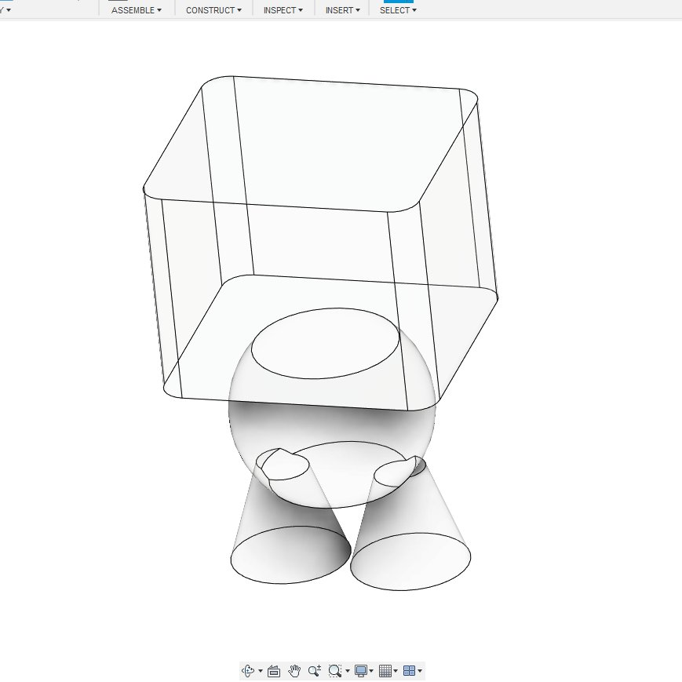
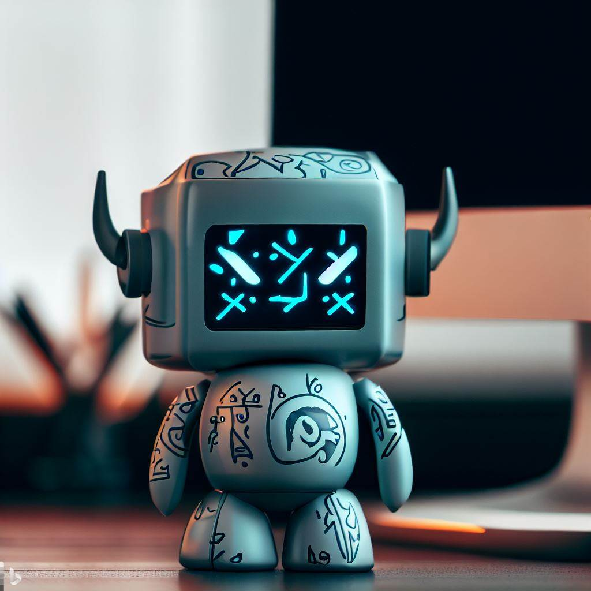

I decided to document my thoughts a bit by starting a [dev log](/devlog). I see it as a more interactive format for collecting links. It will demonstrate why, what, and how I plan.

Sometimes these will be short notes where I'll share my commentary on specific topics. Sometimes I will record my new thoughts and show where they usually go.

It's already been one year since I work on [this](/make/robot) project. So, [one year ago](/blog/robot-coach), little by little, things here and there formed something realistic, something in a shape of a tangible product. Unfortunately, it's like that only in my imagination, there is no prototype yet.

Some people create ten startups a year, but I probably started the greatest endeavor of my life that requires slightly more time. To analyze if this is true or not, in these notes, I will be reviewing what happened this past year.

---

I don't get enough sleep these days. I planned last Friday that I should start writing dev logs. Then I gave myself a word that I should start writing on Monday. But today is Tuesday, and I'm writing it because I thought today is Monday.

And I still don't want to write. When I don't want to write, the text becomes ugly. When I read the previous sentence, I have a feeling that I'd better wait another day. **Update:** No matter what, I return to my notes later (as with this edit), read them again and fix them if they do not sound clear.

Some days I only read papers or design PCB or create 3d models. It's not like writing code or architect a system. Some things are easy to present and share. But when a 3d model is unfinished, I'm ashamed to show it.

Surprisingly Fusion 360 has good official tutorials on YouTube, but we are going to see how long it will take me to turn the concept art into a 3D model that will perfectly fit LCD screen, tiny MCU board and several servo motors.

I think the Viking pattern and facial expression on the LCD screen gives the feeling you get from the concept art. Without it, it's just a boring box, as seen in my WIP model. Or maybe all shapes are important. I will finish with arms and horned helmet, then it will be more evident.

[Next](/devlog/2)