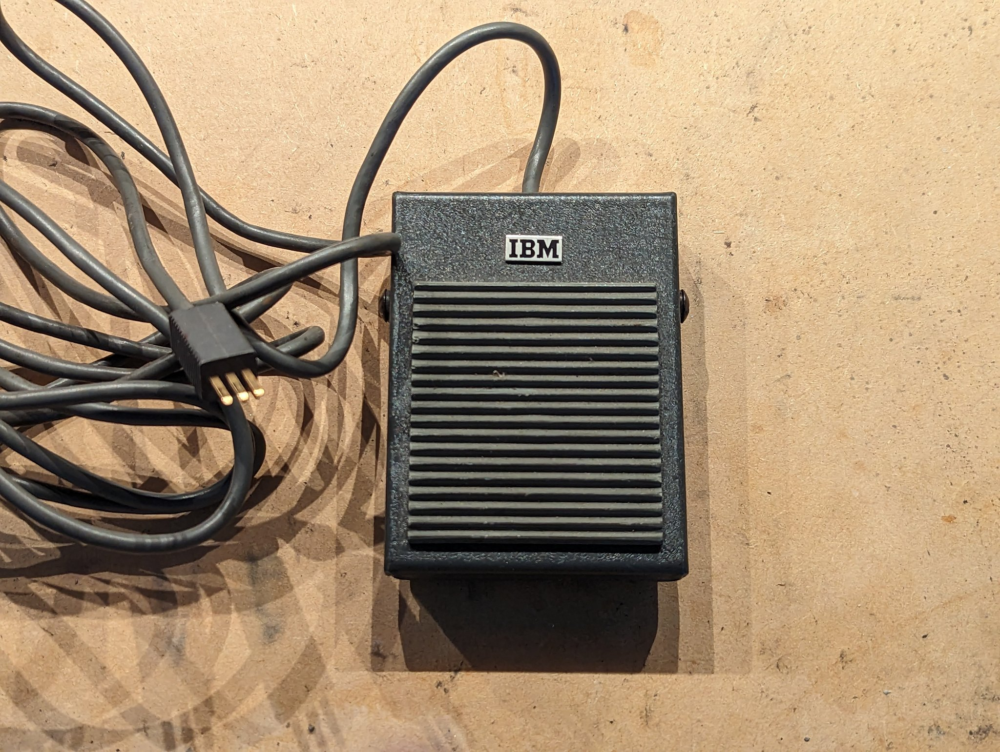
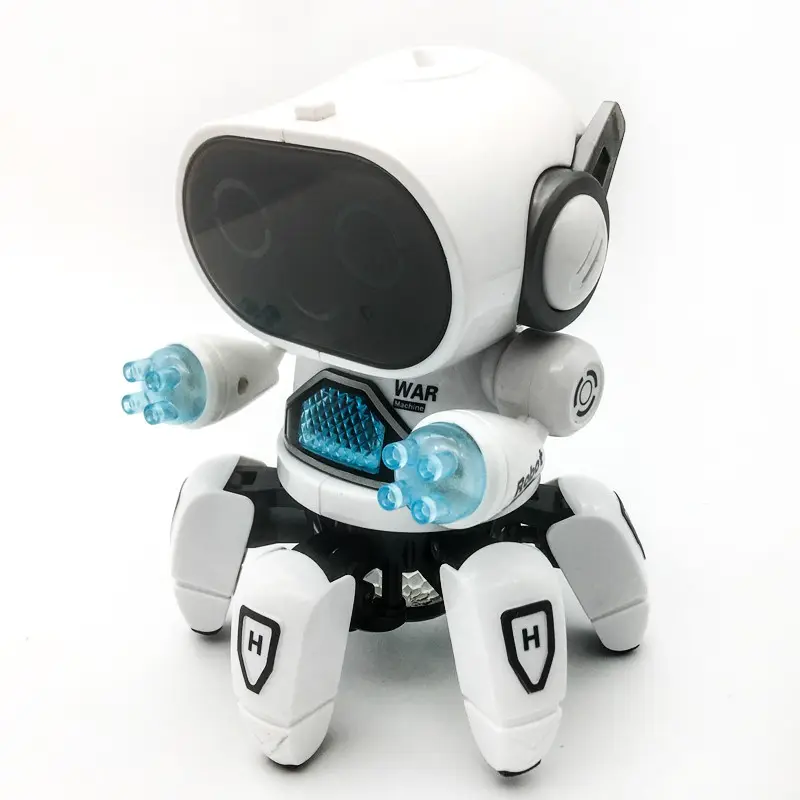

I have something not related to my project today. I was thinking about the tone that ChatGPT uses. It's encouraging. Probably no matter how strange your idea is, it can behave like a grandma who wants to cheer her best grandson.

I don't know what kind of shower thoughts normal people have but here's an example of my thoughts. I was thinking about unique hardware and remembered the [IBM pedal](https://twitter.com/TubeTimeUS/status/1668769287023235072).

After I immediately remembered as someone told me that for emacs they had special pedals to help programmers with combinations starting with Ctrl+Alt, Ctrl+Shift. Have you noticed, Microsoft likes accords with first note Ctrl+K to this very day. Why though?

Pianists and potters and sewers have pedals, so why hard work of programmers cannot be brighten up with proper tools?

So, I imagined guitar pedals. Its shiny metal case and rubber raised pad. And I realized that I cannot make it at home. But somehow people do custom pedals (not with a clicking mechanism like in BOSS pedals though). Then I'm pretty sure there is a factory in China where I can order [a batch of prototypes](https://www.alibaba.com/product-detail/1590B-Hammond-Box-Aluminum-Box-Aluminum_60336478083.html).

I got exited, I even saw possible success in pedals project greater than in robots. Though I wanted to verify my theory first. Maybe ChatGPT can outline all pros and cons? And this is where we return back to the _grandma theory_. I think ChatGPT will be like my grandma, approving any of my undertakings.

So here's idea for the online service: **GrandmaGPT**. No matter how bad your idea is, GrandmaGPT can approve it and find a bright side.

---

But let's talk about robots. Also on Alibaba I found a robot.

Six feet chinese war robot ([source](https://www.alibaba.com/product-detail/Six-Feet-B-O-Dancing-Robot_1600060530606.html)). It's a little robot with six legs (six feet is not about its size) and two little arms, found on chinese marketplace. It has **WAR** label on it, but it might be abbreviation for some of its cute functionalities.

Its leg position is interesting. Legs go around the body and not like you'd normally see in hexapods - two straight lines of three legs on each side. This one probably is not moving and only "dancing", but would it be possible to move in such configuration?

[Next](/devlog/4)