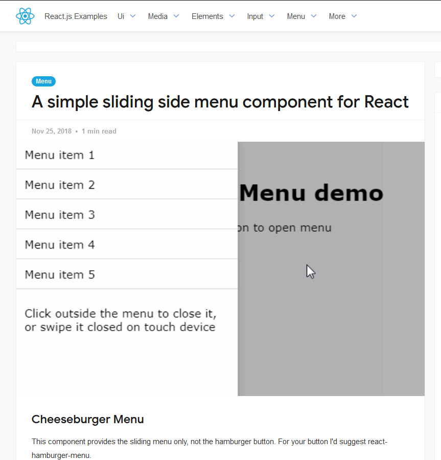
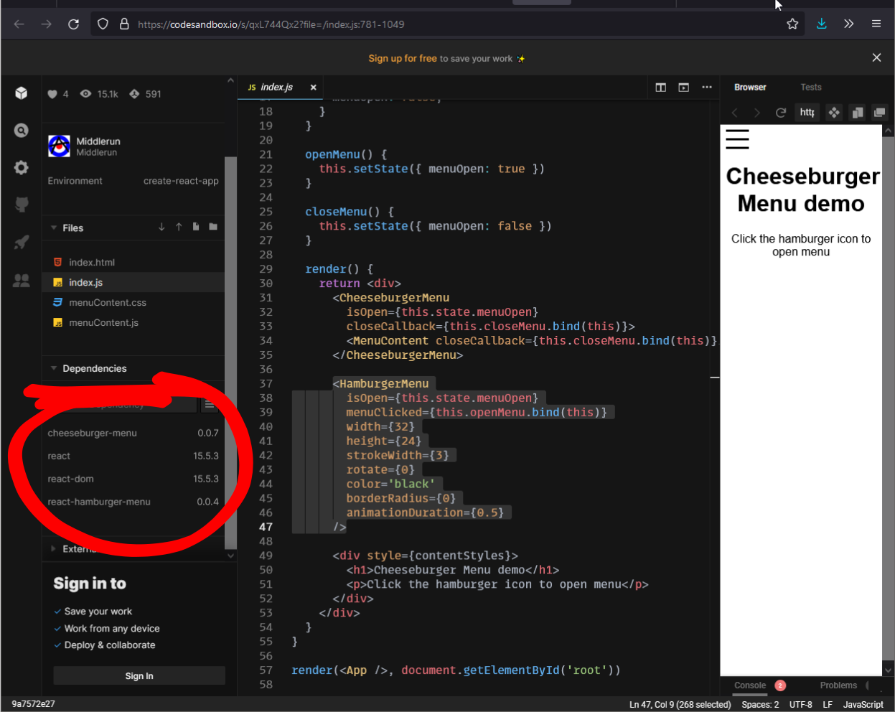

Be careful with "simple" examples. Especially with some solutions that look too good to be true. 

Developers call it "simple", but simplified API does not always mean small and clean code under the hood. 

## A simple sliding side menu component for React

- I don't need swipe, but the Cheeseburger component implements only that.
- Burger icon that doesn't look pretty with default props, come on, there are only 3 divs, what can be simpler?

My point here, it's a good example for reference, but it can be much much simpler to be called "simple".

## Good abstractions and evil code

On the other hand, often we need all these abstractions to be free from boilerplate code and do only things that we paid for - write business logic.

It sounds paranoid, but you need to know what's inside every library before you can trust them. 

Here is the beauty of Open Source: you can check sources of any library and learn something new.

I look at such tidbits and soak in the collective intelligence. 3 examples:

> How good that design pattern does fit into this problem, right?

This is how I found the "trick" used in Qt libraries that allows one to update Qt shared objects/DLLs without linking the app again.

> What is a clean approach of component/module/code organization?
 
Keep the root folder clean, use separate folder for build.

> Wait, this statement shouldn't work in this language... 🤯

Almost anything from Code Golf.

No article can teach you better than a working code.
