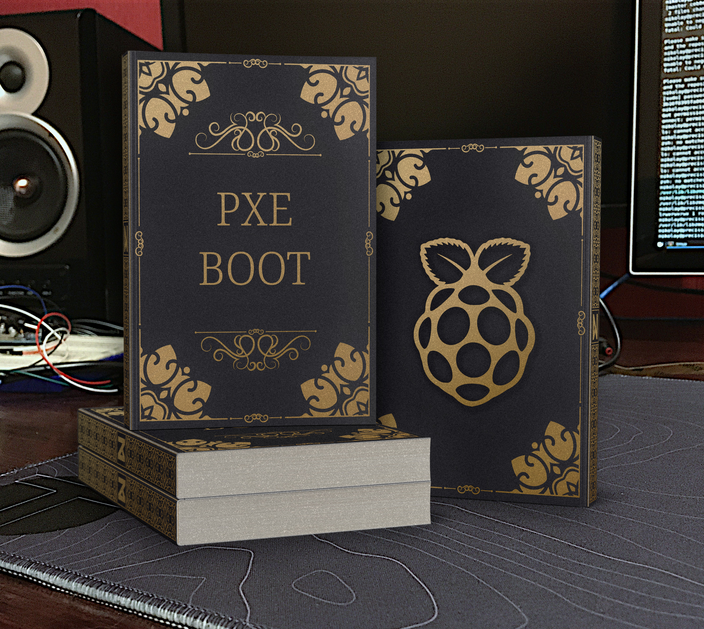

## PXE Boot

My comprehensive tutorial about PXE Boot on BIOS and UEFI clients.

I will cover how to install PXE Server and boot on Legacy systems and then how to upgrade the installation to support modern UEFI firmware. I'm going to use Raspberry Pi board as a server.

Here is [the book](https://neupokoev-n.gitbook.io/pxe-boot/)

### Cover credits

- Artdeco style cover by [Fotolia Stay](https://www.vecteezy.com/vector-art/1406466-elegant-vintage-book-layout-and-design) (<a href="https://www.vecteezy.com/free-vector/vintage-book">Vintage Book Vectors by Vecteezy</a>)
- Logo from raspberrypi.org [publicly available PNG](http://www.raspberrypi.org/wp-content/uploads/2011/10/Raspi-PGB001.pngKontainer)
- Font [Kontainer](https://www.fontfabric.com/fonts/kontanter/) by Kash Singh 

## Godot Patterns

I have a plan of revamping data structures and algorithms in GDScript. I started with design patterns like observer and finite state machine.

Here is [my work in progress](https://neupokoev-n.gitbook.io/godot-patterns/)

## Gamedev log 

My first notes but with the least amount of content comparing to other books.

Let's call it [a first chapter draft](https://neupokoev-n.gitbook.io/bato-yo-slaget/)