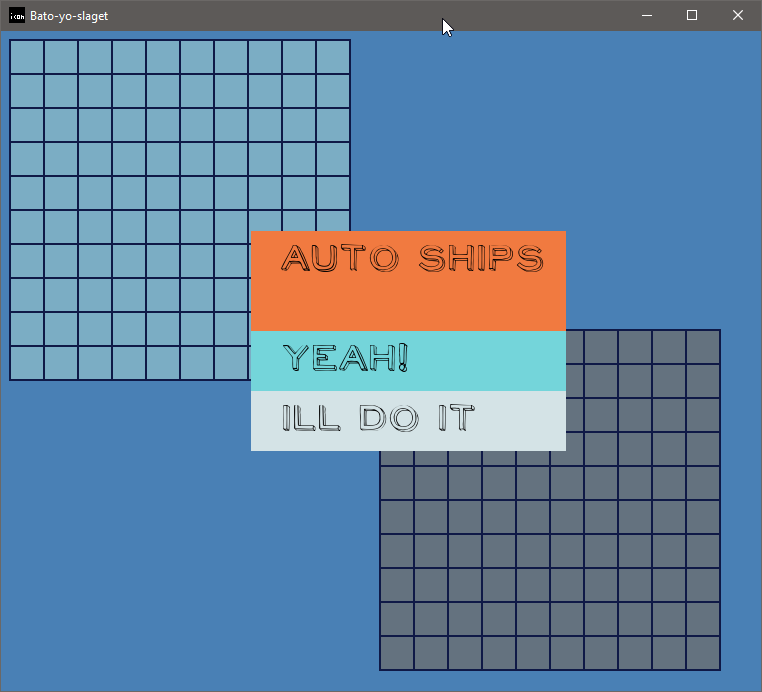
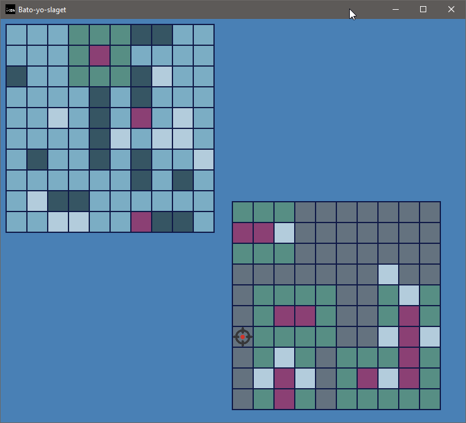

A Python implementation of the classic battleship game.

I decided to be very original with so common name as battleship. I know that Google Translate has about 40 different languages to choose from. I type in "battle ship" in English and start peeking different languages on the opposite side and I start tasting how these new words sound like.

So "the ships, the battle" = "bato yo slaget". You read it as **BA**rcelona **TO**rtuga **YO**lk **SLA**ck fri**GATE**

## History

Basic logic adopted from **@JBKahn** [code](https://github.com/JBKahn/Battleship).

Features I liked:

- board size is a variable
- amount of players defined at runtime
- user ships can be placed on the board randomly
- simple console output

Important things added:

- ships can not intersect
- unlimited amount of players (strange feature of course)
- split the monolith code onto small classes (one class - one file)
- game logic in separate python modules

From **@tmac-balla** I've taken [the engine](https://github.com/tmac-balla/battleship-game) that uses PyGame library and 

* extended logic classes with sprites and fonts
* linked game classes to the engine

## Current state of development

- game ends when the game ends (just restart the app)
- not stable (auto ship positioning going wild)
- and maybe more...

[Github](https://github.com/mikolasan/bato-yo-slaget)

## Roadmap

OK, how to make a regular dead simple Battleship implementation to be more like **Not your father's battleship**?

### Gameplay ideas

1. Not square field (check out [this review](http://boardgamegeek.com/thread/605234/bravo-battleship) and read more about [hexagons](http://www.redblobgames.com/grids/hexagons))
1. Restoring fog of war plus moving ships
1. Ships against coastal defense
1. Aircraft carrier (5 cells) - relatively easy to find and sink, but it gives exploration data with some chance to locate one cell ships

### Technical ideas

1. Run Python on Android
1. Switch to voxel engine

