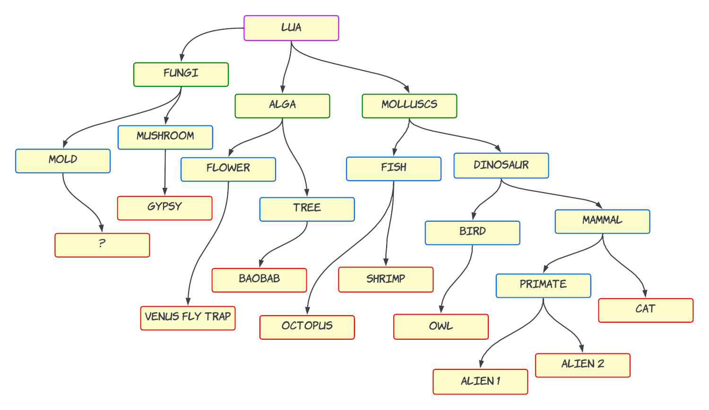

I’m going to go with tamagotchi idea for [this game jam](/gamedev/game-jams). It’s the only thing that fits good in my mind with the **evolution** theme.

So tamagotchi has the following meters

- Hunger
- Happy
- Discipline
- Training

and actions

- Feed
- Play
- Bathroom/Toilet
- Medicine
- Weight check
- Scold (criticism)

While I was thinking about evolution factors, the concept has been developed a little bit further and the tamagotchi interface is going to control not just one pet, but a population. For the first prototype I will go with simple arithmetic, but I also have a thought to try Lotka-Volterra competition model. That’s the only thing I remember from the course of mathematical models, but this name just stuck in my head for the end of my life 🙂 

I found [super cool visualization](https://observablehq.com/@mbostock/predator-and-prey) of dynamic predator–prey interaction by Mike Bostock

It can be an interesting card game, I mean real offline board game. Cruel and educational.But apparently there is already [such board game](https://boardgamegeek.com/boardgame/155703/evolution)! (facepalm) 

> Jamming gives very unique feeling that I've never had at work: after thorough planning on paper and in Confluence I tirelessly code and code and code. No questions, no meetings, no watercooler breaks. Ideal life 🦄

## Card system

### Types

- Genetic modification
  - Locomotion
  - Breath
  - Reproduction
  - Immune
  - Nutrition
- Intervention
  - Environment impact
  - Interference (extracurricular)
- Trait

## Day Shift Cards

Title | Type | One time effect | Constant effect | Description
------|------|-----------------|-----------------|------------
Hermaphroditism | reproduction |   | hermaphroditism | Population is not affected if Distress card targets only one gender. Population can grow only if it is greater than 1. But this trait helps the population to grow again.
Androdioecy (Hermaphroditism) | reproduction |   | hermaphroditism | Population is not affected if Distress card targets only one gender Instant effect: double the population
Gynodioecy (Hermaphroditism) | reproduction |   | hermaphroditism | Population is not affected if Distress card targets only one gender Instant effect: double the population
Trioecy (Hermaphroditism) | reproduction |   | hermaphroditism | Population is not affected if Distress card targets only one gender Instant effect: double the population
Fragmentation | reproduction |   | fragmentation | Vulnerable to changing environments, parasites, 
Gills | breath |   | gills | Breathe underwater, always covered with moist on the ground
Cutaneous respiration | breath |   | thin skin | Breathe with skin, no lungs. Thin skin
Lungs | breath |   | lungs | Breathe with oxygen
Immune response | immune |   | immune | Viruses has no affect
Greenhouse effect | Environment impact |   | greenhouse_effect_func | +1 hunger if it equals 1 or less. Constant
Chloroplast (Photosynthesis) | nutrition |   |   | Convert light into chemical energy. +2 hunger
Go ashore | locomotion | training: +1 | terrestial | Leave water and live on the ground
Herd instinct | Trait | Discipline +2 |   | Live together (forest)
Herbivore | nutrition |   |   | Eat plants +1 Hunger
Frugivore | nutrition |   |   | Eat fruits +1 Hunger, +1 Happiness
Xylophagous | nutrition |   | xylophagous | Diet consists of wood
Predator | nutrition |   |   | Eat other animals, scavenging sometimes, +2 Hunger
Mimicry | deterrent |   |   | Antipredator adaptation. +10 population
Camouflage | deterrent |   |   | Antipredator adaptation. +10 population
Spine | locomotion | training: +1 | vertebrate |  
Thorns | deterrent |   | deterrent | Population protected from predators
Seeds/eggs/spores | reproduction | training: +1 |   |  

## Night Shift Cards

Title | Type | One time effect | Constant effect | Description
------|------|-----------------|-----------------|------------
Asteroid | Environment impact |   |   | -10 population -2 hunger
Virus | immune |   | virus_func | Virus incorporates its DNA into the host system and alters it. Randomly remove one trait
Plague | breath |   | plague_func | Population becomes 10 or 1 if current population was 10. Not affecting if population has no lungs
Ice Age | Environment impact |   |   | Giants die, -2 hunger
Hematophagy | nutrition |   | hematophagy_func | Vampire trait - has to consume blood to feed their hunger. Hunger -1 on every day
Genetic recombination | Interference  |   | genetic_recombination_func |  
Appulse (Parade of the planets) | Environment impact |   |   | Once in a million years Mercury, Venus, Mars, Jupiter and Saturn all lined up in Space which causes a gravitational effect equal to influence of x10 Moons.
Discipline -3
Giant | locomotion |   | giants | Slow, but mighty -1 hunger 
Parasites | nutrition |   |   | -1 hunger
Global warming | Environment impact |   |   | -1 happiness
Heterotrophism | nutrition |   |   | Cannot produce nutrition by itself, must consume plants or animals. -1 hunger
Global flood | Environment impact |   |   | -1 happiness, -1 discipline