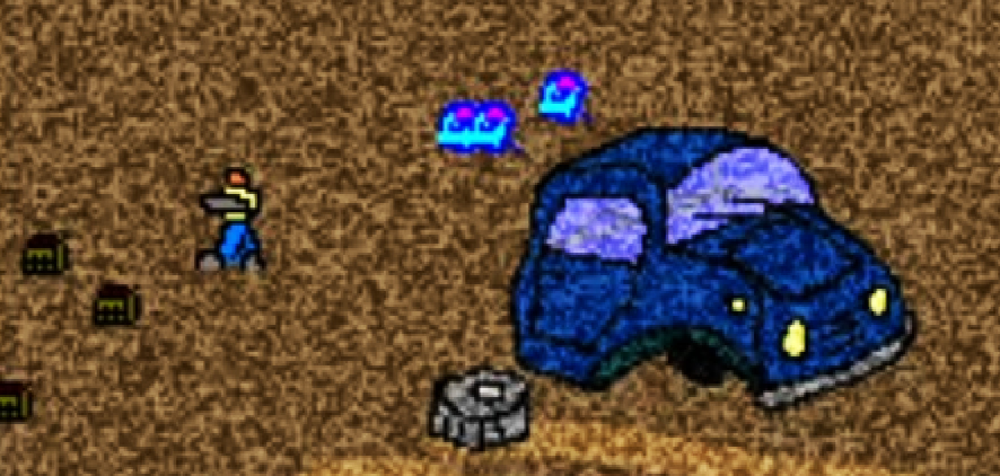
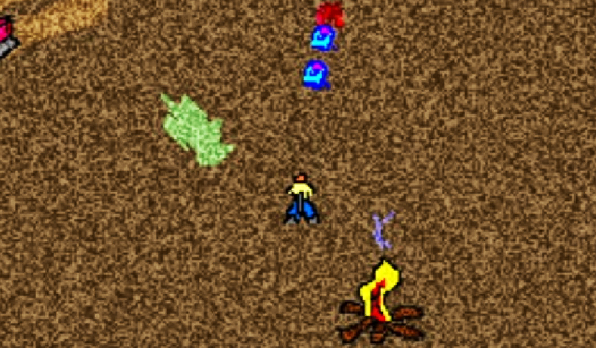
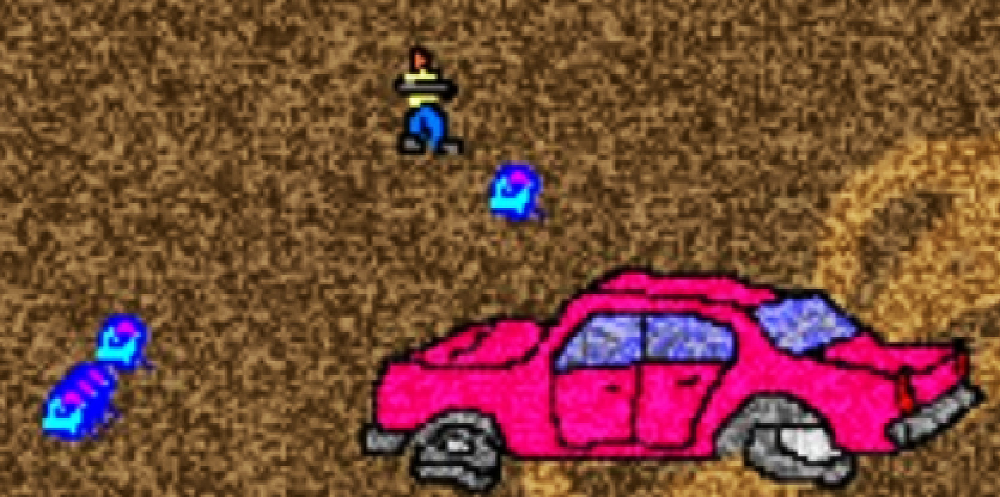
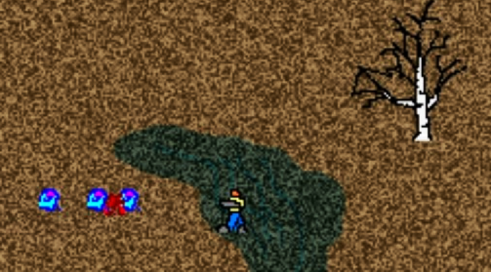

It was 2005. 

I was reading a lot of magazines about computer games and was eager to create my own. At the time I didn't know any programming language. I was good in computer classes, but we only wrote things in notebooks and did simple calculation programs in Pascal.

All art done in MS Paint. Music was created in Fruity Loops Studio 4. I didn't expect to find out that this game has a decent soundtrack. I knew how to use FL Studio back then

Gameplay was highly influenced by Crimsonland and Serious Sam.

I can't release source code for this game because, you know, I just lost the project file and all I have is the bundle compiled by Game Maker. But the game mechanucs is really simple so why not just create a tribute version with new engine and assets.