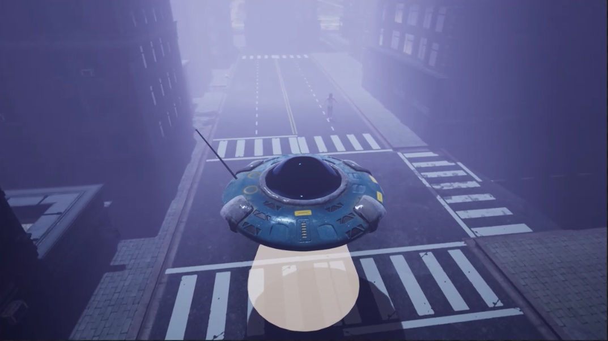

I like jams. But I never win them.

I have participated in several game jams:

## 2019

### Not your father's roguelike

[First Game Jam](https://repl.it/talk/challenge/Were-hosting-a-Game-Jam/11432) hosted by Replit with grand prize of 1BTC. Theme **cash**. 

I decided to go rogue. Top down view. My initial plan was 48x48 pixels for a tile. The game starts in a regular bar, then advance to sci-fi location in a space craft where I need many different alien characters. I attach my programmer art 😂

I was sure that I can find pixel art characters and animations, but I did find only very good reference. Submitted: https://replit.com/@stakanmartini/test-roguelike-11 [Devlog link](/gamedev/pyroguelike).

### Double Down: Aftermath

[Mega Jam](https://itch.io/jam/2019-epic-megajam). Theme: **Down to Earth**. Not submitted, but here's a teaser

You control an alien ship and abduct humans, stupid meatbags run and panic, but some of them are trying to shoot you down. Made with #UnrealEngine

https://twitter.com/mikolasan/status/1480902412655378437

## 2021

### Bad people

[AI and Games 2021](https://itch.io/jam/aiandgames-2021). [Devlog link](/gamedev/ai-and-games).

## 2022

### See you later alligator

Go Godot Jam 3. Submitted: https://neup.itch.io/see-you-later-aligator. [Devlog link](/gamedev/evolution-card-game).

