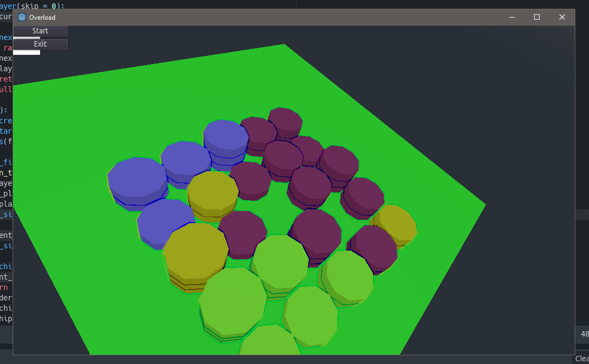
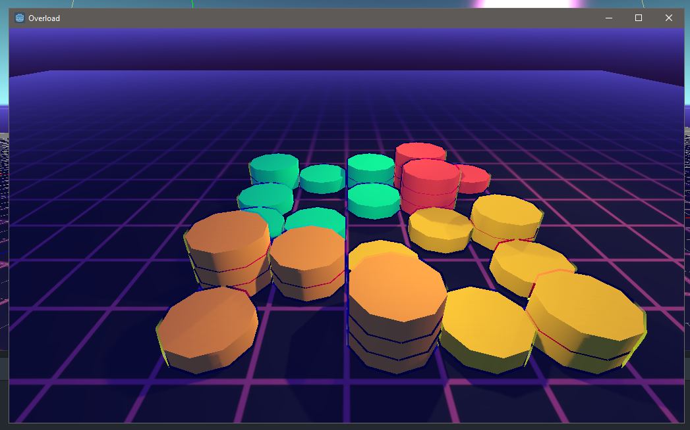
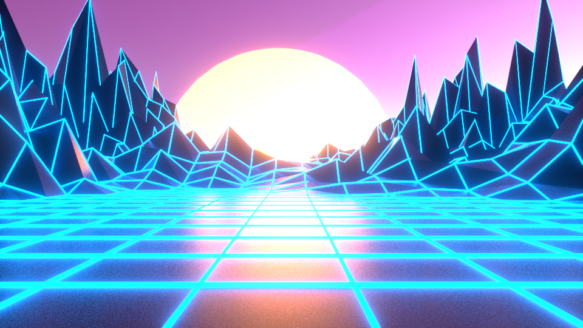
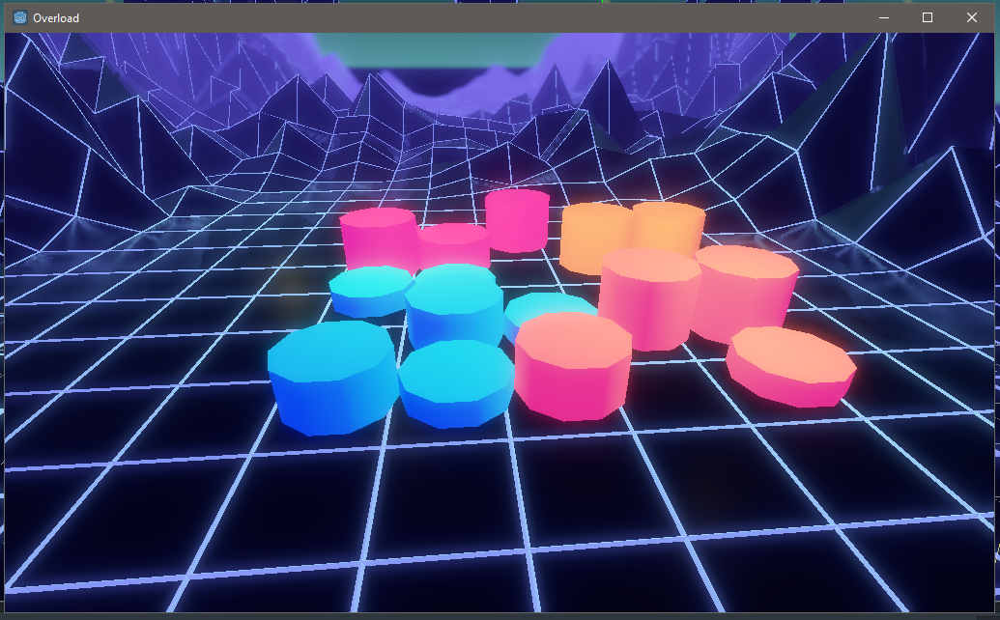
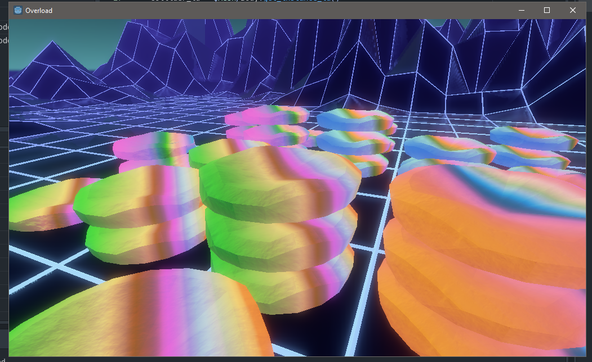
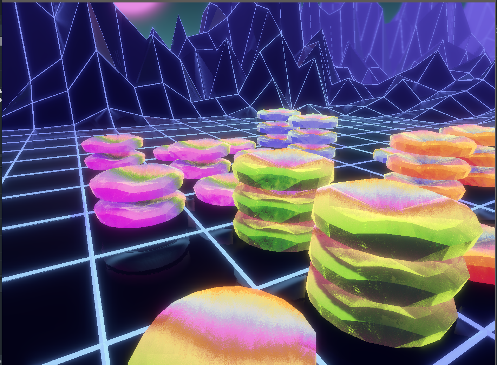

## Godot version

A prototype here made with Godot 3.1.

I believe Astatix came out with this idea first. On their website http://www.astatix.com/overload.php one can find the original game rules as I remember this game.

## Experiments with 3D

So first, I implemented basic logic of this game. There are few players with starting chips, each of them make a turn by putting new chip on one of the existing stacks. When a stack reaches four chips, each chip moves to the nearest cells on the board.

Then I have started playing with colors. I chose pastel tones maybe being under impression of pixel art. I looked at the initial board - flat solid color polygon - and begun to look for ways of adding distinct edges for each cell. To see clearly cells on the board is tactically important in this game.
I found cool space bar scene ([here](https://free3d.com/3d-model/vega-strike-starship-bar-economy-class-88446.html)), but was scared by amount of textures, materials and light that I have to fix after import.
Instead I expected to incorporate the board into landscape. That way of thinking brings me to Synthwave ([example](https://creativemarket.com/dennybusyet/2289747-Synthwave-Retrowave-Background-Pack)).

I followed [a tutorial](https://www.youtube.com/watch?v=hnLsktA4gmY) on YouTube about how to create Synthwave landscape in Blender.

When I imported it to Godot, I needed to play with Environment settings and Material to make it look at least close to the rendered picture from the tutorial.

After I found some balance in glowing parameters, I continued my experiments with 3D objects. As my next target the chips were chosen. I spent a lot of time searching for a good free model of a chip with some interesting ornament on the edge. Nothing for free. So I made one by myself. All together with my texturing skills these cookies are not good.

But I continued playing with them. I shall tell you that they are ugly, just because they are not finished. Thus I am adding a shader to make them look like crystals (inspired by [this](https://80.lv/articles/developing-artistic-ice-in-unreal-engine-4/), [this](https://www.youtube.com/watch?v=7m7_lhrXJ08&t=2s) and [this](https://bobacupcake.itch.io/so-chunks-huh)).

I said, they are crystals!

[Here](https://github.com/mikolasan/overload-godot) you can convince me to change license from GPL 3 to MIT.
