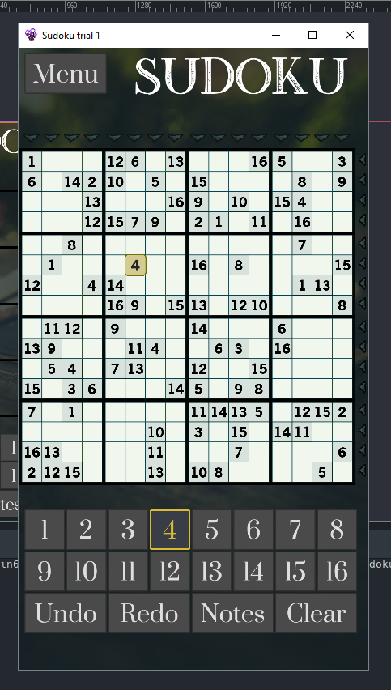

## Questions to developers

- Does it have 16x16=256 buttons?
- Does it save each player's step?
- Does it generate puzzles, or download them from the server?
- Is it possible to rate puzzles?
- What features are available to help solving this gigantic puzzles?

## Where to get it?

Nowhere. It is not yet published to Play Store or App Store, because...

- it is possible to see numbers only on big screens like tablets, but I want to support all resolutions;
- there is no icon that correlates with game design;

and it is not open sourced, because...

- private repositories on Bitbucket are free;
- private repositories on GitHub are free too.

