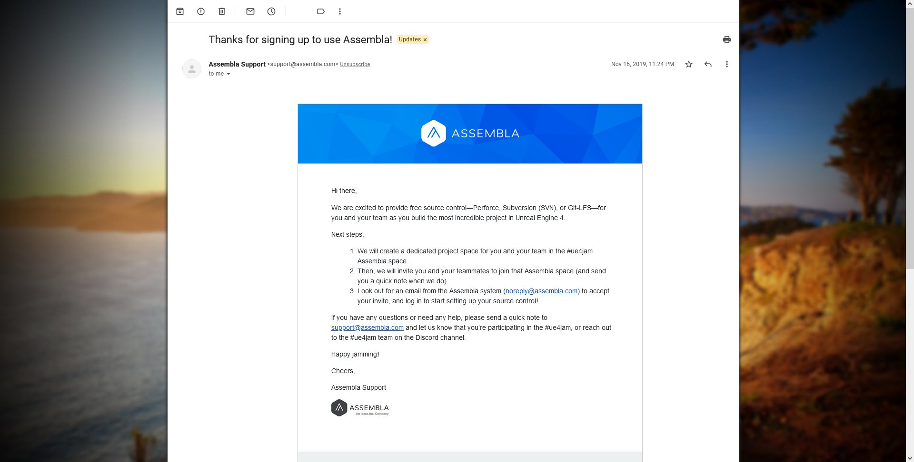

Have you ever used any other version control than Git?

We use Bitbucket and submodules. Each module is a game component with about 500MB - 1GB of PNGs. Sometimes we need to rebase and force push in order to shrink the git history and be under the allowed cap of 2GB. We tried Git LFS, but it's expensive for our team 🥸

I tried Perforce (or Assembla, this marketing stuff is confusing me) while it was free for Mega Jam participants. I tried to upload 3GB Unreal project, but that didn’t work. Plus their GUI for hardcore git users seems like an alien technology. Accodring to [Stephen](https://twitter.com/HulaHeadBang/status/1521577135202131968)

> it works great with large assets. Much better than the other options. It's one of it's main selling points and the reason why so many AAA video game companies, not to mention Microsoft, Intel and Nvidia use it.

Seems like Perforce is free as git, but companies selling hosting for you. I also googled another platform PlasticSCM https://www.plasticscm.com/under-heavy-load. Sadly this is the end of my research. Scripts do fit perfectly the git forkflow, but resources just become a dead weight, neverthless we plan to continue usgin git, because we like git!