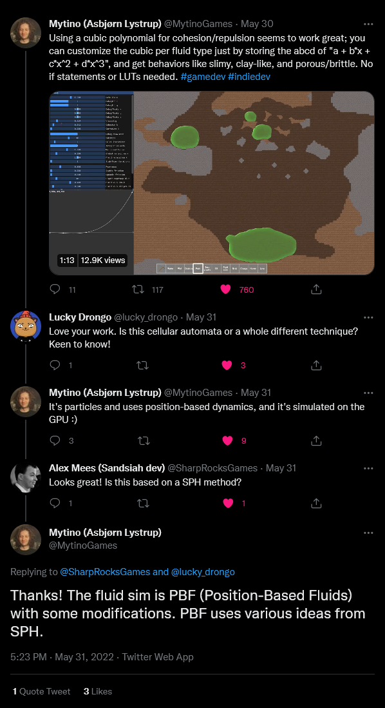
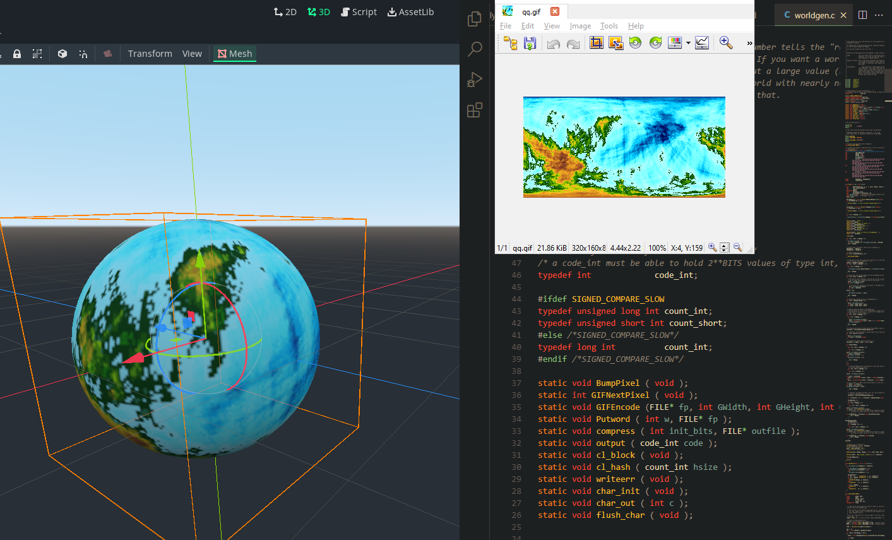

## Liquid simulation

Using a cubic polynomial for cohesion/repulsion seems to work great; you can customize the cubic per fluid type just by storing the abcd of "a + b*x + c*x^2 + d*x^3", and get behaviors like slimy, clay-like, and porous/brittle. No if statements or LUTs needed.

It's particles and uses position-based dynamics, and it's simulated on the GPU :)

The fluid sim is PBF (Position-Based Fluids) with some modifications. PBF uses various ideas from SPH.

https://twitter.com/MytinoGames/status/1531462046449008641

**Position based fluids** https://mmacklin.com/pbf_sig_preprint.pdf where they use Newton steps https://en.wikipedia.org/wiki/Newton%27s_method_in_optimization and Gradients https://en.wikipedia.org/wiki/Gradient (not to be confused with ML term _Gradient descent_ https://en.wikipedia.org/wiki/Gradient_descent)

## Fractal planet generator

This was originally written by a PHD from Denmark - John Olsson

- Code: http://www.lysator.liu.se/~johol/fwmg/source/worldgen.c
- How it works: http://www.lysator.liu.se/~johol/fwmg/howisitdone.html
- Homepage: https://www.lysator.liu.se/~johol/fwmg/fwmg.html

