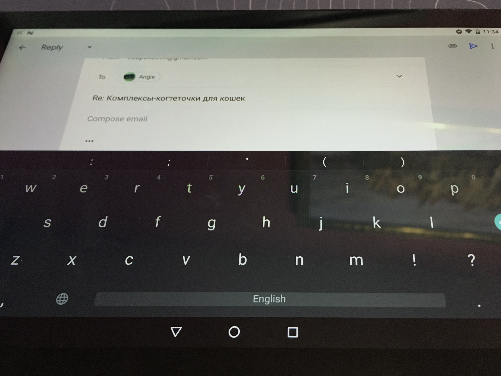
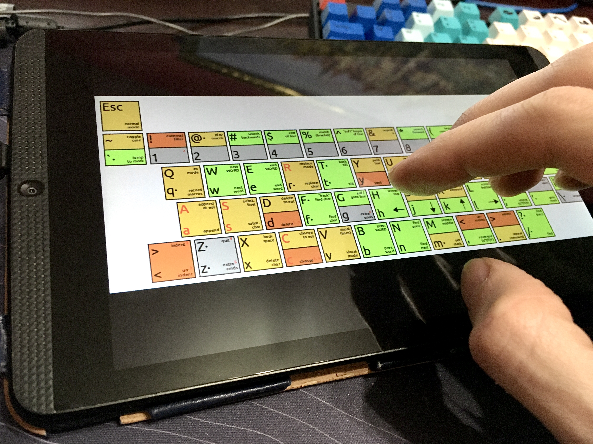

When you put a tablet into landscape orientation the keyboard has a very descent sizе for comfortable typing with two hands. But the rest of the screen is an area of a constant battle between the OS and an app leaving about one line for input preview.

Not a long time ago I have started playing with vim, trying to work more efficiently without a mouse.

But when my look stopped for a moment on a TV screen, I imagined that one can seat on a sofa, type on the tablet, and cast a picture from the tablet to the TV screen. If input will be on the TV screen only, then the tablet has some additional space to display hints, tips, and shortcuts (cheatsheet for vim, [for example](https://hamwaves.com/vim.tutorial/en/index.html)).

Instead of a TV screen, the keyboard app can be remotely connected to a regular PC. They can communicate using Bluetooth.
