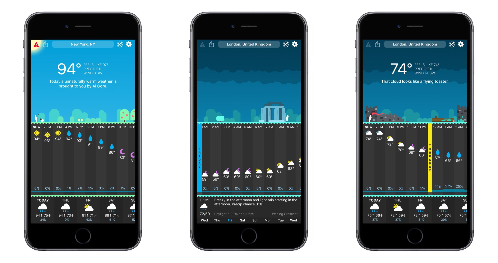
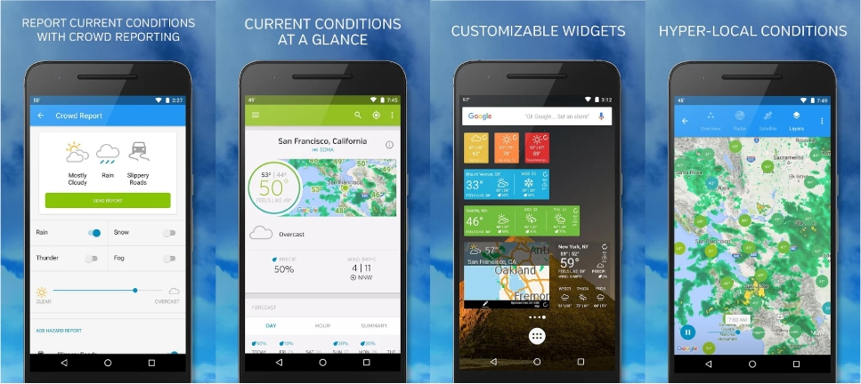
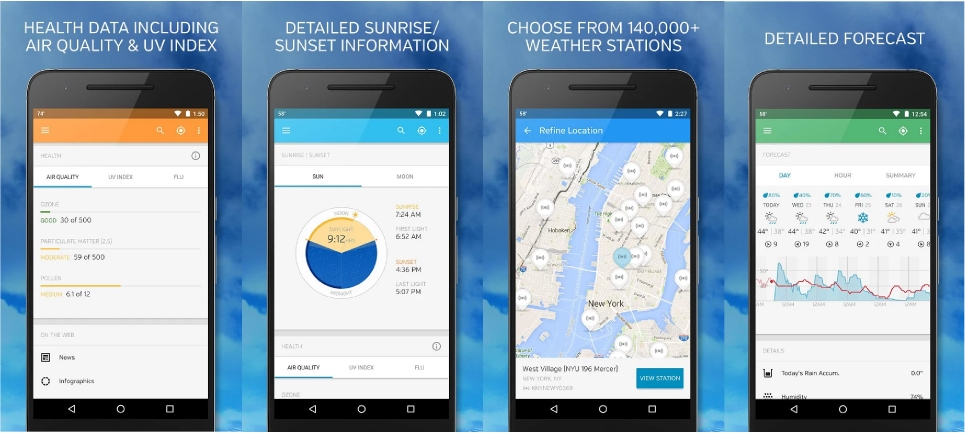
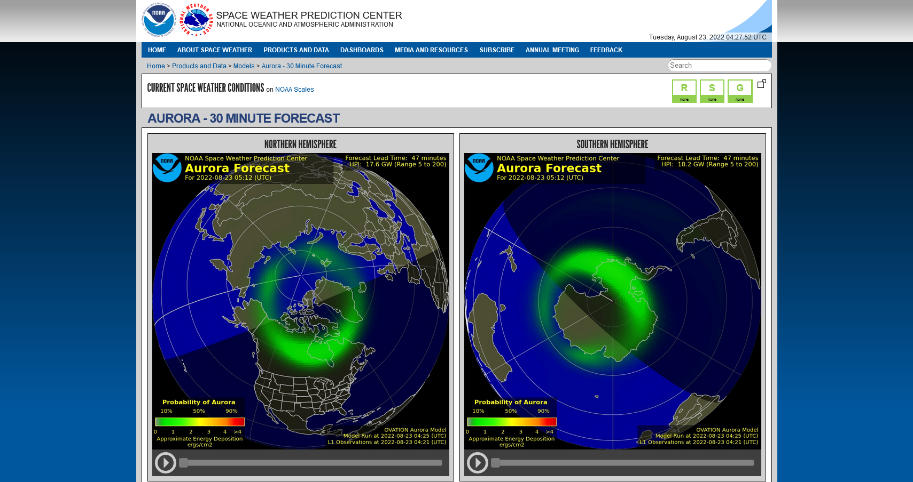

I just checked [CARROT](https://twitter.com/CARROT_app) and it's the best weather app that I've ever used. Even better than [@wunderground](https://twitter.com/wunderground) before its redesign. No wind speed though.

And I'm thinking that the porper weather app should include more!

- solar and geomagnetic activity https://www.spaceweatherlive.com/en/reports/solar-activity-report.html. Can check if aurora can be seen.
- aurora 30 minutes forecast https://www.swpc.noaa.gov/products/aurora-30-minute-forecast

