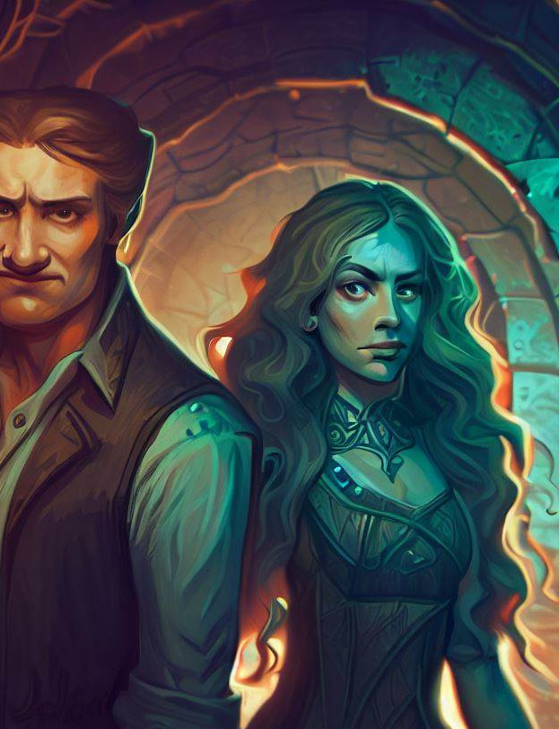

## Casual game ideas

*Sound like a standard pipe tile-rotating puzzle*

**Steampunk Engineering:** Players construct complex 
machinery by connecting gears, pipes, and other components to achieve a 
specific goal. The machinery could power a device necessary for the 
plot's progression.

*Sokoban but with a cosmic god and planets*

**Celestial Navigation:** Players navigate through the 
stars by solving astronomy-based puzzles, connecting constellations, or 
aligning planets to unlock cosmic secrets.

*Sound like crashy cats but big*

**Kaiju Rampage**: Players become giant monsters like 
Godzilla, wreaking havoc on a city. The goal is to cause as much 
destruction as possible within a time limit, earning points for 
demolishing buildings and landmarks.