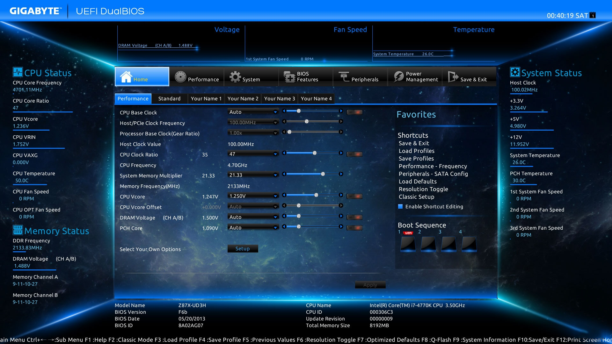

I wonder if there is a UI framework for making minimalistic and beautiful apps that work without OS, the things that we see in UEFI settings like this:




## Build GRUB

```bash
git clone https://git.savannah.gnu.org/git/grub.git
cd grub

./bootstrap

# EFI
./configure \
  --with-platform=efi \
  --target=x86_64 \
  --disable-werror \
  --prefix=$(pwd)/../grub-install

# BIOS
./configure \
  --with-platform=pc \
  --target=i386 \
  --disable-werror \
  --prefix=$(pwd)/../grub-install

make
make install

cd $(pwd)/../grub-install/bin

find ../lib/grub/x86_64-efi -name '*.mod' \
  | sed -e 's/..\/lib\/grub\/x86_64-efi\///g' \
  | sed -e 's/\.mod//g' \
  | sort > modules.list

./grub-mkimage \
  --format=x86_64-efi \
  --output=bootx64.efi \
  --prefix='(tftp,192.168.3.146)/grub' \
  --verbose $(<modules.list|tr '\n' ' ') > grub-mkimage.log 2>&1
# modules = efinet tftp chain
```

Building BIOS version you can get this error:

```
/usr/bin/ld: relocatable linking with relocations from format elf64-x86-64 (lib/zstd/zstd_module-debug.o) to format elf32-i386 (zstd.module) is not supported
```

TODO - how to fix it?

References:

- [DRLM Docs](https://docs.drlm.org/en/latest/building_grub2.html)
- https://gitlab.archlinux.org/archlinux/packaging/packages/grub/-/blob/main/PKGBUILD?ref_type=heads


### Font customization

```bash
./grub-mkfont -s 24 -o Sarabun_24.pf2 Sarabun-Regular.ttf
./grub-mkfont -s 16 -o Sarabun_16.pf2 Sarabun-Regular.ttf
./grub-mkfont -s 32 -o Sarabun_32.pf2 Sarabun-Regular.ttf
```

## edk2

Build edk2 example

```bash
sudo pacman -Syu nasm

git clone https://github.com/tianocore/edk2.git
cd edk2
git submodule update --init
source edksetup.sh BaseTools
# turn off warnings as errors: modify settings under Conf/tools_def.txt
# to remove the warnings-as-errors flag 
# ref: https://edk2-devel.narkive.com/i74qD279/edk2-how-to-turnoff-error-c2220-warning-treated-as-error-edk-ii

make -C BaseTools/Source/C
```

- edit Conf/target.txt

```
TARGET_ARCH           = X64
TOOL_CHAIN_TAG        = GCC
```

- create MyHelloWrold/MyHelloWrold.c
- create MyHelloWrold/MyHelloWrold.inf
- edit ShellPkg/ShellPkg.dsc
- add into [Components]: `MyHelloWorld/MyHelloWorld.inf`
- if you see **BaseTools C Tool binary was not found (GenFw)** you may need to run

```
make -C /scgames/installer/edk2/BaseTools/Source/C
```


## Other links


### gfxboot

- https://en.opensuse.org/SDB:Gfxboot
- https://wiki.ubuntu.com/CdBootloader
- https://github.com/openSUSE/gfxboot
- https://github.com/openSUSE/gfxboot/blob/master/doc/suse.jpg

### dnsmasq configuration

- [https://yulistic.gitlab.io/2018/03/configuring-dnsmasq-only-for-dhcp-server-in-ubuntu-pc/](https://yulistic.gitlab.io/2018/03/configuring-dnsmasq-only-for-dhcp-server-in-ubuntu-pc/ "smartCard-inline")
- [https://wiki.archlinux.org/title/dnsmasq](https://wiki.archlinux.org/title/dnsmasq "smartCard-inline")
- [https://serverfault.com/questions/829068/trouble-with-dnsmasq-dhcp-proxy-pxe-for-uefi-clients](https://serverfault.com/questions/829068/trouble-with-dnsmasq-dhcp-proxy-pxe-for-uefi-clients "smartCard-inline")
- [https://docs.oracle.com/en/operating-systems/oracle-linux/6/install/ol-dnsmasq-conf.html](https://docs.oracle.com/en/operating-systems/oracle-linux/6/install/ol-dnsmasq-conf.html "smartCard-inline")

### UEFI bootloader

- [https://ipxe.org/docs](https://ipxe.org/docs "smartCard-inline")  - sloooooow
- shell? [https://github.com/acidanthera/OpenCorePkg/releases](https://github.com/acidanthera/OpenCorePkg/releases "smartCard-inline") - macOS only :(
- [https://github.com/tianocore/tianocore.github.io/wiki/ShellPkg](https://github.com/tianocore/tianocore.github.io/wiki/ShellPkg "smartCard-inline")
- [https://www.tianocore.org/getting-started.html](https://www.tianocore.org/getting-started.html "smartCard-inline")

### UEFI examples

- [https://stackoverflow.com/questions/38738862/run-a-uefi-shell-command-from-inside-uefi-application](https://stackoverflow.com/questions/38738862/run-a-uefi-shell-command-from-inside-uefi-application "smartCard-inline")
- pseudo graphical forms with HII [https://github.com/Kostr/UEFI-Lessons/tree/master/Lessons/Lesson_58](https://github.com/Kostr/UEFI-Lessons/tree/master/Lessons/Lesson_58 "smartCard-inline")
- [https://uefi.org/specs/UEFI/2.10/34_HII_Protocols.html](https://uefi.org/specs/UEFI/2.10/34_HII_Protocols.html "smartCard-inline")
- [https://edk2-devel.narkive.com/i74qD279/edk2-how-to-turnoff-error-c2220-warning-treated-as-error-edk-ii](https://edk2-devel.narkive.com/i74qD279/edk2-how-to-turnoff-error-c2220-warning-treated-as-error-edk-ii "‌")
- libc [https://github.com/tianocore/edk2-libc](https://github.com/tianocore/edk2-libc "smartCard-inline")

### UEFI GUI

- [https://www.xiaoyao.io/uefi-gui-app/](https://www.xiaoyao.io/uefi-gui-app/ "smartCard-inline")
- clover [https://github.com/CloverHackyColor/CloverBootloader](https://github.com/CloverHackyColor/CloverBootloader "smartCard-inline")

### mu project

- [https://microsoft.github.io/mu/](https://microsoft.github.io/mu/ "smartCard-inline")
- [https://microsoft.github.io/mu/dyn/mu_oem_sample/Docs/OemPkg/](https://microsoft.github.io/mu/dyn/mu_oem_sample/Docs/OemPkg/ "smartCard-inline")
- [https://github.com/microsoft/mu_oem_sample/tree/release/202302](https://github.com/microsoft/mu_oem_sample/tree/release/202302 "smartCard-inline")
- [https://github.com/microsoft/mu_basecore](https://github.com/microsoft/mu_basecore "smartCard-inline")
- [https://github.com/microsoft/mu_plus](https://github.com/microsoft/mu_plus "smartCard-inline")