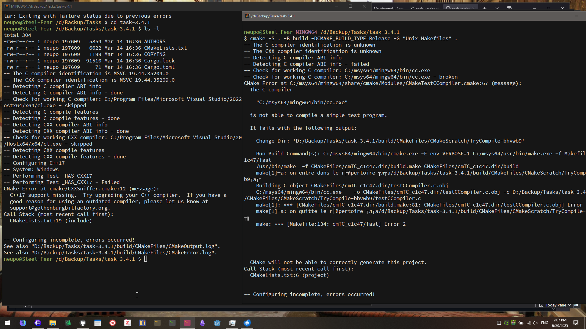

## Prologue

When I changed my email with Asana, the service that I liked so much, I found it when I had trouble planning my day, forgiving routine tasks, and struggling to keep in mind many parallel projects, and it helped, and adding new tasks was so easy (not anymore), but today I used passinbox from Proton that was recognized as not a personal email like gmail, I fell into a trap because Asana decided that personal accounts should be displaced by organizations.

Somehow created an organization, passinbox, that I can’t control, but apparently someone from passinbox could control my account and see my tasks unless they are private.

Though probably there will be no one from passinbox to take that control but this situation really unnerved me that I exported all archived projects and completed tasks (647 tasks, going back to 2017) and a few recent incomplete tasks, and deleted my account.

## Taskwarrior on Windows

So I guess I’m looking for a simple personal task management app that just needs due dates and reminders.

Today I decided to check my old tasks from Asana (saved as a PDF after I suddenly closed the account in one evening) and Jira. But a question appeared: in what sustainable platform should I organize new tasks?  
I decided to give Task Warrior a chance.  
And I had a new vision about gui apps: for any cli tool, we can take a terminal with a specific theme and font settings, which turns it into a standalone gui app.

I already created [a few unique shortcuts for Alacritty](/blog/alacritty-everywhere), and I expect this to be similar.  
But one tui (terminal user interface) app was doubling every letter I press. Strange. Nothing in the issue tracker about it.  
Then I noticed that pacman in MSYS installed the version 2.6, while the latest is 3.4 (and that was from 2023). Anyway, I don’t know if there’s an AUR for MSYS, but I decided to try to compile it on Windows.

It uses cmake build system—everything should be smooth, right? I tried MSVC and MSYS compilers. Both failed even before checking dependencies. It failed while testing compiler capabilities. This was an unpleasant obstacle.  

When it became clear that this is a task for tomorrow, I decided to look through the code, just out of curiosity. I saw a lexer, parser. And overall I found too many lines for a simple CLI tool. Inexplicably this made me sad.

## Plan

There was [some discussion](https://github.com/GothenburgBitFactory/taskwarrior/issues/2159) to support Windows. And even some [partial work](https://github.com/GothenburgBitFactory/taskwarrior/pull/3824) [done](https://github.com/GothenburgBitFactory/taskwarrior/compare/develop...Foadsf:taskwarrior:develop)(which is equal to less than an hour of work). So, what's left?

- Replace library for uuid with [stduuid](https://github.com/mariusbancila/stduuid)
- Sockets?
- 