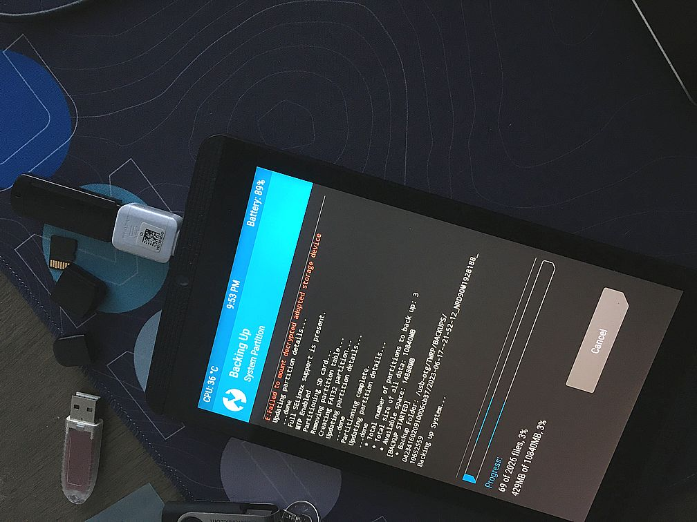

## What to build

- I build [Lineage 15.1 from source](/linux/build-lineage-15). With some complications, but apparently it is possible and this inspired me to go further and build following versions
- But first I go through [treblization](/linux/unofficial-treble-support-for-nvidia-shield)
- Then I build [Android GSI 10](/linux/build-android-gsi-10)
- Then I build [Lineage 16 from source](/linux/build-lineage-16)

## Android history

There are [articles](https://www.computerworld.com/article/3235946/android-versions-a-living-history-from-1-0-to-today.html) explaining how Android has evolved visually. But I'm interested in another aspect of its evolution. This is my list of technical details introduced in specific Android versions

- Android 8 - [VNDK](https://source.android.com/docs/core/architecture/vndk)
- Android 10 - [APEX container format](https://source.android.com/docs/core/ota/apex)


## Backup

### Super critical data

Even if backups will work fine I have a list of things that I'd like to perform manually. 

- Transfer 2FA applications to another device
- Download photos and notes. And download "Downloads"

You can add your valuable items to the list by doing the following exercise. Look at every application and imagine that you delete it, then ask yourself: What will I lose when it's deleted? What if I never can open this app?

### Software backup

**adb** provides some backup functionality. I will use version 1.0.41 from SDK 34.0.3-10161052. You can download [Android SDK Platform Tools](https://developer.android.com/tools/adb) or, if you have Android Studio installed, copy it from `C:\Users\<username>\AppData\Local\Android\Sdk\platform-tools`. I used **Minimal ADB and Fastboot** before but apparently it's an unofficial repack, so it can be sketchy depending on where you download it from.

No root required, only the developer mode, but it only copies installed APKs including system apps.

```powershell
adb backup -apk -shared -all -f C:\Users\neupo\shield_upgrade\backup_shield.ab
```

- `-apk` include APK, so when it restores the system it doesn't need to download it from the store. Especially I like to have identical version that I kept on the device and never update. That happened with very good guitar tuner. It was simple functional and elegant. But after a few years they added a shit load of crap: many more pages and buttons, subscription to pro version, advertisements. What was wrong in the previous version? Or another example, Weather Underground. The forecast was so nicely represented on one screen that I fell in love with that app and weather forecasts in general. Once the developers decided to make a major release, they completely re-wrote it. It has become absolutely unusable. Sometimes you just want to keep what you like.
- `-shared` to save SD card content
- `-all` nothing to do with other flags, this one means to include all packages (it's possible to specify packages for backup, but we do a full backup)
- `-system` include system applications too (I think NVIDIA stuff will go into this category)
- maybe you will want APK expansions with `-oob`


### Full system backup

As mentioned in these answers [ [1](https://android.stackexchange.com/a/104856/392080) ] [ [2](https://android.stackexchange.com/a/159860/392080) ] one can do a full backup of

- boot
- system
- data (there is [a trick](https://forum.fairphone.com/t/how-to-backup-your-internal-storage-through-a-twrp-backup/64010) to include the Internal Storage)

by booting into TWRP and doing so called NANDroid backup (IDK, it's just a big "Backup" button on the main screen)

Once you [find a TWRP image](https://twrp.me/Devices/) for your device, [Nvidia Shield](https://twrp.me/nvidia/nvidiahshieldtablet.html). Download **TWRP** 3.7.0: `twrp-3.7.0_9-0-shieldtablet.img` from [TWRP website](https://eu.dl.twrp.me/shieldtablet/), rename it to **twrp.img** and install on the tablet:

```powershell
adb reboot bootloader

# when device at the booloader screen
fastboot flash recovery twrp.img

# be ready to press a key combo
fastboot reboot
```

Before the tablet/phone boots up hold **Volume Down + Power** buttons. This way we end up in the same bootloader, select **Recovery Mode** and it will load TWRP. 

For more details read [here](https://forum.fairphone.com/t/how-to-backup-your-internal-storage-through-a-twrp-backup/64010)



I assume this is equivalent to connecting via ssh and `dd` every partition. 


## Android flavors

I honestly don't know why I chose Lineage. You can choose from many other ROMs/mods/OSes

- **CyanogenMod** (for [Shield](https://cyanogenmodroms.com/shieldtablet/#Extract_proprietary_blobs))
- **Resurrection Remix OS** Seems like a popular thing, because I find it as a first ROM that I have to install before installing GSI in the process of preparing Shield for Treble system. [Link](https://resurrectionremix.com/)
- **OmniROM** Well, I need to dig into that when I'll have time. [Link](https://omnirom.org/)
- **Arrow OS** Another AOSP-based creation, I've never heard about it. [Link](https://arrowos.net/)
- **postmarket OS** [Nvidia Shield Tablet](https://wiki.postmarketos.org/wiki/Nvidia_Shield_Tablet_(nvidia-shieldtablet))
- **Android Open Source Project** Android Open Source Project (AOSP) is True Android as I call it. Here's [some tips](https://stackoverflow.com/questions/63136813/how-do-you-build-a-linux-kernel-for-android-from-the-aosp)


## Build the ROM

Lineage OS for [Shield](https://wiki.lineageos.org/devices/shieldtablet/) ([github](https://github.com/LineageOS/android_device_nvidia_shieldtablet))

ROMs 

- [XDA 15.1](https://forum.xda-developers.com/t/rom-unofficial-lineageos-15-1-for-shield-tablet-omx-camera-working.4276915/). [Another tutotial](https://forum.xda-developers.com/t/guide-tutorial-howto-nvidia-shield-tablet-k1-stock-to-android-9.4524451/) says "Android 9", but this is not true, maybe they meant **< 9**.
- My [howto for Lineage 15.1 from source](/linux/build-lineage-15)
- My [howto for Lineage 16 from source](/linux/build-lineage-16)

Docs

- [install](https://wiki.lineageos.org/devices/shieldtablet/install) ROM to the device
- [build](https://wiki.lineageos.org/devices/shieldtablet/build) new/custom kernel
- [proprietary blobs](https://wiki.lineageos.org/proprietary_blobs)
- another version from [LineageOs Roms](https://lineageosroms.com/shieldtablet/)

Versions

Lineage | Android | Codename | Branch
--------|---------|----------|-----------
15.1    | 8.1     | Oreo     | lineage-15.1
16      | 9       | Pie      | lineage-16.0
17      | 10      | Q        | lineage-17.0
18      | 11      | R        | lineage-18.0
19      | 12      | S        | lineage-19.0
[20](https://www.lineageos.org/Changelog-27/)      | 13      | T        | lineage-20


## Install

I wrote for myself simplified version of [this wiki page](https://wiki.lineageos.org/devices/shieldtablet/install).

- Reboot into recovery: `adb reboot bootloader`, select Recovery Mode
- Wipe -> Format Data. yes
- done... Back, back, (on the Wipe page again) Advanced Wipe, select **System**, **Cache**, Swipe to Wipe (pun not intended)
- done... Back, back, back.
- Advanced -> ADB Sideload, Swipe
- `adb sideload ..\lineage-15.1-20230624-UNOFFICIAL-shieldtablet.zip`
- Back, ADB Sideload, Swipe
- `adb sideload ..\open_gapps-arm-8.1-nano-20220215.zip`
- `adb reboot`


### Play Store

[Gitlab link](https://gitlab.opengapps.org/opengapps/arm)

Add ["Open" GAPPS](https://opengapps.org/). I mean this in not _open_ like open source, but "open" because it's just sneaked versions from Nexus ROMs.

So I select **ARM** + **8.1** + **nano** (minimal installation for Play Store, no Google apps)

Downsides of installing GAPPS:

- On the first boot it will start with "checking for updates" crap. Solution: just press **back**, it will not go to previous page as illogical as it sounds, it will skip this step.


## Verify

This is my short checklist.

Hardware:

- Wi-Fi (sort of essential step in the first onboarding)
- Speakers
- Bluetooth
- Camera (optional)
- Video encoder (play video from youtube)

Software:

- Play Store


## Resources

- [HOWTO: Unpack, Edit, and Re-Pack Boot Images](https://web.archive.org/web/20200128133443/http://android-dls.com:80/wiki/index.php?title=HOWTO:_Unpack,_Edit,_and_Re-Pack_Boot_Images)
- On [NVIDIA Open Source Resources](https://developer.nvidia.com/shield-open-source) you can find a stock image for Shield Tablet K1 and restore it (for example following [this video](https://www.youtube.com/watch?v=yp2eT-sE2fo))
- [Reproducible builds](https://www.digidow.eu/publications/2020-poell-bachelorthesis/Poell_2020_BachelorThesis_SOAP.pdf)


### Next steps

- [F2FS filesystem](https://forum.xda-developers.com/t/full-f2fs-support-for-shield-tablet-kernel-twrp-fstab-injection-tool-n-updated.3492416/)
- [Linux for Tegra](https://news.ycombinator.com/item?id=10805117). Yeah, no Android, bye-bye Java
- Try some software for rooted devices: Droid Explorer, YouTube Vanced, Adaway, Greenify, Viper4Android, Titanium Backup
- Become a maintainer [for LineageOS](https://wiki.lineageos.org/submitting_device)
- [Alternative kernel](https://forum.xda-developers.com/t/kernel-bito-k12-ku-kernel-for-nvidia-shield-tablet-stock-custom-n.3069776/)


### Websites

- [XDA](https://forum.xda-developers.com/)
- [4PDA](https://4pda.to/forum/index.php?showtopic=892755&st=19400)